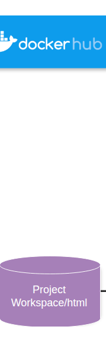

## Lab Details

## Running an NGINX Web Server in a Docker Container

### Overview of This Lab

In this lab, you will learn how to set up and run an NGINX web server inside a Docker container using **Puku CLI** . You will use the integrated terminal in Puku CLI to execute Docker commands, manage containers, and configure an NGINX web server.

By the end of this lab, you will understand how Docker simplifies application deployment by providing a lightweight, portable, and scalable environment for hosting web applications.

### What You'll Learn

- Use Docker commands in the **Puku CLI integrated terminal** to pull images, run containers, and manage container configurations.
- Deploy an NGINX web server inside a Docker container.
- Start, stop, restart, and remove Docker containers.
- View and analyze container logs for monitoring and troubleshooting.

Lab start

## Running an NGINX Web Server in a Docker Container

In today's DevOps and cloud-native world, the ability to quickly deploy services in isolated environments is essential. **Docker** makes this possible by providing lightweight, portable containers. In this lab, you will use **Puku CLI** and its integrated terminal to build, run, and manage an NGINX web server inside a Docker container.

**Part 1**
**Basic Docker Concepts__image_000000_39e68af6226d7c9f358e7875c730cf800029a15e0a193e367c9cf7a0abe012ed_part1.png**

**Part 2**
**Basic Docker Concepts__image_000000_39e68af6226d7c9f358e7875c730cf800029a15e0a193e367c9cf7a0abe012ed_part2.png**

This lab will guide you through the complete process of running an **NGINX web server inside a Docker container** using **Puku CLI** . You will learn how to pull the official NGINX Docker image, create a custom HTML page, configure a volume mount, run the container, and verify that the web server is running successfully.

### Lab Overview

In this lab, you will:

- Understand the basics of Docker and NGINX.
- Pull the official NGINX Docker image.
- Create and serve a custom HTML page from a Docker container.
- Map ports and mount volumes between your local project workspace and the Docker container.
- Manage the container lifecycle using the **Puku CLI integrated terminal** (start, stop, view logs, and remove containers).

## Concepts Explained

Before starting the lab, let's understand the key technologies used.

### What is Docker?

Docker is a containerization platform that packages applications and their dependencies into **containers** . These containers are lightweight, portable, and provide a consistent runtime environment across different systems.

### What is NGINX?

NGINX is a high-performance web server that serves web content efficiently. It can also function as a reverse proxy, load balancer, and HTTP cache, making it a popular choice for hosting modern web applications.

### Docker Image vs. Container

- **Image:** A read-only template that contains everything needed to run an application (for example, the official **NGINX** image).
- **Container:** A running instance of an image with its own isolated filesystem, processes, and networking.

## Hands-on: Running NGINX in Docker

In the following exercises, you will use the **Puku CLI integrated terminal** to pull the official NGINX Docker image, run it as a container, and manage it using Docker commands.

Yes, exactly. Since you're **actually running the commands in Puku CLI** , your documentation should say **Puku CLI** , not AWS Terminal. The commands remain the same.

Here's a professional version for your docs:

### Step 1: Pull the Official NGINX Docker Image

Open **Puku CLI** and launch the **integrated terminal** .

Run the following command to download the latest official NGINX image from Docker Hub:

docker pull nginx

**Basic Docker Concepts__image_000001_3d0f24c68bef2702dd4fdfe756e9ada4d7031e99ced5f0bc1c249906e5faf772.png**

Docker will download the required image layers. Once the download is complete, the latest NGINX image will be available on your local machine.

**Expected Output**

You should see output similar to the following in the Puku CLI terminal:

**Basic Docker Concepts__image_000002_c40b3889b133ac72b0b44ed744890dcceefe1c0bbc070b02312622efbe61ce89.png**

#### Verify the Download

To confirm that the image has been downloaded successfully, run:

docker images

**Basic Docker Concepts__image_000003_d3fc8307702e79a6b4cdc1b678530e15cf63a6a43cb7cca5084874114778b5b2.png**

**Expected Output**

The command should list the nginx image with the latest tag.

**Basic Docker Concepts__image_000004_f79b74c4f53d0758a6232ef685c6d87d512cd25a9721e9864b096b5e07d1e03b.png**

This format is much cleaner because the screenshots you capture from **Puku CLI** will naturally match the text in your documentation.

Here's the Puku CLI version with only the necessary changes. The commands stay the same except for the project path.

### Step 2: Create a Directory for Web Content

Open the **Puku CLI integrated terminal** and create a directory to store your custom HTML content. This directory will later be mounted into the NGINX container.

**Basic Docker Concepts__image_000005_a6eec19b9f1450b21498f87672dffe4d945b9f9ffedc98fb62d17983ab347e1d.png**

This directory will act as the source for the web content served by the NGINX container, allowing you to update files without modifying the container itself.

### Step 3: Create a Simple Web Page

Create a simple HTML page inside the html directory by running the following command:

**Basic Docker Concepts__image_000006_39c020f80ffd0ac5e551a3081535353b2a89df210d92c855a519a4ff67ff0751.png**

This page will be served by the NGINX web server once the container is running.

### Step 4: Run the NGINX Container

From the **Puku CLI integrated terminal** , run the following command:

**Basic Docker Concepts__image_000007_0df2f31113b163049852f4c1946f45849f4473033ef58ba5d07deb057ce494e2.png**

**Note:** On Windows PowerShell, replace $(pwd) with ${PWD} if required.

#### Command Breakdown

- --name my-nginx – Assigns the name **my-nginx** to the container.
- -v $(pwd)/nginx-lab/html:/usr/share/nginx/html:ro – Mounts your local HTML directory into the container's web root in read-only mode.
- -p 8000:80 – Maps port **8000** on your machine to port **80** inside the container.
- -d nginx – Runs the NGINX container in detached mode.

**Expected Output**

If the command executes successfully, Docker will return a long container ID.

**Basic Docker Concepts__image_000008_f10c690de8c020aaf4dfa513c3bac71456f0180a41b0bd26b88556a47883a968.png**

## 

## Step 5: Verify the Setup

### Check Running Containers

Run the following command to confirm that the NGINX container is running:

**Basic Docker Concepts__image_000009_a2367ebb15710c3761d2368ce26d19dad75a0acf4735ef52268efc555a9695a0.png**

Verify that:

- The container name is **my-nginx**
- The status is **Up**
- **Host port 5000 is mapped to container port 80**

### View the Web Page

Test the web server directly from the terminal:

curl http://localhost:50000

Expected output:

**Basic Docker Concepts__image_000010_d64048952936f48016d8e9ea0550e2e399a991fd8d490401f6d1e16968a88dff.png**

If you're using **Puku CLI** , you can also open the forwarded port from the Ports panel or the generated preview URL to view the page in your browser.

You should see:

Hello from NGINX running in Docker!

## Managing the NGINX Container

### Stop the Container

docker stop my-nginx

### Start the Container Again

docker start my-nginx

### View Container Logs

Display the NGINX logs:

docker logs my-nginx

Example output:

**Basic Docker Concepts__image_000011_8e0750bc17bffa7d2e5f89de88015943c2d017cffd2672fb153d722895e911cd.png**

Viewing logs is useful for debugging configuration issues and monitoring the container.

## Remove the Container

Once you're finished with the lab, stop and remove the container.

Stop the container:

docker stop my-nginx

Remove the container:

docker rm my-nginx

The NGINX image will remain on your system, allowing you to create new containers without downloading the image again.

## Conclusion

Congratulations! 🎉

You have successfully deployed an **NGINX web server inside a Docker container using Puku CLI** .

Throughout this lab, you learned how to:

- Pull a Docker image from Docker Hub.
- Run an NGINX container.
- Map host ports to container ports.
- Mount a local directory to serve a custom HTML page.
- Verify that the container is running.
- Access the web server using both curl and the Puku CLI browser preview.
- View container logs for troubleshooting.
- Stop, restart, and remove Docker containers.

This exercise demonstrates how Docker provides a portable and reproducible environment for running web applications. Using **Puku CLI** , you can develop, test, and manage containerized applications directly from your browser without installing Docker locally.
