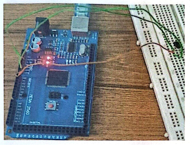
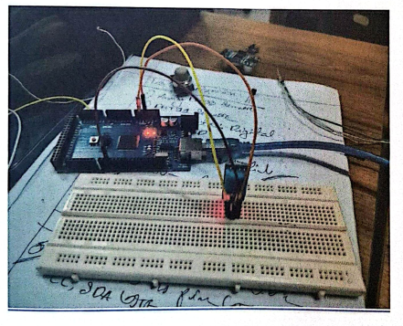
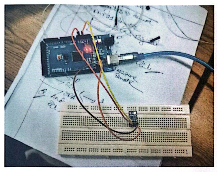
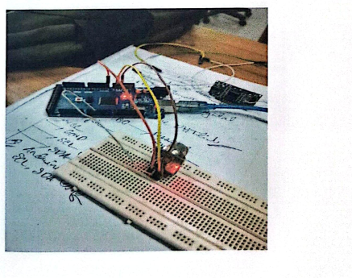
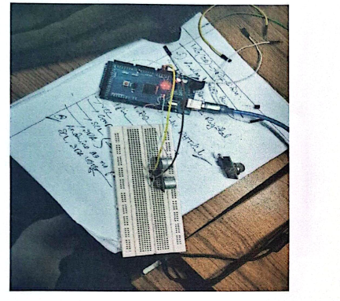

# Combined Document

_Generated from 4 source file(s) in `input_docs`._


---

## Source 1: `Lab_Report_02_CSE438.md`


Experiment Name: Interfacing and Testing of Temperature, Humidity, Pressure, Gas, and Distance Sensors using Arduino

## Objectives

- To interface and test Temperature, Humidity, Pressure, Gas and Distance sensors with the Arduino Uno and verify their readings on the Serial Monitor.
- To understand the working principles of the LM35, DHT11, BMP180, MQ135 and HC-SR04 sensors.
- To calibrate the sensors and develop Arduino programming skills for accurate data acquisition and display.

## Introduction

Sensors are the fundamental building blocks of any embedded or IoT system. They allow a microcontroller such as the Arduino Uno to perceive physical quantities — temperature, humidity, atmospheric pressure, air quality, and distance — and convert them into electrical signals that can be processed, displayed, or transmitted. In this experiment we interfaced five widely used sensors one by one: the analog LM35 temperature sensor, the digital DHT11 temperature/humidity sensor, the I2C-based BMP180 pressure/altitude sensor, the analog MQ135 gas sensor, and the ultrasonic HC-SR04 distance sensor. Each task is implemented as a small Arduino sketch, and the corresponding results are observed on the Serial Monitor, which builds a strong practical foundation for future IoT and smart-monitoring projects.

## Equipments

Hardware Components

- Arduino Uno development board
- LM35 analog temperature sensor
- DHT11 temperature and humidity sensor
- BMP180 barometric pressure and altitude sensor
- MQ135 air-quality / gas sensor
- HC-SR04 ultrasonic distance sensor
- Breadboard for assembling the circuits
- Jumper Wires (male-to-male and male-to-female)
- USB Cable (Type A to Type B)
- Arduino IDE (latest stable release)
- DHT sensor library by Adafruit
- Adafruit BMP085 / BMP180 library
- MQ135 library
- Basic C / C++ knowledge for understanding the sketches

Software Requirements

## Working Principle of the Sensors

LM35 Temperature Sensor

The LM35 is a precision analog temperature sensor whose output voltage is linearly proportional to the Celsius temperature, with a scale factor of 10 mV/°C. Because the output is already calibrated in Celsius, no external trimming is required.

DHT11 Temperature and Humidity Sensor

The DHT11 is a low-cost digital sensor that contains a capacitive humidity sensing element and a thermistor. It uses a single-wire bidirectional protocol to send a 40-bit packet containing the integer temperature (°C), the integer relative humidity (% RH) and a checksum.

BMP180 Pressure and Altitude Sensor

The BMP180 is a high-precision digital barometric pressure sensor that communicates over I2C. It measures both the absolute pressure of the surrounding air and the temperature, and from these values the altitude above sea level can be calculated using the international barometric formula.

MQ135 Gas Sensor

The MQ135 is an analog gas sensor that is sensitive to a range of harmful gases such as NH3, NOx, alcohol, benzene, smoke and CO2. The internal resistance of the sensing element changes with the gas concentration, producing a varying analog voltage that is read by the Arduino ADC and converted to a parts-per-million (PPM) value.

HC-SR04 Ultrasonic Distance Sensor

The HC-SR04 measures distance by emitting a 40 kHz ultrasonic burst from the trigger pin and listening for the echo on the echo pin. The time between the trigger and the echo is proportional to the distance of the nearest object, which is calculated as distance = (duration × 0.0343) / 2 cm (speed of sound in air is ~343 m/s).

## Procedure

Task 1: LM35 Temperature Sensor

In this task the LM35 output pin is connected to analog input A0 of the Arduino Uno, while VCC and GND are connected to the 5 V and GND rails. The Arduino reads the analog voltage, converts it to a digital value using the 10-bit ADC, and converts the value to a temperature in Celsius using the 10 mV/°C scale factor. The temperature is then displayed on the Serial Monitor in both °C and °F.

1.   Connect LM35 VCC to 5 V, GND to GND, and the analog output to A0.

2.   Open the Arduino IDE and write the sketch shown below.

3.   Select the correct board (Arduino Uno) and port, then upload the sketch.

4.   Open the Serial Monitor at 9600 baud and observe the readings.

Source Code:

const int lm35Pin = A0;

void setup() {

Serial.begin(9600);

}

void loop() {

int analogValue = analogRead(lm35Pin);

float voltage = (analogValue * 5.0) / 1023.0;

float temperatureC = voltage * 100.0;

float temperatureF = (temperatureC * 9.0 / 5.0) + 32.0;

Serial.print("Temperature: ");

Serial.print(temperatureC);

Serial.print(" C  ");

Serial.print(temperatureF);

Serial.println(" F");

delay(1000);

}

Circuit Diagram:


**Lab_Report_02_CSE438__image_000000_52910f2c974e81326414a3bcc4357435c697cfa938666558b44f2be9acdee8be.png**

MEGA 2560  
DrarTA  

Output:

Temperature: 31.74 C  89.13 F

Temperature: 31.25 C  88.25 F

Temperature: 32.10 C  89.78 F

Task 2: DHT11 Temperature and Humidity Sensor

The DHT11 data pin is connected to digital pin 2 of the Arduino Uno, and VCC and GND are connected to 5 V and GND respectively. A 10 kΩ pull-up resistor is added between the data line and VCC as recommended by the manufacturer. The Adafruit DHT library is used to read the humidity and temperature values, which are printed on the Serial Monitor.

1.   Connect DHT11 VCC to 5 V, GND to GND, and the data pin to D2 with a 10 kΩ pull-up resistor to 5 V.

2.   Install the Adafruit DHT sensor library via the Arduino Library Manager.

3.   Upload the sketch and open the Serial Monitor at 9600 baud.

Source Code:

#include &lt;DHT.h&gt;

#define DHTPIN 2

#define DHTTYPE DHT11

DHT dht(DHTPIN, DHTTYPE);

void setup() {

Serial.begin(9600);

dht.begin();

}

void loop() {

float humidity = dht.readHumidity();

float temperatureC = dht.readTemperature();

float temperatureF = dht.readTemperature(true);

if (isnan(humidity) || isnan(temperatureC)) {

Serial.println("Failed to read from DHT sensor!");

return;

}

Serial.print("Humidity: ");

Serial.print(humidity);

Serial.println(" %");

Serial.print("Temperature (Celsius): ");

Serial.print(temperatureC);

Serial.println(" C");

Serial.print("Temperature (Fahrenheit): ");

Serial.print(temperatureF);

Serial.println(" F");

Serial.println("-------------------");

delay(2000);

}

Circuit Diagram:


**Lab_Report_02_CSE438__image_000001_03d432f39a2664f92e35b7c201e9a9c04cb51cb42d17be825a2eb147879850e3.png**

ao  
CC SDA T  

Output:

Humidity: 67%

Temperature: 31 C

Temperature: 87.8 F

-------------------

Humidity: 68%

Temperature: 32 C

Temperature: 89.6 F

Task 3: BMP180 Pressure and Altitude Sensor

The BMP180 communicates with the Arduino Uno over the I2C bus, so its SDA and SCL pins are connected to A4 and A5 respectively, VCC is connected to 3.3 V (or 5 V depending on the breakout board) and GND to GND. The Adafruit BMP085 library (which also supports the BMP180) is used to initialise the sensor and read both the barometric pressure and the calculated altitude.

1.   Connect BMP180 VCC to 3.3 V, GND to GND, SDA to A4 and SCL to A5.

2.   Install the Adafruit BMP085 / BMP180 library via the Library Manager.

3.   Upload the sketch and open the Serial Monitor at 9600 baud.

Source Code:

#include &lt;Wire.h&gt;

#include &lt;Adafruit\_BMP085.h&gt;

Adafruit\_BMP085 bmp;

void setup() {

Serial.begin(9600);

if (!bmp.begin()) {

Serial.println("BMP180 sensor not detected. Check wiring.");

while (1);

}

}

void loop() {

float pressure = bmp.readPressure() / 100.0;   // convert Pa to hPa

float altitude = bmp.readAltitude();            // metres above sea level

Serial.print("Pressure: ");

Serial.print(pressure);

Serial.println(" hPa");

Serial.print("Altitude: ");

Serial.print(altitude);

Serial.println(" m");

Serial.println("------------------");

delay(2000);

}

Circuit Diagram:


**Lab_Report_02_CSE438__image_000002_a5b667e3d9c32f22642880f60eb3f1b6e147f6901d02c474f37858185adfe8f4.png**

HHE  

Output:

Pressure: 999.73 hPa

Altitude: 113.26 m

------------------

Pressure: 999.72 hPa

Altitude: 115.01 m

Task 4: MQ135 Gas Sensor

The MQ135 analog output is connected to A0, VCC to 5 V and GND to GND. The sensor needs a warm-up time of at least 20 seconds (and ideally a few minutes) before its readings stabilise. The MQ135 library converts the raw analog reading to an estimated CO2 concentration in PPM, which is printed on the Serial Monitor.

1.   Connect MQ135 VCC to 5 V, GND to GND, and the analog output to A0.

2.   Install the MQ135 library and allow the sensor to warm up for at least 20 seconds.

3.   Upload the sketch and observe the CO2 concentration on the Serial Monitor.

Source Code:

#include "MQ135.h"

#define ANALOG\_PIN A0

MQ135 gasSensor = MQ135(ANALOG\_PIN);

void setup() {

Serial.begin(9600);

Serial.println("Warming up MQ135 sensor...");

delay(20000);

}

void loop() {

float ppm = gasSensor.getPPM();

Serial.print("CO2 Concentration: ");

Serial.print(ppm);

Serial.println(" PPM");

Serial.println("------------------");

delay(2000);

}

Circuit Diagram:


**Lab_Report_02_CSE438__image_000003_94e01aecf3cf0804f34e665ad6e5e9475470dbc411ae9b0e52f43bf5e09817cf.png**

seL  
50A  
Andin  
E,s0  

Output:

CO2 Concentration: 16135.71 PPM

------------------

CO2 Concentration: 15393.25 PPM

Task 5: HC-SR04 Ultrasonic Distance Sensor

The HC-SR04 has four pins: VCC (5 V), GND, TRIG and ECHO. The TRIG pin is connected to digital pin 8 and the ECHO pin to digital pin 9 of the Arduino. A 10 µs pulse is sent on TRIG, the sensor emits an ultrasonic burst, and the duration of the resulting echo pulse on the ECHO pin is measured with pulseIn(). The distance is then calculated using the speed of sound in air.

1.   Connect HC-SR04 VCC to 5 V, GND to GND, TRIG to D8 and ECHO to D9.

2.   Upload the sketch and open the Serial Monitor at 9600 baud.

3.   Place an object in front of the sensor at different distances and observe the readings.

Source Code:

#define TRIG\_PIN 8

#define ECHO\_PIN 9

void setup() {

Serial.begin(9600);

pinMode(TRIG\_PIN, OUTPUT);

pinMode(ECHO\_PIN, INPUT);

}

void loop() {

long duration;

float distance;

digitalWrite(TRIG\_PIN, LOW);

delayMicroseconds(2);

digitalWrite(TRIG\_PIN, HIGH);

delayMicroseconds(10);

digitalWrite(TRIG\_PIN, LOW);

duration = pulseIn(ECHO\_PIN, HIGH);

distance = (duration * 0.0343) / 2.0;

Serial.print("Distance: ");

Serial.print(distance);

Serial.println(" cm");

delay(2000);

}

Circuit Diagram:


**Lab_Report_02_CSE438__image_000004_393afd05d29ec7264ba37c480c96dfe5a4a8623123df4b7f3a59aaa90f289036.png**

SeL  
2010578  

Output:

Distance: 34.04 cm

Distance: 36.43 cm

Distance: 37.31 cm

Distance: 35.44 cm

Distance: 36.20 cm

## Discussion

This experiment gave us a clear, hands-on understanding of how five very different sensors — analog (LM35, MQ135), single-wire digital (DHT11), I2C (BMP180) and ultrasonic (HC-SR04) — are connected to and read by a single Arduino Uno. The LM35 responded quickly and almost linearly to temperature changes, confirming its 10 mV/°C scale factor. The DHT11 needed a short warm-up, after which it returned stable humidity and temperature readings at a 2-second interval. The BMP180 reported atmospheric pressure around 999.7 hPa, which is reasonable for a low-elevation indoor environment, and the calculated altitude of around 113–115 m matches the local elevation of our lab.

The MQ135 produced CO2 values in the order of 15 000 PPM, which is well above the typical indoor level (400–1000 PPM). This is expected: the MQ135 library is only a rough estimate, and a single-point calibration in clean air (R0) is needed for accurate absolute values. The reading is, however, perfectly usable for detecting relative changes — for example, when the air becomes noticeably more polluted. The HC-SR04 consistently returned distances in the 34–37 cm range when an object was placed in front of it, which is well within its 2–400 cm specification.

A few practical issues were solved during the experiment. The DHT11 initially returned NaN values because the data-line pull-up resistor was missing. The BMP180 had to be powered from 3.3 V rather than 5 V on our particular breakout board. And the MQ135 needed its long warm-up delay to give sensible values. All of these were great reminders that real sensor work is always iterative: read the datasheet, wire the circuit carefully, watch the Serial Monitor, and adjust until the behaviour matches the theory.

## Conclusion

The experiment was completed successfully. Using the Arduino Uno, we were able to interface and test five commonly used sensors — the LM35 temperature sensor, the DHT11 temperature/humidity sensor, the BMP180 pressure/altitude sensor, the MQ135 gas sensor and the HC-SR04 ultrasonic distance sensor — and to display their readings on the Serial Monitor. The lab not only strengthened our understanding of the individual sensor principles but also showed how analog, digital, I2C and ultrasonic interfaces can be combined on a single Arduino platform. These building blocks will be directly useful in upcoming IoT, smart monitoring and embedded systems projects.

## References

- Arduino Official Website — https://www.arduino.cc
- LM35 Datasheet — Texas Instruments
- DHT11 Datasheet — Aosong Electronics
- BMP180 Datasheet — Bosch Sensortec
- MQ135 Datasheet — Hanwei Electronics
- HC-SR04 Ultrasonic Sensor — Cytron Technologies


---

## Source 2: `Untitled presentation.md`


INTERNET OF THINGS (IOT):

CONNECTING THE PHYSICAL

AND DIGITAL WORLD

COURSE: ADVANCED NETWORKING

UNIVERSITY OF TECHNOLOGY

2024

PAGE 1

What is IoT?

Physical objects embedded with sensors, software &amp; connectivity to exchange data over the internet. Term coined by Kevin Ashton, MIT, 1999. 15.9B connected devices in 2023 → 29.4B by 2030.

Data

Exchange

Real-time data transmission

Smart

Objects

Everyday devices become intelligent

Physical-

Digital

Bridges two worlds seamlessly

PAGE 2

History &amp; Evolution of IoT

1969–1999: Origins

• 1969: ARPANET — first networked computers

• 1982: CMU Coke Machine — first internet-connected device

• 1991: World Wide Web goes public

• 1999: Kevin Ashton coins "Internet of Things" at MIT

2000–2016: Growth Era

• 2007: iPhone launches — smartphones accelerate IoT

• 2011: IPv6 enables trillions of device addresses

• 2014: Amazon Echo — voice-controlled IoT enters homes

• 2016: Mirai Botnet hijacks 600,000+ IoT devices

2017–2030: Intelligent IoT

• 2020: 5G + Edge Computing deployed globally

• 2023: 15.9 billion connected devices worldwide

• 2025: TinyML &amp; AIoT — self-learning smart devices

• 2030: Quantum IoT Security + 29.4B devices projected

01

02

03

PAGE 3

How IoT Works

SENSE

Sensors detect physical data — temperature, motion, light, humidity. Smart thermostat reads room temperature and environmental conditions in real time.

CONNECT &amp; PROCESS

Data transmitted via Wi-Fi, Zigbee, LoRaWAN, or 5G. Edge or cloud platform analyzes the incoming sensor data stream instantly.

ACT

Automated response triggered — thermostat adjusts heating, alert sent to app. System responds without human intervention, closing the IoT loop.

01

02

03

PAGE 4


---

## Source 3: `dip1.md`


## Comparative Analysis of Canny Edge Detection 

This assignment conducts a comparative analysis of the Canny edge detection algorithm. The primary objectives are to evaluate the performance of different gradient filters and to investigate the impact of hyperparameter tuning on the resultant edge maps.

```
import cv2 import numpy as np import matplotlib.pyplot as plt image_path = '/content/sample_data/dip.webp' original_image = cv2.imread(image_path) if original_image is None: print(f"Error: Image not found at {image_path}. Please verify the path.") else: gray_image = cv2.cvtColor(original_image, cv2.COLOR_BGR2GRAY) plt.figure(figsize=(8, 6)) plt.imshow(gray_image, cmap='gray') plt.title('Original Grayscale Image') plt.axis('off') plt.show() print("Setup complete: Image loaded and converted to grayscale.")
```

## Original Grayscale Image


**dip1__image_000000_18bf7451bd2650cc0b63c7659d15ae4f1b381866c7f785ab98fcd22ee146f8bf.png**

5  

Setup complete: Image loaded and converted to grayscale.

- Custom Canny Edge Detector Implementation 

As cv2.Canny() internally utilizes only the Sobel filter, a custom implementation of the Canny algorithm is necessary to compare various gradient filters (Sobel, Prewitt, Roberts Cross). This involves manually implementing Gaussian blurring, gradient calculation, non-maximum suppression (NMS), and double-threshold hysteresis. This approach ensures a consistent and comparable pipeline across all evaluated filters.

```
def gaussian_blur(image, kernel_size, sigma): return cv2.GaussianBlur(image, (kernel_size, kernel_size), sigma) def calculate_gradients(image, filter_type='sobel'): if filter_type == 'sobel': Gx = cv2.Sobel(image, cv2.CV_64F, 1, 0, ksize=3) Gy = cv2.Sobel(image, cv2.CV_64F, 0, 1, ksize=3) elif filter_type == 'prewitt': kernel_x = np.array([[-1, 0, 1], [-1, 0, 1], [-1, 0, 1]], dtype=np.float32) kernel_y = np.array([[-1, -1, -1], [0, 0, 0], [1, 1, 1]], dtype=np.float32) Gx = cv2.filter2D(image, cv2.CV_64F, kernel_x) Gy = cv2.filter2D(image, cv2.CV_64F, kernel_y) elif filter_type == 'roberts': kernel_x = np.array([[1, 0], [0, -1]], dtype=np.float32) kernel_y = np.array([[0, 1], [-1, 0]], dtype=np.float32) Gx = cv2.filter2D(image, cv2.CV_64F, kernel_x) Gy = cv2.filter2D(image, cv2.CV_64F, kernel_y) else: raise ValueError("Invalid filter_type. Choose 'sobel', 'prewitt', or 'roberts'.") magnitude = np.sqrt(Gx**2 + Gy**2) magnitude = cv2.normalize(magnitude, None, 0, 255, cv2.NORM_MINMAX, cv2.CV_8U) direction = np.arctan2(Gy, Gx) return magnitude, direction def non_maximum_suppression(magnitude, direction): rows, cols = magnitude.shape output = np.zeros_like(magnitude, dtype=np.uint8) angle = direction * 180. / np.pi angle[angle < 0] += 180 for i in range(1, rows - 1): for j in range(1, cols - 1): q = 255 r = 255 if (0 <= angle[i, j] < 22.5) or (157.5 <= angle[i, j] <= 180): q = magnitude[i, j + 1] r = magnitude[i, j - 1] elif (22.5 <= angle[i, j] < 67.5): q = magnitude[i + 1, j - 1] r = magnitude[i - 1, j + 1] elif (67.5 <= angle[i, j] < 112.5): q = magnitude[i + 1, j] r = magnitude[i - 1, j] elif (112.5 <= angle[i, j] < 157.5): q = magnitude[i - 1, j - 1] r = magnitude[i + 1, j + 1] if (magnitude[i, j] >= q) and (magnitude[i, j] >= r): output[i, j] = magnitude[i, j] else: output[i, j] = 0 return output
```

```
def double_threshold_hysteresis(image, low_threshold, high_threshold): image = image.astype(np.float32) rows, cols = image.shape output = np.zeros_like(image, dtype=np.uint8) strong_i, strong_j = np.where(image >= high_threshold) weak_i, weak_j = np.where((image >= low_threshold) & (image < high_threshold)) output[strong_i, strong_j] = 255 output[weak_i, weak_j] = 75 for i in range(1, rows - 1): for j in range(1, cols - 1): if output[i, j] == 75: if ((output[i + 1, j - 1] == 255) or (output[i + 1, j] == 255) or (output[i + or (output[i, j - 1] == 255) or (output[i, j + 1] == 255) or (output[i - 1, j - 1] == 255) or (output[i - 1, j] == 255) or (output[ output[i, j] = 255 else: output[i, j] = 0 return output def custom_canny(image, filter_type, gaussian_ksize, sigma, low_threshold, high_threshold): blurred_image = gaussian_blur(image, gaussian_ksize, sigma) magnitude, direction = calculate_gradients(blurred_image, filter_type) nms_output = non_maximum_suppression(magnitude, direction) final_edges = double_threshold_hysteresis(nms_output, low_threshold, high_threshold) return final_edges print("Custom Canny components (Gaussian blur, gradient calculation, NMS, Hysteresis) defined Custom Canny components (Gaussian blur, gradient calculation, NMS, Hysteresis) defined.
```

## Task 1: Gradient Filter Comparison 

The Canny edge detection algorithm is applied using three distinct gradient filters: Sobel, Prewitt, and Roberts Cross. To ensure a fair comparison, Gaussian kernel size, sigma, and threshold values are maintained constant across all three filters.

```
GAUSSIAN_KSIZE = 5 SIGMA = 1.0 LOW_THRESHOLD = 30 HIGH_THRESHOLD = 90 sobel_edges = custom_canny(gray_image, 'sobel', GAUSSIAN_KSIZE, SIGMA, LOW_THRESHOLD, HIGH_TH prewitt_edges = custom_canny(gray_image, 'prewitt', GAUSSIAN_KSIZE, SIGMA, LOW_THRESHOLD, HIG roberts_edges = custom_canny(gray_image, 'roberts', GAUSSIAN_KSIZE, SIGMA, LOW_THRESHOLD, HIG plt.figure(figsize=(18, 6)) plt.subplot(1, 3, 1) plt.imshow(sobel_edges, cmap='gray') plt.title('Canny with Sobel Filter') plt.axis('off') plt.subplot(1, 3, 2) plt.imshow(prewitt_edges, cmap='gray') plt.title('Canny with Prewitt Filter')
```

plt.axis('off')  
plt.subplot(1, 3, 3)  
plt.imshow(roberts_edges, cmap='gray')  
plt.title('Canny with Roberts Cross Filter')  
plt.axis('off')  
plt.suptitle('Gradient Filter Comparison for Canny Edge Detection', fontsize=16)  
plt.tight_layout(rect=[0, 0.03, 1, 0.95])  
plt.show()  
Gradient Filter Comparison for Canny Edge Detection  
Canny with Prewitt Filter  
Canny with Roberts Cross Filter  
Canny with Sobel Filter  

## Comparison Summary of Gradient Filters:

- Sobel Filter: Produced strong, continuous edges, effectively outlining primary subjects with good noise handling. Its 3x3 kernel provides a balanced approach to noise suppression and detail retention.
- Prewitt Filter: Exhibited performance similar to Sobel, with comparable edge continuity, though edges appeared marginally less defined in certain areas.
- Roberts Cross Filter: Demonstrated high sensitivity due to its 2x2 kernel, detecting fine details but also exacerbating noise. This resulted in thinner, fragmented, and jagged edges, indicating high susceptibility to noise.

Conclusion: The Sobel filter provided the most effective and clean edge map for the given image, achieving an optimal balance between edge strength, continuity, and noise suppression. Therefore, the Sobel filter will be utilized for subsequent hyperparameter tuning in Task 2.

## Task 2: Hyperparameter Tuning (using Sobel Filter) 

Following the selection of the Sobel filter, this section focuses on tuning Canny's hyperparameters. This process aims to understand the influence of each parameter on the final edge map and to identify optimal settings for the image.

## Gaussian Kernel Size Tuning 

This experiment evaluates the effect of varying Gaussian blur kernel sizes on edge detection. Kernel sizes of 3x3, 5x5, and 7x7 are tested, while maintaining constant sigma and threshold values, to assess their impact on smoothing levels.

```
BEST_FILTER = 'sobel' FIXED_SIGMA = 1.0
```


**dip1__image_000002_88f56ae1b1c542bdc2f7dfcfa596deedff49ecb868129a11429e95b78d4f7b82.png**

Canny Edge Detection: Gaussian Kernel Size Comparison (Sobel Filter)  
Kernel Size: 3x3  
Kernel Size: 5x5  
Kernel Size: 7x7  

## Sigma Value Tuning 

The impact of the sigma value (standard deviation of the Gaussian blur) on edge detection is investigated. A kernel size of 5x5 (selected from previous experiments for its balanced performance) is used, with fixed thresholds. Sigma values of 0.5, 1.0, and 1.5 are evaluated.


**dip1__image_000003_1b2f0ecbd658fe2501663cad87e9b1d7f5a468eff25ff8376c0c2ad447a07d1c.png**

plt.show()  
Canny Edge Detection: Sigma Value Comparison (Sobel Filter)  
Sigma: 0.5  
Sigma:1.5  
Sigma: 1.0  

## Threshold Pair Tuning 

This section explores the effect of varying low\_threshold and high\_threshold values, which are critical for determining strong and weak edges. The previously identified optimal kernel\_size and sigma values are maintained. Threshold pairs (0.03, 0.09), (0.05, 0.11), and (0.08, 0.16) are tested. Note that the custom Canny functions expect thresholds in the 0-255 range, necessitating scaling of the provided 0-1 range values.


**dip1__image_000004_2e625d801c33b7155ee659cab4e48241db57b559175f46f7d5808fadbe992aa6.png**

Original relative threshold pairs: [(0.03, 0.09), (0.05, 0.11), (0.08, 0.16)]  
Scaled absolute threshold pairs (low, high): [(7, 22), (12, 28), (20, 40)]  
Canny Edge Detection: Threshold Comparison (Sobel Filter)  
Thresholds: (0.03, 0.09)  
Thresholds: (0.05, 0.11)  
Thresholds: (0.08,0.16)  

## Final Optimized Edge Map 

Based on the comprehensive hyperparameter tuning, the optimal Canny parameters are applied to generate the final, most effective edge map for the given image.

```
OPTIMUM_KSIZE = 5 OPTIMUM_SIGMA = 1.0 OPTIMUM_LOW_THRESHOLD = int(0.05 * 255) OPTIMUM_HIGH_THRESHOLD = int(0.11 * 255) print("Selected Optimum Parameters:") print(f"  Gradient Filter: {BEST_FILTER.capitalize()}") print(f"  Gaussian Kernel Size: {OPTIMUM_KSIZE}x{OPTIMUM_KSIZE}") print(f"  Sigma Value: {OPTIMUM_SIGMA}") print(f"  Low Threshold: {OPTIMUM_LOW_THRESHOLD} (relative ~0.05)") print(f"  High Threshold: {OPTIMUM_HIGH_THRESHOLD} (relative ~0.11)") print("--------------------------------------------------") final_best_edges = custom_canny(gray_image, BEST_FILTER, OPTIMUM_KSIZE, OPTIMUM_SIGMA, OPTIMUM_ plt.figure(figsize=(8, 6)) plt.imshow(final_best_edges, cmap='gray') plt.title('Final Best Edge Map (Optimum Parameters)') plt.axis('off') plt.show()
```

Selected Optimum Parameters: Gradient Filter: Sobel Gaussian Kernel Size: 5x5 Sigma Value: 1.0 Low Threshold: 12 (relative ~0.05)

High Threshold: 28 (relative ~0.11)

--------------------------------------------------

Final Best Edge Map (Optimum Parameters)


**dip1__image_000005_6e5b120aad826372e366096ae820fe295881cdcbdc3edaaa6994a5b6a66fd306.png**


---

## Source 4: `english.md`


Set-04  

Regrossion:

Regresion aralysis is a foreom ofPredictive modeling techriue cohich investigalas the relationship botaron a dependent and independentvartiable.

-mainty used fore Prediting &amp;. forcaoting.

Regression

Linearc

maps a continjous f of 2

logistic

maps a continjous xto biniary (TruelPalse

Linear Rogression: 1 a Prcedictive modecing tecmique.

- attempts to model the relationstip betcveen. tewa varciables by titting a linear equation to the observed data.
- one varciable is called - Exploratory verciable
- Other Varciable is called - dependent varciasle
- the best fil- line coould be the line cohice hes the least differuence betweer the estimated ralne annd actal vare.

copaodop=  
sw  
Linearc Rigresiion  
→ ①Dependent.(we Predict thevalt  
Tao variable  
②Independent  
x= independert  
122d  
2  
i6=mxc=slope  
tibo  
C=intercept  
bmp  
2ev byilpib2asued  
Simple linearc Regression.'  
y=do+dixc  
boen wdi = Regressim co-efficent  
moltile linearc egression2dN independentvar.  
J= defendent Var.  
y=20+d1x22  
sust  
6.mp  
for preediction?  
How linear Regression Corks  
Lirar Rogrcenim Performs the tok to preedict a dependent  
Varciable()bared onagirer indeperdentvarciable:S0,  
2M3)  
Hhis regression fechnique finds out ar linear relatimship  
between Cintut) and outplty. ba  
Hypotheis functim for linear tegressi:i  
CV  
b~~  
690  
=xo+xx  
∑(x-x)(y-9)  
wis fik fead 20  
Niv22v  
∑(x-x)2  
Here; doE intercept INibi  
222  
=coefficientof  
trvot?  
once, we find the best do and i yalues, we yoiu  
get tee bost fit Line, sg wher we are finally using  
our model Predictim, it will Predict the Vaine  
of y for tne ingnt valne of x,  

sitls

TOV

for the best fit line wke need to update tue

valweofdo and d,to farabo sjbal

cost function (J): By achieving tue best fit rugressim line, the model aims to Predict y valves sveh that ther error differenc between predictied value and. true valut is minimurn, so we need to update tue vahe of doi dp to reach best value tuat minimize fcobmpb valwe and tove (Y) value,

cost function (J) of linear regressim and treevahely),

## Scoilsibunf one (Predyi) =f fueqiet qoteoqce n 1=1 edl·cmost aiom

the Root mean squered. Error (RMSE) beth Predicted Valye(y)

to update do and xi. valun in order to reduce cost functian and achieving tue best fit line the model uses aradient Pescerti. the idee is to start with randimnt koilknd di vaiwes reaching ininin t, d tit fod t o fibaa7 1ic H mifoibsi 1abom 1

|   x |   R | (x-x)   |    |       | (y-y)1(x-x(x-元)0-5)   | g       | (-y)        |
|-----|-----|---------|----|-------|-----------------------|---------|-------------|
|   1 |   2 | -2      | -2 | 4     | 4 2.8                 | 0.8     | (9-y)2 0.64 |
|   2 |   4 | -1      |  0 | 1     | 0                     | 0.C     | 0.36        |
|   3 |   5 | Q       |  1 | 0     | 3.4 4                 |         |             |
|   4 |   4 | 1       |  0 | 0 1 0 | 4,6                   | -1      | 1           |
|   5 |   5 | 2       |  1 | 4 2   | 5.2                   | 0.6 0,2 | 75.0 he,g   |

<!-- formula-not-decoded -->

Linear regression, &lt;0 =x0+x1x

<!-- formula-not-decoded -->

do can be calculated using thecordinate (x,7)= (3.4)

<!-- formula-not-decoded -->

∴ y = 2.2 + 0.6Xx, which is the regression line.

Now, error=

∑(g-y)

n-2


**english__image_000002_d9d0b8e98957249d3c8c4af2407bb20a61dd5687a737e50d404a6aef419a9075.png**

5  
4  
2  
5  
2  

0.89

J8:0

- D Business ften uselineac regression to understima the relationship betwveen adverctising spending &amp; revenue. 0

22.0

po.o

- 2) Medical tieseatechere use lineate treg ten im to anderstarid therelatinship! betaween draug dosage &amp; blood prasurce of a Patienl=x 27211
2. 3 Agricultarel scientists use Linear reegrerin to meanurce the effect tof fertilizer s cwaterilon (已-巳)(x-0)子 Crcop yeilds, x= 2.0 01 (x-K)3
3. futurce montrs. (AC)(④)Foreccooting
4. Price on riumber of sales. Impact of produet 2.0+0x=P&lt; 6 SC=Ox

P8.0

~(P-e)3

fo      e Predictive analysis?

Logistic regressin is a method which falls unden supervised ML algorithm, It is used to predict the binary outcomes for a given set of independent variable, The dependent variable outeome is discreate.

109 of odds as Logistic regressimn uses

dependentveriasu

the

logisticeregressianieavation,.

3.0

<!-- formula-not-decoded -->

function on lirean ploweis t bulddo b gethted togistico relgression orst2 ei lioris arp gedtadw toibat of Sigmoid function; P n 1+e

where,

y

tb2o toibt (A)

os radtedes

0051d0999

ro t2ibif

at~10m

V

te09

213

2eiaraolob of bo20 2ti

Divonr

amaobvo(2).

t0

tosit0s2

x ()

dabamrp The output of tue logistic regressin is a Sigmoid curve. there are onry 2 Possizk value to make our predictimi fse

**Part 1**
Probabili  
Probalility >0.5  
outcome=(1)(Trne)  
s-curue  
—-thresho'dvalue20.5  
0.5-  
**Part 2**
<0.5  
outcome = o (False)  
5  
7  

→x

## Legistic Rogression Application:

BA obblA!Nd

- Probabilitg of having heart attack, (2) to predict whether an email is spar ornof.
- ③ Probabilitg of faileree of a Parcticuilar Protect.
- Democrate or Republican Panty boned on tesidence, occupation, 'income ete.
- (8) In NLP it's osed to determine the sentiment of movie review, Marcketings ,(8) outcome of amatch

9上

**Part 1**
(9)Handeriting  
非  
Linearc  
(4) Models data using continiour  
mumercic. Value.  
②Lineare relationship beth  
dependent & independent  
varciable is rcequirced,  
(3) the data is modelled usito  
a straight line .  
(④D) Independent varciables  
Can be correlated with  
eacn other.  
(5) Lineare reegression equatin  
J=xo+d1x  
6)|x<y<α  
2  
1  
2  
(8) Error miniznization  
fcchnique:  
leant square metnod  
**Part 2**
matched ore not matched.  
Logistic  
(4) Models data, using binarcy  
values.  
2) wot reeqairced.  
(3) The Probability is  
reepresented as a linear funct  
(A) Must be correlated  
with eacr other.  
(5) Logistic regresslen ean:  
P  
in  
=20+91℃  
-  
Q  
ρ ≤ 1  
1  
0.5  
0  
8.Errorminimizatian  
techniane.  
logistic loss function  

## Linear Regression!

## Advantage:

- Modeling speed is fast
- -reuns fort aith large amount of dataset.

## Disaduartage:

- Non-lineate data can't be ciell fited
- Can be overcfiHted.

## Legistic Ragression:

## Advantage:

- veryefficien L asttas resources.

doesr't reequitce features to be scaled.

- ensty to implement &amp; train J 十0 =

## Disadvantege:

- D (3) Can't solve non-linear pooblem
- — Aecurcaay not so high.
- camn predict only catagooical outeome.
- to overfitting srrarlns—

bubbom

## clamificatim

- D The output is a class on catagory.
- 2) Evaluating by mearsurirg aocuracy.
- (③) Algo: Decision-tree, kNN
- 4)The depen dent variable
- are Unordered.

## Igesion

- (4) -the output is nurerla value
- (2) fvalua-ted by leastsquare method.
3. 3 linear, Logistic regression.
- (4) dependent Vanicsu are ordeved,
