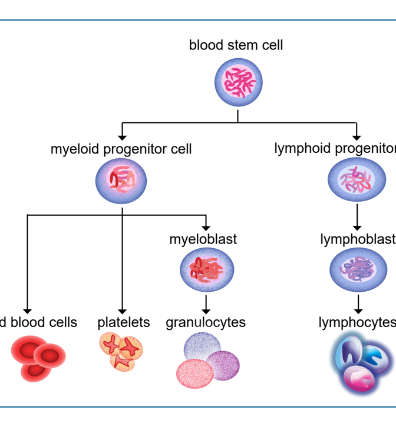
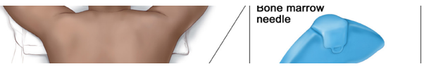
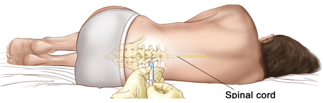
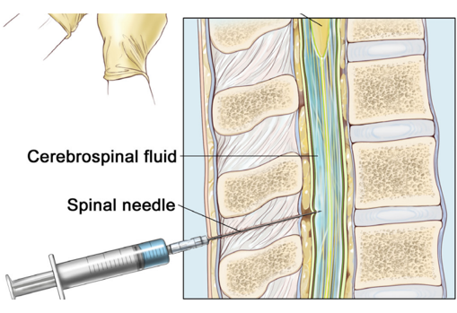
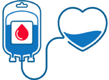

# Combined Document

_Generated from 2 source file(s) in `input_docs`._

---

## Source 1: `Nsave_Trust_Turnaround.md`

The Cost of Silence  
Eradicating Withdrawal Churn and  
Rebuilding the Infrastructure of Trust.  
A 90-Day Turnaround Strategy for Nsave's Product,  
Engineering, and Compliance Teams.  
nsave  
BRAINFUEL  
NotebookLM  

Users who successfully deposit never make it out.  
The Micro Failure  
The Macro Success  
(Bottom of Funnel)  
(Top of Funnel)  
- 14 Active Markets (including  
- ~110 Negative Trustpilot  
AE, AR, BD, BH, DZ, EG, GB).  
Reviews (Post-2024).  
- $22.5M Total Funding (Seed +  
- 3-21 Days: Average time funds  
Series A, Jan 2025).  
are stuck in ACH/SEPA limbo.  
- Low barrier to entry for  
- The Result: A withdrawal-to-  
underserved financial markets.  
suspension pipeline that  
destroys lifetime value.  
NotebookLM  

We are designing for a user base with a baseline trust of zero.  
Pakistan  
Lebanon  
Nigeria  
Naira Devaluation & Strict Controls  
Hyperinflation & Bank Freezes  
Extreme Currency Volatility  
The Emotional Stakes: To a standard  
The Starting Reality: Our users in  
The Insight: We are treating the  
withdrawal phase as a functional  
financially underserved markets have  
fintech user, a 5-day delay is an  
already been burned by their local  
inconvenience. To a user in Lebanon or  
transaction. The user experiences it  
banking systems. They chose Nsave  
Nigeria, a 5-day silent delay feels like  
as the ultimate test of our core  
theft.  
to escape unpredictability.  
promise.  
NotebookLM  

The Friction Heatmap isolates "Silence"  
as our PO failure.  
- Silent compliance holds: Account restricted, no in-app notification.  
PO - Critical Impact  
- Pending State Limbo: Transfers stuck without any ETA.  
- Source-of-funds loops: Repeated, cyclical document requests.  
- Geo-feature mismatch: Discovering restrictions only after sign-up.  
P1 - High Impact  
- Supportvoid: No visible escalation path in the app.  
P2 - Medium Impact  
- App instability, card issuance delays.  
NotebookLM  

The Black Box: A first-person audit of the withdrawal void.  
TostoikE  
7:58 G M  
8:06  
Support  
×  
×  
Get Help  
Support  
Sevi  
Savi  
X  
Total balance  
Active  
longer.  
Fm sorry to hear you want a refund of your  
$0.00  
USoce e e  e e nnrl  
Sure thankcs  
ree s so ed   y  
in situations where stablecoins aren't  
Fin connecting you with a team memiker who  
supported: Please give me a noawwnt  
can hoty. A may tale come time for thtem to  
spooe e e ed poent  
jeln the corverestion, so plcocs boer with as.  
whie. I look into that.  
Gur five suppart toem ucualy responds  
wittith a few houre, Kewever If Kils Is over the  
Refunding stablecoin (USDC) deposits  
wootend (F1-Sun], the response time may be  
sent frem Bangladesh lan't possible  
longer.  
8  
becsuse nsave doese't support this  
Stn = 4h  
methed due to regulesory and banking  
partner restrictions. Unsupported  
Application is being processed  
steclecoin deposits hke these can't be  
We will notify you as soon s we have reviewed  
credited or refunded by ua. For future  
deposits, please use supported methods  
your applicatien. This cen take up to a few  
such as AcHl or SW#T transters, wfiich are  
working days.  
avallable fer your aecounit.  
Here is the POF as wall  
What are you say? t already sent usdc to  
yeor compeny nsave, now you don't  
ralend mg monayy  
man's you are  
spainiting niy roon  
Message...  
Message...  
0  
The Breakdown  
The Chase  
The Trigger  
The platform does not lead. The user  
A silent compliance review starts.  
Support lacks context, repeats questions,  
The user is left with a generic  
must proactively hunt for answers  
and provides generic non-answers,  
hourglass and no ETA.  
through unstructured chat.  
confirming the user's worst fears.  
NotebookLM  

The Trust Erosion Curve illustrates how silence  
accelerates churn.  
3-21 Days of Silence  
First  
Checks Balance  
Successful  
- Still Pending  
Deposit  
Contacts Support  
User's Trust Balance  
- Gets Bot  
Account Locked  
Account Abandonment  
(A)  
& Negative Review  
Day 3  
Day 7  
Day 0  
Day 14  
Day 21  
Time (Days 1 to 21)  
Users who wait are not churning because  
Trust is not a steady state;  
Every day a hold runs silently is  
it is a ledger.  
a massive withdrawal from the  
of the delay—they are churning because  
trust account.  
they experience silence as abandonment.  
NotebookLM  

Isolating the root cause through a diagnostic drill-down  
Llevts t   u su : age  
Level 2: Withdrawals sit in a pending state  
for 3-21 days with zero communication.  
Level 3: AML/Compliance review triggers  
automatically, but is entirely invisible  
to the user.  
Level 4: The compliance  
workflow was built to satisfy  
regulators, ignoring user  
psychology.  
The Root Truth:  
Nsave built the compliance layer for regulators,  
not for users. There is no product design sitting  
between the compliance engine and the user  
interface.  
NotebookLM  

The Controllable Delta: Designing around the regulator.  
The Product  
The Regulatory  
Constraint  
Layer  
100% Controllable  
Fixed /Unchangeable  
- State machines  
- FATF guidelines  
The Delta:  
- Swiss SO-FIT  
- Push notifications  
The space where we  
structures  
win or lose.  
- ETA engines  
- High-risk corridor  
- Proactive support  
requirements  
We cannot change the fact that a user from Lebanon requires enhanced monitoring. We can change how that monitoring  
is communicated. Treating a compliance hold as a product dead-end is a design choice. We must choose transparency.  
NotebookLM  

The Competitive Architecture Matrix highlights our structural vulnerability.  
Competitor  
Withdrawal Speed  
Compliance Model  
Primary Infrastructure  
Fasset ($51M Series B) -  
Automated pre-transfer  
Near-instant withdrawal.  
Stablecoin infrastructure.  
The Structural Threat  
compliance.  
Flat $1 fee, highly defined  
Raenest (Geegpay) -  
Traditional/SWIFT.  
Transparent pre-flight rules.  
The Predictability Winner  
timelines.  
Strictly defined  
PiggyVest -  
Rules are the product.  
Nigerian CBN-licensed.  
The Structure Winner  
lock/unlock dates.  
Manual review with silent  
Traditional rails.  
2–21 variable days.  
Nsave (Current)  
holds.  
The Insight: Speed isn't the only way to win. If we  
cannot beat Fasset on infrastructure speed, we  
must beat them on absolute predictability.  
NotebookLM  

The Solution Paradigm: From the Black Box to the Glass Box.  
The Goal: Transform the compliance process from a silent, anxiety-inducing void into a  
transparent, communicative, and structured product feature.  
We will stop hiding the bureaucracy and start using it to manage expectations proactively.  
NotebookLM  

The Three-Track Architecture Blueprint.  
Top Layer (Track 3):  
UX & Navigation  
Overhaul  
- Implementing Track 1 without  
Track 2 treats the symptom  
but ignores the cause.  
Middle Layer (Track 2):  
- Implementing Track 3 without  
Pre-Withdrawal  
Track 1 fixes the edges but  
Expectations  
leaves the core broken.  
- Only the full architectural  
stack can rebuild user trust.  
Base Layer (Track 1):  
Compliance Transparency  
NotebookLM  

Track 1: The Compliance Transparency Layer (Immediate Fix).  
Withdrawal State Machine  
Initiated  
Under Review  
Processing  
Complete  
Approved  
• Compliance Review ETA Engine  
• In-App Escalation Button  
(activates after 72 hours)  
State Machine Automation:  
ETA Engine:  
Triage Escalation:  
Surface a calculated ETA (e.g., "2-5  
A visible escalation button appears  
Every transition triggers a proactive  
only after 72 hours of pending status,  
update. The user never has to ask,  
days") immediately upon review  
initiation based on corridor risk and  
"Where is my money?"  
structuring support requests and  
transaction size.  
ending WhatsApp chaos.  
NotebookLM  

Track 2: Pre-Withdrawal Expectation  
Architecture (Structural Fix).  
Pre-Flight Summary Screen  
KYC Tier Transparency Dashboard  
Advanced  
Intermediate  
(Current Tier)  
Expected Corridor Timing:  
1-2 Business Days  
$1.50 (Total)  
Explicit Fees:  
Basic  
Premium  
Confirm Pre-Flight Check  
Withdrawal Limits: $10,000/day | Speed: Priority Processing  
Confirmation Toggle  
The Pre-Flight Check  
Gamified Compliance  
Stop users from flying blind. Surface corridor-specific processing  
Transform hidden KYC variables into a user-controlled  
windows and exact fee breakdowns before they click submit.  
progression dashboard. Turn bureaucracy into a feature.  
Corridor Education: Deploy "What to Expect" cards for high-friction  
markets (Pakistan, Lebanon, Nigeria) explaining local compliance  
realities.  
NotebookLM  

Track 3: UX & Navigation Overhaul (Retention Fix).  
UX & Navigation Roadmap: Illuminated Structure  
←  
Review transfer  
• Geo-Feature Gating at Onboarding: Stop the 'bait and  
IMTEAZ UL KHAN SAKIB  
Bangladesh  
switch.' Surface country-specific feature limitations  
during sign-up, not after a deposit is made.  
Reference  
Bill  
• App Stability Hardening: Commission a targeted bug  
bash specifically on account management and  
Summary  
withdrawal flows. Treat high error rates as P0 incidents.  
• Support Quality Protocol: Implement structured  
resolution scripts for the top 10 withdrawal issues to  
Transfer failed  
eliminate repetitive agent questions. Track first-contact  
Issue with contact  
resolution rates.  
Close  
• Open Community Feedback: Cease suppressing  
-1-3 Days  
Estimated delivery  
negative public comments. A publicly handled complaint  
builds significantly more trust than a deleted one.  
The Broken Baseline: Opaque Failure.  
NotebookLM  

RICE Prioritization isolates the most critical  
immediate actions.  
Initiative  
Reach  
Confidence  
Effort  
Score  
Impact  
1260  
2000  
5  
2  
8  
Escalation button in pending screen  
Withdrawal state machine + proactive notification  
1500  
6  
6  
4  
810  
4  
Withdrawal pre-flight screen  
1500  
5  
850  
9  
The Decision: The escalation button and the state machine form the Minimum Viable Trust Fix.  
Thist te c  t  e  t  r oe Ge e t e ce -  
- They must ship in Sprint 1.  
NotebookLM  

The 90-Day Blueprint for Deployment.  
Weeks 1-4  
Weeks 5-8  
Weeks 9-12  
Sprint 1-2: Stop the Bleeding  
- Ship the 5-state withdrawal machine + notifications.  
- Deploy 72hr escalation button in pending view.  
- Publish internal corridor-specific ETA guidelines.  
Sprint 3-4: Build the Pre-Withdrawal Layer  
Launch Pre-fllght withdrawal screen.  
-Deploy 'What to Expect' cards for top 4 complaint corridors.  
Overhaul support scripts & open community feedback loop.  
Sprint 5-6: Scale and Retain  
- Launch geo-feature gating at onboarding.  
- Release KYC tier progression UI.  
- Run A/B testing on compliance education impact.  
NotebookLM  

Defining Success: The 90-Day Litmus Test  
Guardrails  
Leading Indicators  
The North Star Metric  
(The Fix is Working)  
(Do No Harm)  
- >95% of withdrawals  
- Deposit volume per  
Reduce post-withdrawal churn  
active user must not  
receive state change  
rate by 40% within 90 days  
notification within 24hrs.  
decrease.  
- First-contact support  
- Onboarding completion  
(Measured by 90-day retention of users  
resolution rate >50%.  
rate must remain stable.  
who have completed ≥1 withdrawal)  
The Bottom Line: If we illuminate the Black Box, we don't just save  
transactions; we save the lifetime value of our most critical demographic.  
NotebookLM

---

## Source 2: `patients.md`

NCCN  
GUIDELINES  
NCCN  
FOR PATIENTS  

2025

## Acute Lymphoblastic Leukemia

**patients__image_000001_28dc6bfe4ee3709c25a47cd4bac5e6962c864a8183916412e969f8191530a19f_trimmed.png**

NATIONAL COMPREHENSIVE CANCER NETWORK  
FOUNDATION  
NCCN  
Guiding Treatment. Changing Lives.  

**patients__image_000003_5bd58041bd251bec352b5c0ab11ff6071e5ba1fbe4818ce358f4cd1a7a6a4c0d_trimmed.png**

Ü

## Acute Lymphoblastic Leukemia

## About the NCCN Guidelines for Patients ®

National Comprehensive  
NCCN  
Cancer Network  

Did you know that top cancer centers across the United States work together to improve cancer care? This alliance of leading cancer centers is called the National Comprehensive Cancer Network ®  (NCCN ® ).

**patients__image_000005_9c64e7f2be3a16e215e4244d23fb2bf5efc3ad116407e5dbc0337ef860c3e335_trimmed.png**

Cancer care is always changing. NCCN develops evidence-based cancer care recommendations used by health care providers worldwide. These frequently updated recommendations are the NCCN Clinical Practice Guidelines in Oncology (NCCN Guidelines ® ). The NCCN Guidelines for Patients plainly explain these expert recommendations for people with cancer and caregivers.

These NCCN Guidelines for Patients are based on the NCCN Clinical Practice Guidelines in Oncology (NCCN Guidelines ® ) for Acute Lymphoblastic Leukemia Version 1.2025 - May 15, 2025

Learn how the NCCN Guidelines for Patients are developed NCCN.org/patient-guidelines-process

View the NCCN Guidelines for Patients free online

NCCN.org/patientguidelines

Connect with us Find an NCCN Cancer Center near you NCCN.org/cancercenters in

**patients__image_000006_b3a417ad771ddd50b4d80594b080fd3c3e4fe1d265e0ab169681c3c9433af18f_trimmed.png**

X  

0  

YouTube  

in  

## Supporters

NATIONAL COMPREHENSIVE CANCER NETWORK  
FOUNDATION  
NCCN  
Guiding Treatment. Changing Lives.  

NCCN Guidelines for Patients are supported by funding from the NCCN Foundation ®

NCCN Foundation gratefully acknowledges the following corporate supporters for helping to make available these NCCN Guidelines for Patients: Amgen Inc.; AstraZeneca; and Kite, a Gilead Company.

NCCN independently adapts, updates, and hosts the NCCN Guidelines for Patients. Our corporate supporters do not participate in the development of the NCCN Guidelines for Patients and are not responsible for the content and recommendations contained therein.

To make a gift or learn more, visit online or email

NCCNFoundation.org/Donate PatientGuidelines@ NCCN.org

- 4 About ALL
- 9 Testing for ALL
- 25 Types of treatment
- 40 Supportive care
- 48 Ph-positive B-ALL
- 52 Ph-negative B-ALL
- 56 T-ALL
- 60 Other resources
- 64 Words to know
- 68 NCCN Contributors
- 69 NCCN Cancer Centers
- 72 Index

© 2025 National Comprehensive Cancer Network, Inc . All rights reserved. NCCN Guidelines for Patients and illustrations herein may not be reproduced in any form for any purpose without the express written permission of NCCN. No one, including doctors or patients, may use the NCCN Guidelines for Patients for any commercial purpose and may not claim, represent, or imply that the NCCN Guidelines for Patients that have been modified in any manner are derived from, based on, related to, or arise out of the NCCN Guidelines for Patients. The NCCN Guidelines are a work in progress that may be redefined as often as new significant data become available. NCCN makes no warranties of any kind whatsoever regarding its content, use, or application and disclaims any responsibility for its application or use in any way.

## Contents

NCCN Foundation seeks to support the millions of patients and their families affected by a cancer diagnosis by funding and distributing NCCN Guidelines for Patients. NCCN Foundation is also committed to advancing cancer treatment by funding the nation's promising doctors at the center of innovation in cancer research. For more details and the full library of patient and caregiver resources, visit NCCN.org/patients.

National Comprehensive Cancer Network (NCCN) and NCCN Foundation 3025 Chemical Road, Suite 100, Plymouth Meeting, PA 19462 USA

## 1

## About ALL

- 5 What is acute lymphoblastic leukemia?
- 5 What is blood?
- 7 What's in this book?
- 8 What can you do to get the best care?

Acute lymphoblastic leukemia (ALL) is a fast-growing cancer that starts in lymphocytes, a type of white blood cell. In ALL, bone marrow makes too many immature lymphocytes called lymphoblasts. Treatment depends on the type of ALL, age at diagnosis, and other factors. This book is for those being treated at an adult cancer center.

## What is acute lymphoblastic leukemia?

Acute lymphoblastic leukemia (ALL) is a fast-growing blood cancer that starts in disease-fighting white blood cells of your immune system called lymphocytes. In ALL, bone marrow makes too many immature lymphocytes called lymphoblasts (or blasts). Lymphoblasts can crowd out normal bone marrow. This leads to less blood being made.

Keep reading to learn more about lymphocytes, a type of white blood cell, and how blood cells are made.

## Why you should read this book

Making decisions about cancer care can be stressful. You may need to make tough decisions under pressure about complex choices.

The NCCN Guidelines for Patients are trusted by patients and providers. They clearly explain current care recommendations made by respected experts in the field. Recommendations are based on the latest research and practices at leading cancer centers.

Cancer care is not the same for everyone. By following expert recommendations for your situation, you are more likely to improve your care and have better outcomes as a result. Use this book as your guide to find the information you need to make important decisions.

## What is blood?

There are 4 main components of bloodplasma, red blood cells, white blood cells, and platelets. Blood's function is to move oxygen and nutrients throughout your body and carry away waste. Blood also plays an important role for the immune system and in preventing bleeding.

## Types of blood cells

Your blood contains different types of cells that float in plasma. Plasma is a clear, yellowish fluid made up of mostly water.

There are 3 types of blood cells:

- † Red blood cells (RBCs or erythrocytes) carry oxygen throughout the body
- † White blood cells (WBCs or leukocytes) help fight and prevent infection. WBCs include granulocytes (or neutrophils), monocytes, lymphocytes, and others.
- † Platelets (PLTs or thrombocytes) help control bleeding.

## What are lymphocytes?

Usually in ALL, there are too many immature lymphocytes called lymphoblasts (or blasts). A lymphocyte is a type of white blood cell found in blood and lymph tissue, as well as all organs in the body. Lymph tissue includes lymph vessels and lymph nodes. Lymphocytes help fight and prevent infection.

There are 3 main types of lymphocytes:

- † B lymphocytes or B cells make antibodies. An antibody is a protein that specifically targets infections or cancer cells and recruits other parts of the immune system.
- † T lymphocytes or T cells help fight infections, kill tumor cells, and control immune responses.
- † Natural killer (NK) cells can kill tumor cells or virus-infected cells.

ALL most often affects B cells or T cells.

- † B cell ALL or B-ALL starts in B-cell lymphocytes. B-ALL is more common than T-ALL.
- † T cell ALL or T-ALL starts in T-cell lymphocytes. T-ALL can cause an enlarged thymus (a small organ in front of the windpipe), which can sometimes lead to breathing problems due to pressure on the windpipe and blood vessels.

## How are blood cells formed?

Bone marrow is the organ that creates blood in our body. It is the sponge-like tissue in the center of most bones. Inside your bone marrow are early blood-forming cells called blood (hematopoietic) stem cells. At any given time, the bone marrow contains cells at various stages of development, from very immature to nearly mature. Once a blood stem cell fully develops into a red blood cell, white blood cell, or platelet, it is released into the bloodstream as needed.

The role of blood stem cells is to make cells called intermediaries that will become red blood cells, white blood cells, and platelets. These intermediaries are called progenitor cells or precursor cells. In ALL, the bone marrow becomes packed with immature lymphocytes (or blasts), which squeeze out healthy stem cells.

There are different types of progenitor cells:

- † Lymphoid progenitor cells form into lymphoblasts that mature into lymphocytes.

- † Myeloid progenitor cells form into myeloblasts and other non-lymphoid blood cells.

ALL is thought to arise from stem cells that make an increased amount of lymphoid progenitor cells.

## What's in this book?

This book applies to adults and AYAs who are being treated for ALL at an adult cancer center. An adolescent and young adult (AYA) is someone 15 to 39 years of age at the time of initial cancer diagnosis. AYAs are a unique group that can be treated by pediatric or adult oncologists in pediatric or adult cancer centers depending on the type of cancer.

More information for AYAs seeking ALL treatment at a pediatric (children's) cancer center can be found in the NCCN Guidelines for Patients: Acute Lymphoblastic Leukemia in Children at NCCN.org/patientguidelines and on the NCCN Patient Guides for Cancer app.

NCCN Guidelines for Patients*  
Acute  
Lymphoblastic  
Leukemia  
in Children  

**Part 1**
Blood cell formation  
All blood cells start  
as blood stem cells.  
A blood stem cell  
has to mature or go  
through many stages  
to become a red blood  
cell, white blood cell,  
or platelet. ALL affects  
the lymphoid progenitor  
cells, which develop  
into lymphocytes.  
Copyright © 2020 National  
Comprehensive Cancer Network® (NCCN  
www.nccn.org  

**patients__image_000013_8fd28478b2a0f270f27b84a868fe15e8c21dbaa40d60bdaa25aba322e9bd9914_part2.png**
Part 2

blood stem cell  
家  
lymphoid progenito  
myeloid progenitor cell  
myeloblast  
lymphoblast  
d blood cells platelets granulocytes  
lymphocytes  

This book is organized into the following chapters:

Chapter 2: Testing for ALL provides an overview of tests you might receive, how fertility might be impacted by treatment, and the role of genetic and biomarker mutation testing.

Chapter 3: Types of treatments gives a general overview of treatment. Everyone with ALL will be treated with steroids and multiagent chemotherapy. Other types of systemic therapy might be given.

Chapter 4: Supportive care discusses what supportive care is and possible side effects of treatment.

Chapter 5: Ph-positive B-ALL treatment aims to stop the activity of the BCR::ABL protein caused by the BCR::ABL1 gene. Treatment is usually an intense combination of systemic therapies, including a tyrosine kinase inhibitor (TKI) or a clinical trial. Ph+ is the most common subtype of B-ALL in adults.

Chapter 6: Ph-negative B-ALL discusses treatment for B-ALL that doesn't have the Philadelphia chromosome or BCR::ABL1 gene. Treatment is a clinical trial or a combination of systemic therapies.

Chapter 7: T-ALL discusses a group of cancers that start in T-cell lymphocytes. T-ALL is less common than B-ALL. Treatment options include a clinical trial or a combination of systemic therapies.

Chapter 8: Other resources provides information on patient advocacy groups and where to get help.

Those with ALL should be treated at centers experienced in this type of cancer with access to clinical trials.

## What can you do to get the best care?

Advocate for yourself. You have an important role to play in your care. In fact, you're more likely to get the care you want by asking questions and making shared decisions with your care team.

The NCCN Guidelines for Patients will help you understand cancer care. With better understanding, you'll be more prepared to discuss your care with your team and share your concerns. Many people feel more satisfied when they play an active role in their care.

You may not know what to ask your care team. That's common. Each chapter in this book ends with an important section called Questions to ask. These suggested questions will help you get more information on all aspects of your care.

Take the next step and keep reading to learn what is the best care for you!

## 2

## Testing for ALL

- 10 General health tests
- 12 Blood tests
- 14 Fertility (all genders)
- 15 Bone marrow tests
- 17 Genetic cancer risk testing
- 18 ALL biomarker and genetic testing
- 20 Imaging tests
- 22 Heart tests
- 23 Lumbar puncture
- 24 Key points
- 24 Questions to ask

Accurate testing is needed to diagnose and treat acute lymphoblastic leukemia (ALL). This chapter presents an overview of the possible tests and procedures you might receive and what to expect.

Treatment planning starts with testing. Your care team will want to gather as much information as they can about your cancer. A diagnosis of acute lymphoblastic leukemia (ALL) is confirmed using a bone marrow aspirate and bone marrow biopsy. This and other tests will be used to determine what treatments are best for your type of ALL and check how the cancer is responding to treatment.

In general, to be diagnosed with ALL, 25 percent (25%) or more lymphoblasts must be present in the bone marrow. This means that at least 1 out of every 4 bone marrow cells are lymphoblasts. In certain cases, a diagnosis of ALL is possible with less than 25 percent lymphoblasts. ALL can be found in bone marrow, blood, lymph nodes, and organs such as the liver, spleen, testicles, or the central nervous system (CNS).

For possible tests and procedures, see Guide 1.

## General health tests

Some general health tests are described next.

## Medical history

A medical history is a record of all health issues and treatments you have had in your life. Be prepared to list any illness or injury and when it happened. Bring a list of old and new medicines and any over-the-counter (OTC) medicines, herbals, or supplements you take. Some supplements interact with and affect medicines that your care team may prescribe. Tell your care team about any symptoms you have. A medical history, sometimes called a health history, will help determine which treatment is best for you.

## Physical exam

During a physical exam, your health care provider may:

- † Check your temperature, blood pressure, pulse, and breathing rate
- † Check your height and weight
- † Listen to your lungs and heart
- † Look in your eyes, ears, nose, and throat
- † Feel and apply pressure to parts of your body to see if organs are of normal size, are soft or hard, or cause pain when touched.
- † Feel for enlarged lymph nodes in your neck, underarm, and groin.

## Testicular exam

ALL can spread to the testicles and cause them to swell or become more firm than usual. A testicular exam is a complete physical exam of the groin and the genitals, which are the penis, scrotum, and testicles. A doctor will feel the organs and check for lumps, swelling, shrinking, and other signs of ALL.

## Guide 1 Possible tests and procedures

Medical history and physical exam

Bone marrow aspirate and biopsy

Complete blood count (CBC), platelets, differential, chemistry profile, liver function tests (LFTs)

Blood clotting tests

Tumor lysis syndrome (TLS) panel: Lactate dehydrogenase (LDH), uric acid, potassium (K), calcium (Ca), phosphorus (Phos)

Testing for hepatitis B, hepatitis C, and HIV

Pregnancy testing, fertility counseling, and preservation as needed

CT, MRI, or PET scan as needed based on symptoms

Lumbar puncture (LP) with intrathecal (IT) chemotherapy

Testicular exam, including scrotal ultrasound as needed

Screen for opportunistic infections as needed

Echocardiogram or cardiac nuclear medicine scan should be considered

Strongly consider early hematopoietic cell transplant (HCT) evaluation and donor search

Consider possible cancer predisposition syndromes

## Family history

Some cancers and other diseases can run in families. Your doctor will ask about the health history of family members who are blood relatives. This information is called a family history. Ask family members on both sides of your family about their health issues like heart disease, cancer, and diabetes, and at what age they were diagnosed. It's important to know the specific type of cancer, or where the cancer started, and if it is in multiple locations, and if they had genetic testing.

## Leukemia predisposition syndrome

Certain genetic changes, or mutations, can increase a person's chances of developing cancer. These changes, known as hereditary cancer syndromes, can be passed down from birth parent to child. Your doctor should do a thorough family history and ask if anyone who is related by blood to you has had leukemia or other types of cancer, especially during childhood. If there is a concern for leukemia predisposition syndrome, you might be referred to a genetic counselor or geneticist. Since blood-related family members are often bone marrow donors, it is important to rule out leukemia predisposition syndrome.

## Performance status

Performance status (PS) is a person's general level of fitness and ability to perform daily tasks. Your state of general health might be rated using a PS scale called the Eastern Cooperative Oncology Group (ECOG) score or the Karnofsky Performance Status (KPS). PS is one factor taken into consideration when choosing a treatment plan.

## Blood tests

Blood tests check for signs of disease and how well organs are working. They require a sample of your blood, which is removed through a needle placed into a vein in your arm. Be prepared to have many blood tests during ALL treatment and recovery to check treatment results, blood counts, and the health of organs like your liver and kidneys.

Some possible tests are described next.

## Blood clotting tests

Your body stops bleeding by turning blood into a gel-like form. The gel-like blood forms into a solid mass called a blood clot. Clotting is a process or series of events. Proteins, called coagulation factors, are needed for clotting. They are made by the liver. These tests are known together as a coagulation panel or disseminated intravascular coagulation (DIC) panel.

An impaired clotting process is common in leukemia, and those with leukemia can have blood that clots too much or too little. This is called coagulopathy. You may have bleeding and bruises or blot clots.

## Chemistry profile

A chemistry profile or panel measures the levels of different substances released in your blood by the liver, bone, and other organs. When ALL is present, the chemistry panel can be abnormal.

## Complete blood count and differential

A complete blood count (CBC) measures the levels of red blood cells (RBCs), white blood cells (WBCs), and platelets (PLTs) in your blood. A differential counts the number of each type of WBC (neutrophils, lymphocytes, monocytes, eosinophils, and basophils). It also checks if the counts are in balance with each other and whether leukemia cells (blasts) are present. ALL often causes low counts of healthy blood cells.

## Hepatitis B and hepatitis C

Hepatitis B virus (HBV) and hepatitis C (HCV) virus infections affect the liver. A hepatitis blood test will show if you had hepatitis in the past or if you have it today. Some cancer treatments can wake up (or reactivate) the virus. If this happens, it can harm the liver.

## HIV

Human immunodeficiency virus (HIV) weakens the immune system, increasing the risk of cancers, and may cause acquired immunodeficiency syndrome (AIDS). An HIV antibody test checks for HIV antibodies in a sample of blood. It's important to let your doctor know if you have ever been infected with HIV. HIV screening is recommended for those with a new leukemia diagnosis.

## HLA typing

Human leukocyte antigen (HLA) is a protein found on the surface of most cells. It plays an important role in your body's immune response. HLAs are unique to each person. They mark your body's cells. Your body detects these markers to tell which cells are yours. In other words, all your cells have the same set of HLAs. Each person's set of HLAs is called the HLA type or tissue type.

HLA typing is a test that detects a person's HLA type. This test is done before a donor (allogeneic) hematopoietic cell transplant (HCT). To find a donor match, your proteins will be compared to the donor's proteins to see how many proteins are the same. A very good match is needed for a transplant to be a treatment option. Otherwise, your body will reject the donor cells or the donor cells will Testing takes time. It might take weeks for all your test results to come in.

react against your body. Blood samples from you and your blood relatives will be tested first.

## Liver function tests

Liver function tests (LFTs) look at the health of the liver by measuring chemicals that are made or processed by the liver. Levels that are too high or low signal that the liver is not working well or the bile ducts might be blocked.

## Pregnancy test

Those who can become pregnant should be given a pregnancy test before treatment begins.

## Screen for opportunistic infections

An opportunistic infection is an infection that happens because someone's immune system is not working normally. Drug treatment for ALL can weaken the body's natural defense against infections. You will be monitored for opportunistic infections, as needed.

If not treated early, infections can be fatal. Infections can be caused by bacteria, fungus, or viruses. Antibiotics can prevent or treat bacterial infections. Antifungal medicines can prevent or treat fungal infections. You may be given antiviral drugs to prevent or treat viral infections.

## Tumor lysis syndrome panel

Cancer treatment causes cell death. In tumor lysis syndrome (TLS), waste released by dead cells builds up in the body causing kidney damage and severe blood electrolyte disturbances. TLS is common when ALL treatment is started. Changes in creatinine, potassium, phosphate, and uric acid levels can be signs of TLS. These levels are watched closely when you are first diagnosed and starting treatment. You might receive medicine and IV (intravenous) fluids to help prevent the levels from getting too high. In rare cases, you may need dialysis for a short period of time to help get levels back to normal.

- † Lactate dehydrogenase (LDH) or lactic acid dehydrogenase is an enzyme found in most cells. Dying cells release LDH into blood. Fast-growing cells, such as cancer cells, also release LDH. High levels of LDH can be a sign of ALL.
- † Uric acid is released by cells when DNA breaks down. It is a normal waste product that dissolves in your blood and is filtered by the kidneys where it leaves the body as urine. Too much uric acid in the body is called hyperuricemia. With ALL, it can be caused by a fast turnover of white blood cells or as a side effect of treatment. Very high levels of uric acid in the blood can damage the kidneys.
- † Potassium is very important to certain processes such as the electrical signals in the heart. Very high levels of potassium in the blood can cause dangerous heart rhythms.
- † Calcium is needed for healthy teeth, bones, and other body tissues. You might have higher calcium levels (hypercalcemia) if your kidneys aren't working normally.
- † Phosphorus or phosphate is found in every cell in the body. Your kidneys help get rid of extra phosphate, but too much phosphate in the blood can also damage the kidneys, making it harder to get the levels back down to normal.

## Fertility (all genders)

Treatment with systemic (drug) therapy can affect fertility, or the ability to have children. If you think you want children in the future, ask your care team how cancer and cancer treatment might affect your fertility.

Fertility preservation is all about keeping your options open, whether you know you want to have children later in life or aren't sure at the moment. Fertility and reproductive specialists can help you sort through what may be best for your situation.

More information on fertility preservation can be found at NCCN Guidelines for Patients: Adolescent and Young Adult Cancer at NCCN. org/patientguidelines and on the NCCN Patient Guides for Cancer app.

ishi  

## Changes in fertility

Treatment might cause your fertility to be temporarily impaired or interrupted. This temporary loss of fertility is related to your age at time of diagnosis, treatment type(s), treatment dose, and treatment length. Talk to your care team about your concerns and if you are planning a pregnancy.

## Preventing pregnancy during treatment

Preventing pregnancy during treatment is important. Cancer treatment can affect the ovaries, damage sperm, and hurt a developing baby. Therefore, becoming pregnant or having one's partner become pregnant during treatment should be avoided. If you are pregnant or breastfeeding at the time of your cancer diagnosis, treatments may need to be adjusted.

## Bone marrow tests

Leukemia starts in the bone marrow. To diagnose ALL samples of bone marrow must be removed and tested before starting any treatment. Your sample should be reviewed by a pathologist who is an expert in the diagnosis of ALL. This review is often referred to as histology, histopathology, or hematopathology review. The pathologist will note the overall appearance and the size, shape, and type of cells. Tests will be done on the biopsied cells.

There are 2 types of bone marrow tests that are often done at the same time:

- † Bone marrow aspirate
- † Bone marrow biopsy

Your bone marrow is like a sponge holding liquid and cells. An aspirate takes some of the liquid and cells out of the sponge, and a biopsy takes a piece of the sponge.

**Part 1**
Bone marrow aspirate  
and biopsy  
Samples of bone and  
marrow are removed in a  
biopsy.  

**patients__image_000015_fa0a34f924ca68ca39a9ce1b8623cc29b493dcb664b02f6ba9e621bd6ef756d0_part2.png**
Part 2

Bone marrow  
needle  

A bone marrow aspirate and biopsy are bedside procedures. They are not surgeries and do not require an operating room. Your care team will try to make you as comfortable as possible during the procedures. In some places, sedation or anesthesia is provided during these procedures. The samples are usually taken from the back of the hip bone (pelvis). You will likely lie on your belly or side. For an aspirate, a hollow needle will be pushed through your skin and into the bone marrow. Liquid bone marrow will then be drawn into a syringe. For the biopsy, a wider needle will be used to remove a small piece of bone marrow. You may feel bone pain at your hip for a few days. Your skin may bruise.

## Flow cytometry

Flow cytometry is a laboratory method used to detect, identify, and count specific cells. Flow cytometry involves adding a light-sensitive dye to cells. The dyed cells are passed through a beam of light in a machine. The machine

'Leukemia impacts every part of us -physical, emotional, mental, and spiritual. It takes support in all areas to get through the journey. Don't be afraid to ask for help.'

measures the number of cells, things like the size and shape of the cells, and other unique features of cells.

Flow cytometry may be used on cells from circulating (peripheral) blood or from a bone marrow aspirate. A blood test can count the number of white blood cells, but it cannot detect the subtle differences between different types of blood cancers. Flow cytometry can detect these subtle differences. The most common use of flow cytometry is in the identification of markers on cells, particularly in the immune system (called immunophenotyping).

## Immunophenotyping

Immunophenotyping uses antibodies to detect the presence or absence of white blood cell antigens called biomarkers. These antigens are proteins that can be found on the surface of or inside white blood cells. Certain biomarkers are targeted in ALL treatment.

**patients__image_000016_66c073e304cef6e907319c1b5be5437290a0bf6c009b97d776a35afce2813295_trimmed.png**

D  

## Immunohistochemistry

Immunohistochemistry (IHC) is a special staining process that involves adding antibodies to detect specific proteins called antigens. The cells are then studied using a microscope. IHC looks for the immunophenotype of cells from a biopsy or tissue sample.

## Genetic cancer risk testing

You might be thinking why did I get cancer? Most of the time, the answer is one cell made a mistake when dividing and then a cancer formed. Some, however, have a predisposition or have something in their DNA (genetic material) that makes them more likely to develop cancer. Understanding whether you have a cancer predisposition condition can sometimes affect your cancer treatment, but more often, it can affect screening for other cancers. Therefore, identifying a cancer predisposition condition is important.

Genetic testing is done using blood or saliva (spitting into a cup or using a cheek swab). The goal is to look for gene mutations inherited from your biological (birth) parents called germline mutations. Some mutations can put you at risk for more than one type of cancer. You can pass these genes on to your children. Also, family members might carry these mutations. Tell your care team if there is a family history of cancer.

A genetic risk assessment will identify if you carry a cancer risk and if you may benefit from genetic testing, additional screening, or preventive interventions. Depending on the genetic risk assessment, you might undergo genetic testing and genetic counseling.

## Leukemia predisposition syndromes

A family history of leukemia can affect treatment. A skin punch biopsy might be done if a predisposition condition is suspected. If your blood was tested at diagnosis, you would see the genetic changes of the leukemia. Therefore, a skin punch biopsy is used. In this procedure, a small piece of skin and connective tissue is removed to get DNA that hasn't been altered by ALL. This will be used to see if you inherited genes that increase your risk of leukemia. Blood and saliva can be used when ALL cells disappear in remission.

Leukemia predisposition syndrome can affect how your body responds to treatment. Biological family members (blood relatives) who are possible hematopoietic cell donors might be tested for leukemia predisposition syndrome.

While it can be confusing, just know that testing done to look for an inherited gene (germline) mutation or an inherited risk of cancer is different than genetic testing done specifically on cancer cells or testing to look for proteins produced by cancer cells.

## ALL biomarker and genetic testing

Genetic and biomarker tests are used to learn more about your type of ALL, to target treatment, and to determine the likely path your cancer will take (prognosis). This genetic testing is different from family history genetic testing or genetic cancer risk testing. This testing looks for changes only in the ALL cells that have developed over time and not changes in the rest of your body's cells. You may be placed into a risk group based on the types of genetic abnormalities found.

Inside our cells are DNA (deoxyribonucleic acid) molecules. These molecules are tightly packaged into what is called a chromosome. Chromosomes contain most of the genetic information in a cell. Normal human cells contain 23 pairs of chromosomes for a total of 46 chromosomes. Each chromosome contains thousands of genes. Genes are coded instructions for the proteins your cells make. A mutation is when something goes wrong in the genetic code. Proteins are written like this: BCR. Genes are written in italics like this: BCR.

ALL cells sometimes have changes in genes and chromosomes that can be found with special tests.

## ALL mutation testing

Mutation testing using methods such as karyotype, fluorescence in situ hybridization (FISH), polymerase chain reaction (PCR), and next-generation sequencing (NGS) looks for changes or abnormalities that are unique to ALL cells (genes and chromosomes). A sample of your blood or bone marrow will be used to see if the ALL cancer cells have any specific mutations. Some mutations may determine the type of treatment you need. You may be placed into a risk group based on the types of genetic abnormalities found.

- † ABL1 kinase domain mutation testing analyzes the ABL1 kinase domain, a region of the ABL1 gene.

## Karyotype

A karyotype is a picture of chromosomes. Normal human cells contain 23 pairs of chromosomes for a total of 46 chromosomes. A karyotype will show extra, missing (deletion), translocated, or abnormal pieces of chromosomes. Since a karyotype requires growing cells, a sample of bone marrow or blood must be used.

## FISH

Fluorescence in situ hybridization (FISH) is a method that involves special dyes called probes that attach to pieces of DNA. FISH can look for mutations that are too small to be seen with other methods. It can only be used for known changes. Since this test doesn't need growing cells, it can be performed on either a bone marrow or blood sample. Sometimes, a bone marrow sample is needed to get all the information the care team needs to help plan your treatment.

## PCR

A polymerase chain reaction (PCR) is a lab process that can make millions or billions of copies of one's DNA or RNA (genetic information). PCR is very sensitive. It can find 1 abnormal cell among more than

100,000 normal cells. These copies, called PCR product, might be used for NGS. This is important when testing for treatment response or remission. A real-time or reverse transcriptase (RT) is a type of PCR used to look for gene rearrangements such as BCR::ABL1 .

## Next-generation sequencing

Next-generation sequencing (NGS) is a method used to determine a portion of a person's DNA sequence. It shows if a gene has any mutations that might affect how the gene works. NGS looks at the gene in a more detailed way than other methods, and can find mutations that other methods might miss.

## Translocations and rearrangements

Translocation is a switching of parts between two chromosomes. If this is explained at the gene level, it is called rearrangement. The Philadelphia chromosome occurs with translocation between chromosome 9 and 22 and is written as t(9;22) (q34;q11.2) in the chromosome level and BCR::ABL1 in the gene level. The detailed explanation is shown in the image on the next page.

Other common translocations in ALL include t(v;11q23.3) written as KMT2A -rearranged and t(12;21)(p13.2;q22.1) written as ETV6::RUNX1 .

## ALL genetic changes

ALL cells can have changes in genes and chromosomes. Mutation testing looks for these changes or abnormalities that are unique to ALL cells. Examples of such changes are called deletion, insertion, amplification, translocation (rearrangement), and point mutation.

- 3 Amplification - When part or a whole chromosome or gene is increased (for example, duplicated) such as intrachromosomal amplification of chromosome 21 (iAMP21)
- 3 Deletion - When part of a chromosome or gene is missing such as IKZF1
- 3 Insertion - When a new part of a chromosome or gene is included
- 3 Inversion - Switching of parts within 1 chromosome
- 3 Point mutation - When part of a gene is changed
- 3 Chromosome translocation and gene rearrangement - Switching of parts between 2 chromosomes. When described at the chromosome level, it is called a translocation. When described at the gene level, it is called rearrangement. For example, the chromosome translocation is written as t(9;22)(p34;q11.2) and its gene rearrangement is written as BCR::ABL1.

## Philadelphia chromosome

In the Philadelphia chromosome, a piece of chromosome 9 and a piece of chromosome 22 break off and trade places with each other. These pieces create a new, abnormal chromosome 22 that contains a small part of chromosome 9. This new, abnormal chromosome 22 is referred to as the Philadelphia chromosome. You might see it written as Ph-positive (Ph+).

Chromosomes have many genes. One piece of chromosome 9 contains a gene called ABL1 . One piece of chromosome 22 contains a gene called BCR. When these genes fuse together on chromosome 22, a new BCR::ABL1 gene is formed. This translocation is also shown as t(9;22). BCR::ABL1 makes

## Philadelphia chromosome

The Philadelphia chromosome is created when a piece of chromosome 9 and a piece of chromosome 22 break off and trade places. The result is a fused gene called BCR::ABL1 and a shortened chromosome 22 called the Philadelphia (Ph) chromosome.

**Part 1**
Normal chromosomes  
Chromosome 9  
Chromosome 22  
←BCR gene  
←ABL1 gene  
**Part 2**
Chromosomes break  
Chromosome 9  
Chromosome 22  
←BCR gene  
←ABL1 gene  
**Part 3**
Changed chromosomes  
Chromosome 9  
Philadelphia  
chromosome  
BCR-ABL1  
gene  

a new protein that leads to uncontrolled cell growth. BCR::ABL1 is not found in normal blood cells. It is not passed down from parents to children.

## Imaging tests

Imaging tests take pictures of the inside of one's body to look for sites with leukemia. Leukemia can spread outside the bloodstream to lymph nodes, liver, spleen, and skin. It rarely spreads to the lining of the brain and spinal cord or the testicles. Imaging tests can also show areas of infection or bleeding, which may impact your care.

A radiologist, a medical expert, will interpret the imaging test and send a report to your doctor. The doctor will discuss the results with you.

## Contrast material

Contrast material is a substance used to improve the quality of the pictures of the inside of the body. It is used to make the pictures clearer. Contrast might be taken by mouth (oral) or given through a vein (IV). Oral contrast does not get absorbed from your intestines and will be passed with your next bowel movements. IV contrast will leave the body in the urine immediately after the test. The types of contrast vary and are different for CT and MRI. Not all imaging tests require contrast, but many do.

## Brain CT

A CT or CAT(computed tomography) scan uses x-rays and computer technology to take pictures of the inside of the body. It takes many x-rays of the same body part from different angles. All the images are combined to make one detailed picture. A brain CT is used to look for bleeding in the brain.

## Brain MRI

An MRI (magnetic resonance imaging) scan uses radio waves and powerful magnets to take pictures of the inside of the body. It does not use x-rays, which means there is no radiation delivered to your body during the test. Because of the very strong magnets used in the MRI machine, tell the technologist if you have any metal or a pacemaker in your body. During the test, you will likely be asked to hold your breath for 10 to 20 seconds as the technician collects the images.

For a brain MRI, a device will be placed around your head that sends and receives radio waves. An MRI can show if the outer layer of the brain is swollen. Swelling caused by leukemia is called leukemic meningitis. Contrast should be used.

A closed MRI has a capsule-like design where the magnet surrounds you. The space is small and enclosed. An open MRI has a magnetic top and bottom, which allows for an opening on each end. Closed MRIs are more common than open MRIs, so if you have claustrophobia (a dread or fear of enclosed spaces), be sure to talk to your care team about it. MRI scans take longer to perform than CT scans.

## PET scan

A PET (positron emission tomography) scan uses a radioactive drug called a tracer. A tracer is a substance injected into a vein to see where cancer cells are in the body and how much sugar is being taken up by the cancer cells. This gives an idea about how fast the cancer cells are growing. Cancer cells show up as bright spots on PET scans. However, not all tumors will appear on a PET scan. Also, not all bright spots found on the PET scan are cancer. It is normal for the brain, heart, kidneys, and bladder to be bright on PET. Inflammation or infection can also show up as a bright spot. When a PET scan is combined with CT, it is called a PET/CT scan.

## Scrotal ultrasound

A scrotal ultrasound uses sound waves to make images of the scrotum. The scrotum is the pouch of skin at the base of the penis that contains the testicles. The images are recorded on a computer.

## Heart tests

Heart or cardiac tests are used to see how well the heart works. These tests might be used to monitor treatment side effects or to measure your heart function before you start treatment. You might be referred to a heart specialist called a cardiologist.

## Lumbar puncture

A lumbar puncture is a procedure that removes spinal fluid.

- † An electrocardiogram (ECG or EKG) shows electrical activity in the heart.
- † An echocardiogram (or echo) uses sound waves to make pictures of the heart.
- † A multigated acquisition (MUGA) or cardiac nuclear scan uses a radiotracer and a special camera, called a gamma camera, to create computergenerated movie images of your beating heart.

**patients__image_000018_7e241530e31da0fd0e49fa8853ceec8c82dbce6e673ac260e2d35bcc330291a9_part1.png**
Part 1

Spinal cord  

**patients__image_000018_7e241530e31da0fd0e49fa8853ceec8c82dbce6e673ac260e2d35bcc330291a9_part2.png**
Part 2

Cerebrospinal fluid  
Spinal needle  

U.S. Govt. has certain rights

## Lumbar puncture

Leukemia can travel to the fluid that surrounds the spine or brain. This may cause symptoms such as headaches, neck pain, and sensitivity to light.

To know if leukemia cells are in your central nervous system (CNS), a sample of spinal fluid must be taken and tested, A lumbar puncture (LP) or spinal tap is a procedure that removes spinal fluid by inserting a needle into the middle of the lower back. A lumbar puncture may also be used to inject cancer drugs into spinal fluid. This is called intrathecal (IT) chemotherapy. When systemic therapy and IT therapy are given together to prevent CNS disease, it is called CNS prophylaxis.

良  

## We want your feedback!

Our goal is to provide helpful and easy-to-understand information on cancer. Take our survey to let us know what we got right and what we could do better.

NCCN.org/patients/feedback

## Key points

- † A diagnosis of acute lymphoblastic leukemia (ALL) is confirmed using a bone marrow aspirate and bone marrow biopsy.
- † In general, to be diagnosed with ALL, 25 percent (25%) or more lymphoblasts must be present in the bone marrow. This means that at least 1 out of every 4 marrow cells are lymphoblasts.
- † Genetic and biomarker tests are used to learn more about your subtype of ALL, to target treatment, and to determine the likely course the cancer will take called a prognosis.
- † HLA typing should be done in those with newly diagnosed ALL for whom donor (allogeneic) hematopoietic cell transplant (HCT) is an option.
- † Imaging tests are used to look for sites of infection, bleeding, and leukemia that might have spread outside the bloodstream to areas such as the testicles.
- † Heart or cardiac tests might be used to monitor your heart health during treatment.
- † A lumbar puncture (LP) may be done to look for leukemia in spinal and brain fluid.

## Questions to ask

- † What subtype of ALL do I have? What does this mean in terms of prognosis and treatment options?
- † What genetic testing was done?
- † Is there a cancer center or hospital nearby that specializes in ALL?
- † What tests will I have? How often will they be repeated?
- † Who will talk with me about the next steps? When?

3

## Types of treatment

- 26 Care team
- 26 Treatment overview
- 28 Risk groups
- 30 Treatment phases
- 33 Clinical trials
- 34 Steroids
- 34 Chemotherapy
- 35 Targeted therapy
- 35 Immunotherapy
- 37 Radiation therapy
- 38 Hematopoietic cell transplant
- 39 Key points
- 39 Questions to ask

There is more than one treatment for acute lymphoblastic leukemia (ALL). This chapter presents an overview of the phases and types of treatment and what to expect. Not everyone will receive the same treatment. However, all treatment plans include steroids and chemotherapy.

Results from blood and bone marrow tests will be used to guide your treatment plan. Many factors play a role in how cancer responds to treatment. It is important to have regular talks with your care team about your goals for treatment and your treatment plan.

## Care team

Treating acute lymphoblastic leukemia (ALL) takes a team approach. Treatment decisions should involve a multidisciplinary team (MDT). An MDT is a team of health care and psychosocial care professionals from different professional backgrounds who have knowledge (expertise) and experience in your type of cancer. This team is united in the planning and implementing of your treatment. Ask who will coordinate your care.

Some members of your care team will be with you throughout cancer treatment, while others will only be there for parts of it. Get to know your care team and help them get to know you.

Depending on your diagnosis, the care team might include the following:

- † A hematologist or hematologic oncologist is a medical expert in blood diseases and blood cancers and uses systemic (drug) therapy to treat these conditions.
- † A pathologist or hematopathologist analyzes the cells and tissues removed during a biopsy and provides cancer diagnosis and information about biomarker testing.
- † A radiation oncologist prescribes and plans radiation therapy to treat cancer.

## Treatment overview

ALL treatment is not the same for everyone. As the body ages, it can have difficulty tolerating higher doses or more intense cancer treatments. In addition to age, your overall health, general level of fitness (performance status), and genetic cancer risk play a role in treatment decisions. Some cancers are treated more aggressively than others. An intensive therapy might have more side effects or be of a higher dose than a less intensive therapy. An intensive therapy is not necessarily better. Remission or a complete response is still possible in lower-intensity treatments.

There are always risks with treatment. Talk with your care team about the risks and why a certain treatment might be better for you. Find out how treatment might affect the quality and length of life. Your preferences about treatment are also important.

## What is ALL treated with?

ALL is treated with systemic therapy-drug therapy that works throughout the body. Chemotherapy is a type of systemic therapy. It is the backbone of ALL treatment and is often combined with other drug therapies. Some examples of chemotherapy and other systemic therapies that might be used to treat ALL can be found in Guide 2.

Systemic therapy options are often described in the following ways:

- † Preferred therapies have the most evidence they work better and may be safer than other therapies.
- † Other recommended therapies may not work quite as well as preferred therapies, but they can still help treat cancer.
- † Therapies used in certain cases work best for people with specific cancer features or health circumstances.

| Guide 2 Systemic therapy examples   | Guide 2 Systemic therapy examples                                                                                                                                                       | Guide 2 Systemic therapy examples                                                                                                                                                       |
|-------------------------------------|-----------------------------------------------------------------------------------------------------------------------------------------------------------------------------------------|-----------------------------------------------------------------------------------------------------------------------------------------------------------------------------------------|
| Chemotherapy                        | • Vincristine (Oncovin, Vincasar) • Cyclophosphamide • Cytarabine (Cytosar-U) • Daunorubicin (Cerubidine) • Doxorubicin (Adriamycin)                                                    | • 6-MP (6-mercaptopurine) • Methotrexate • Nelarabine (Arranon) • Thioguanine (Tabloid)                                                                                                 |
| Enzyme                              | • Asparaginase - comes in the form of pegaspargase (PEG or Oncaspar), calaspargase (Cal-PEG or Asparlas), and asparaginase Erwinia chrysanthemi (recombinant)-rywn (ERW-rywn or Rylaze) | • Asparaginase - comes in the form of pegaspargase (PEG or Oncaspar), calaspargase (Cal-PEG or Asparlas), and asparaginase Erwinia chrysanthemi (recombinant)-rywn (ERW-rywn or Rylaze) |
| Targeted therapy                    | • Bortezomib (Velcade) • Etoposide (Etopophos)                                                                                                                                          | • Bortezomib (Velcade) • Etoposide (Etopophos)                                                                                                                                          |
| TKI                                 | • Bosutinib (Bosulif) • Dasatinib (Sprycel) • Imatinib (Gleevec)                                                                                                                        | • Nilotinib (Tasigna) • Ponatinib (Iclusig)                                                                                                                                             |
| Immunotherapy                       | • Blinatumomab (Blincyto) • Daratumumab (Darzalex) • Inotuzumab ozogamicin (Besponsa) • Rituximab (Rituxan)                                                                             | • Blinatumomab (Blincyto) • Daratumumab (Darzalex) • Inotuzumab ozogamicin (Besponsa) • Rituximab (Rituxan)                                                                             |
| CAR T-cell therapy                  | • Tisagenlecleucel (Kymriah) • Brexucabtagene autoleucel (Tecartus)                                                                                                                     | • Tisagenlecleucel (Kymriah) • Brexucabtagene autoleucel (Tecartus)                                                                                                                     |

## Risk groups

Treatment options for ALL are based on age, white blood cell counts at diagnosis, and results of tests done on leukemia cells to look for targets on the cell surface, and gene or chromosome changes. The presence of certain mutations can sometimes predict how ALL will respond to certain types of treatment. How ALL responds to treatment and if minimal residual disease remains after treatment are also important.

You might be placed into a risk group based on the following risk factors:

- † Age
- † White blood cell (WBC) count at diagnosis
- † Gene or chromosome mutations, translocations, deletions, and rearrangements
- † Response to therapy-often expressed as minimal residual disease (MRD)
- † Cancer predisposition syndrome

Risk groups and treatment planning are based on testing lymphoblasts in bone marrow or blood for specific genetic abnormalities. Some risk factors are further explained below.

## Age

ALL tends to be more aggressive in those 35 years of age and over.

## WBC

In B-ALL, greater than 30,000 WBCs per microliter (30 x 10 9 /L) at initial diagnosis is considered high risk.

In T-ALL, greater than 100,000 per microliter (100 x 10 9 /L) at initial diagnosis is considered high risk.

## Genetic risk groups

Those with B-ALL will be placed into an initial risk group based on the genetic features (mutations) found in the leukemia cells. Some genetic mutations respond better to treatment. Poor risk features are more of a challenge to treat. At certain treatment milestones, risk group might be reassessed by considering response to treatment. See Guide 3.

## Chromosome changes

Normal cells have 46 chromosomes.

- † In hyperdiploidy, leukemia cells have more than 50 chromosomes. In high hyperdiploidy leukemia, cells have 51 to 67 chromosomes.
- † In hypodiploidy, leukemia cells have fewer than 44 chromosomes. Hypodiploidy is considered poor risk.

## Cancer predisposition syndrome

Some cancer syndromes can be passed down from birth parent to child. A family history of leukemia can affect treatment. Leukemia predisposition syndrome can affect how your body responds to treatment.

| Guide 3 B-ALL risk groups based on genetic and biomarker testing   | Guide 3 B-ALL risk groups based on genetic and biomarker testing                                                                                                                                                          |
|--------------------------------------------------------------------|---------------------------------------------------------------------------------------------------------------------------------------------------------------------------------------------------------------------------|
| Standard features                                                  | Hyperdiploidy (leukemia cells with 51 to 65 chromosomes). • Triple trisomy of chromosomes 4, 10, and 17 have the most favorable outcome                                                                                   |
| Standard features                                                  | t(12;21)(p13;q22): ETV6::RUNX1 fusion                                                                                                                                                                                     |
| Standard features                                                  | t(1;19)(q23;p13.3): TCF3::PBX1                                                                                                                                                                                            |
| Standard features                                                  | DUX4 rearranged                                                                                                                                                                                                           |
| Standard features                                                  | PAX5 P80R                                                                                                                                                                                                                 |
| Standard features                                                  | t(9;22)(q34;q11.2): BCR::ABL1 without IKZF1 plus and/or antecedent CML                                                                                                                                                    |
| Poor features                                                      | Hypodiploidy (leukemia cells with less than 44 chromosomes)                                                                                                                                                               |
| Poor features                                                      | TP53 mutation                                                                                                                                                                                                             |
| Poor features                                                      | KMT2A rearranged (t[4;11] or others)                                                                                                                                                                                      |
| Poor features                                                      | IgH rearranged                                                                                                                                                                                                            |
| Poor features                                                      | HLF rearranged                                                                                                                                                                                                            |
| Poor features                                                      | ZNF384 rearranged                                                                                                                                                                                                         |
| Poor features                                                      | MEF2D rearranged                                                                                                                                                                                                          |
| Poor features                                                      | MYC rearranged                                                                                                                                                                                                            |
| Poor features                                                      | BCR::ABL1 -like (Ph-like) ALL • JAK-STAT ( CRLF2r, EPORr, JAK1/2/3r, TYK2r , mutations of SH2B3, IL7R, JAK1/2/3 ) • ABL class (rearrangements of ABL1, ABL2, PDGFRA, PDGFRB, FGFR1 ) • Other (NTRKr, FLT3r, LYNr, PTK2Br) |
| Poor features                                                      | PAX5alt                                                                                                                                                                                                                   |
| Poor features                                                      | t(9;22)(q34;q11.2): BCR::ABL1 with IKZF1 plus and/or antecedent CML                                                                                                                                                       |
| Poor features                                                      | Intrachromosomal amplification of chromosome 21 (iAMP21)                                                                                                                                                                  |
| Poor features                                                      | Alterations of IKZF1                                                                                                                                                                                                      |
| Poor features                                                      | Complex karyotype (5 or more chromosome abnormalities)                                                                                                                                                                    |

## Treatment phases

The goal of treatment is a complete response or complete remission. Treatment will be in phases. Each phase has a different name depending on the treatment plan your care team is using. All treatment plans include an induction phase, which aims to put leukemia into remission. After (post) induction, there will be multiple phases or cycles of treatment to rid the body of any remaining leukemia cells. Maintenance phase helps prevent relapse.

In general, there are several phases or cycles of intense chemotherapy followed by a longer phase of less intense maintenance chemotherapy. Treatment phases may include induction, after induction or post-induction phases, and maintenance. However, not all doctors use the same terms when discussing treatment. The number of phases and the type of chemotherapy given depend on the type of leukemia, as well as how the cancer responds to the first phases of treatment.

## Types of response

There are different types of treatment response. When there are no signs of cancer, it is called a complete response (CR) or complete remission. This does not always mean that ALL has been cured. Remission can be short-term (temporary) or long-lasting (permanent).

In a complete remission (CR) , all of the following are true:

- † No lymphoblasts are found in blood.
- † There are no signs and symptoms of cancer outside the bone marrow (extramedullary disease, which includes

lymph nodes, spleen, skin, gums, testicles, and central nervous system).

- † Less than 5 percent (5%) blasts are found in bone marrow when looking at the sample under a microscope. This means that there are fewer than 5 blasts out of every 100 blood cells.
- † Blood cell counts have recovered.

In a partial remission (PR), there are no lymphoblasts in the blood or no signs or symptoms of extramedullary disease, blood cell counts have recovered, but the bone marrow may still contain 5% to 25% lymphoblasts.

In a partial blood recovery (CRh), blood cell counts are improving, but have not yet fully recovered.

In an incomplete blood count recovery or incomplete response (CRi), the platelet (PLT) count or absolute neutrophil count (ANC) has not yet returned to normal. ANC is an estimate of the body's ability to fight infections, especially bacterial infections.

## Induction

Induction is the first phase of treatment. You will likely feel very tired or fatigued and spend time in the hospital for part of this treatment. Treatment is a multi-drug combination of chemotherapies (called multiagent chemotherapy) and steroids.

The goal of induction is a complete response or remission. In a complete response, less than 5 percent (5%) blasts remain at the end of induction. When induction does not lead to a complete response, it could be a sign that this cancer is very difficult to treat. In many subtypes, how ALL responds to initial treatment affects prognosis.

After induction, bone marrow aspirate and biopsy and flow cytometry are used to look for a complete response and to measure the amount of leukemia cells that might remain called minimal residual disease.

## Minimal residual disease

In minimal or measurable residual disease (MRD) very sensitive lab tests, such as flow cytometry, PCR, or NGS, find leukemia cells in bone marrow that cannot be seen under a microscope. Not all MRD can be found with tests. Treatment aims to reduce the amount of MRD.

## Post-induction

After induction, there are multiple phases of intensive chemotherapy. These post-induction or consolidation phases are needed to rid the body of any leukemia cells that might remain called minimal residual disease and aim to prevent cancer from returning. The time spent in these phases and the intensity of the drug regimen will vary. It will be based on factors such as age, how well ALL responds to treatment, and risk factors.

## Maintenance

Maintenance chemotherapy is the final and longest stage of treatment for ALL. Treatment is less intensive than prior chemotherapy. It usually lasts at least 2 years and is given at an outpatient center. The goal is to lower the risk of relapse.

良  

## Warnings about supplements and drug interactions

You might be asked to stop taking or avoid certain herbal supplements when on a systemic therapy. Some supplements can affect the ability of a drug to do its job. This is called a drug interaction.

It is critical to speak with your care team about any supplements you may be taking. Some examples include:

- † Turmeric
- † Ginkgo biloba
- † Green tea extract
- † St. John's Wort
- † Antioxidants

Certain medicines can also affect the ability of a drug to do its job. Antacids, heart or blood pressure medicine, and antidepressants are just some of the medicines that might interact with a systemic therapy or supportive care medicines given during systemic therapy. Therefore, it is very important to tell your care team about any medicines, vitamins, over-the-counter (OTC) drugs, herbals, or supplements you are taking.

Bring a list with you to every visit.

## CNS disease

All treatment plans include intrathecal (IT) chemotherapy. IT chemotherapy is injected into spinal fluid. Some treatments include IT treatment throughout therapy, whereas others do not include it in later phase maintenance therapy. Options for IT chemotherapy include IT methotrexate or a combination of IT methotrexate, IT cytarabine, and hydrocortisone (known as triple IT chemotherapy). If ALL is found in your CNS at the time of diagnosis, you may need more IT chemotherapy or radiation to the brain.

Treatment to prevent ALL from spreading to the central nervous system (CNS) is called CNS prophylaxis or prophylactic treatment. It is typically given throughout all phases of treatment.

## Surveillance and monitoring

Monitoring or surveillance watches for any changes in your condition. See Guide 4.

| Guide 4 Surveillance and monitoring   | Guide 4 Surveillance and monitoring                                                                                                                                                                                                                                                                                                                                                                               |
|---------------------------------------|-------------------------------------------------------------------------------------------------------------------------------------------------------------------------------------------------------------------------------------------------------------------------------------------------------------------------------------------------------------------------------------------------------------------|
| Surveillance                          | 1 year after treatment ª Every 1 to 3 months • Physical exam • Complete blood count (CBC) with differential • Liver function tests (LFTs) until normal                                                                                                                                                                                                                                                            |
|                                       | 2 years after treatment ª Every 2 to 6 months • Physical exam • CBC with differential                                                                                                                                                                                                                                                                                                                             |
|                                       | 3 years after treatment ª Every 6 to 12 months or as needed • Physical exam • CBC with differential                                                                                                                                                                                                                                                                                                               |
| Procedures and biomarker testing      | • Bone marrow aspirate as needed up to 3 to 6 months for at least 5 years • Biomarker and other testing might include: BCR::ABL1, flow cytometry, FISH, chromosome, and minimal residual disease (MRD) testing.                                                                                                                                                                                                   |
| Monitoring for late effects           | • See Long-Term Follow-up Guidelines for Survivors of Childhood, Adolescent, and Young Adult Cancers from the Children's Oncology Group (COG) at survivorshipguidelines.org • See NCCN Guidelines for Patients: Survivorship Care for Cancer-Related Late and Long-Term Effects at NCCN.org/patientguidelines • See NCCN Guidelines for Patients: Adolescent and Young Adult Cancer at NCCN.org/patientguidelines |

## Refractory disease

When leukemia remains in high levels at the end of induction (EOI) and then does not respond to post-induction treatment, it is called refractory or resistant cancer. The cancer may be resistant at the start of treatment or it may become resistant during treatment. Refractory disease is very serious. It is important to ask about prognosis.

## Disease progression

When the percentage of ALL increases in blood or bone marrow during treatment, it is called progressive disease. Disease progression also occurs when the number of blasts within the blood or bone marrow increases by at least 25 percent (25%).

## Relapse

When leukemia returns after a period of remission, it is called a relapse. The goal of treatment is to achieve remission again. Relapse might happen more than once. With each relapse the goal of treatment is a complete response or remission. Ask the care team about your specific risk of relapse. A relapse can be very serious. It is important to ask about prognosis.

When cancer returns only in the bone marrow, it is called isolated medullary relapse. When cancer is found in the central nervous system (CNS) and testicles, but not in the bone marrow or blood, it is called isolated extramedullary relapse.

## Clinical trials

A clinical trial is a type of medical research study. After being developed and tested in a lab, potential new ways of treating cancer need to be studied in people. If found to be safe and effective in a clinical trial, a drug, device, or treatment approach may be approved by the U.S. Food and Drug Administration (FDA).

Everyone with cancer should carefully consider all of the treatment options available for their cancer type, including standard treatments and clinical trials. Talk to your doctor about whether a clinical trial may make sense for you.

## Phases

Most cancer clinical trials focus on treatment and are done in phases.

- † Phase 1 trials study the safety and side effects of an investigational drug or treatment approach.
- † Phase 2 trials study how well the drug or approach works against a specific type of cancer.
- † Phase 3 trials test the drug or approach against a standard treatment. If the results are good, it may be approved by the FDA.
- † Phase 4 trials study the safety and benefit of an FDA-approved treatment.

## Who can enroll?

It depends on the clinical trial's rules, called eligibility criteria. The rules may be about age, cancer type and stage, treatment history, or general health. They ensure that participants are alike in specific ways and that the trial is as safe as possible for the participants.

## Informed consent

Clinical trials are managed by a research team. This group of experts will review the study with you in detail, including its purpose and the risks and benefits of joining. All of this information is also provided in an informed consent form. Read the form carefully and ask questions before signing it. Take time to discuss it with people you trust. Keep in mind that you can leave and seek treatment outside of the clinical trial at any time.

## Will I get a placebo?

Placebos (inactive versions of real medicines) are almost never used alone in cancer clinical trials. It is common to receive either a placebo with a standard treatment, or a new drug with a standard treatment. You will be informed, verbally and in writing, if a placebo is part of a clinical trial before you enroll.

## Are clinical trials free?

There is no fee to enroll in a clinical trial. The study sponsor pays for research-related costs, including the study drug. But you may need to pay for other services, like transportation or childcare, due to extra appointments. During the trial, you will continue to receive standard cancer care. This care is often covered by insurance

## Steroids

All treatments for ALL include steroids. Steroids are human-made versions of hormones made by the adrenal glands. The adrenal glands are small structures found near the kidneys, which help regulate blood pressure and reduce inflammation. Steroids also are toxic to lymphoid cells and are an important part of ALL chemotherapy. Steroids can cause short-term and long-term side effects. The type of steroids used to treat ALL are called corticosteroids or glucocorticoids.

## Chemotherapy

Chemotherapy is the standard of care for treating ALL. Chemotherapy kills fast-dividing cells throughout the body, including cancer cells. You will be monitored throughout treatment for side effects or other unwanted (adverse) reactions. All chemotherapy drugs may cause severe, life-threatening, or fatal reactions.

Most chemotherapy is given in cycles of treatment days followed by days of rest. This allows the body to recover before the next cycle. Cycles vary in length depending on which drugs are used. The number of treatment days per cycle and the total number of cycles given also vary.

In addition to other forms of chemotherapy, everyone with ALL will have chemotherapy injected into the cerebrospinal fluid (CSF) to kill any leukemia cells that might have spread to the brain and spinal cord. This treatment is given through a lumbar puncture (spinal tap) and is called intrathecal (IT) chemotherapy.

## Types of chemotherapy

There are many types of chemotherapy used to treat ALL. Often chemotherapies are combined. This is called multiagent chemotherapy or a multiagent regimen. Each chemotherapy works to kill cancer cells in a different way, which helps prevent the cancer from coming back. Each type of chemotherapy can also cause different side effects. Talk to the care team about the types of chemotherapy you are getting, when you will get them, and what side effects to expect.

## Targeted therapy

Targeted therapy is a form of systemic therapy that focuses on specific or unique features of cancer cells. Targeted therapies seek out how cancer cells grow, divide, and move in the body. These drugs stop the action of molecules that help cancer cells grow and/or survive.

You will be monitored throughout treatment for side effects or other unwanted (adverse) reactions. As with other systemic therapies, targeted therapy may cause severe, lifethreatening, or fatal reactions.

## Tyrosine kinase inhibitor

A tyrosine kinase inhibitor (TKI) is a type of targeted therapy that blocks the signals that cause cancer to grow and spread. TKIs might be used alone or in combination with other systemic therapies like chemotherapy.

Tyrosine kinases are proteins in cells that are important for many cell functions. The protein made by the BCR::ABL1 gene is a tyrosine kinase. It moves or transfers chemicals, Treatment is needed to prevent ALL from spreading to the central nervous system (CNS). This is called CNS prophylaxis and everyone with ALL receives it.

called phosphates, from one molecule to another. TKIs block this transfer, which stops uncontrolled cell growth in ALL.

TKIs are slightly different from one another, but they generally work in a similar way. They may cause different side effects. You might not be given a certain TKI if you have a health condition, such as lung or heart issues, or certain mutations.

## TKI side effects

Side effects are common among TKIs. A side effect is an unwanted health issue. It is very important for you to continue to take the medicine even if you do not feel well. Speak to the care team before making any changes!

## Immunotherapy

Immunotherapy is drug therapy that helps your immune system better identify and destroy cancer cells. By doing so, it improves your body's ability to find and destroy cancer cells. Immunotherapy can be given alone or with other types of treatment.

## Antibody therapy

Antibody therapy uses antibodies to help the body fight cancer, infection, or other diseases. Antibodies are proteins made by the immune system that bind to specific markers on cells or tissues. A monoclonal antibody (mAb) is made from a unique white blood cell, such as a B or T cell. As with other treatments, there is the potential for complications. Antibody therapies that might be used to treat certain subtypes of ALL are described below.

## Bispecific antibody therapy

Bispecific antibodies (BsAbs) such as blinatumomab (Blincyto) bind to 2 different proteins (CD19 and CD3) at the same time. They treat cancer by engaging T cells. Bispecifics can cause a side effect called cytokine release syndrome (CRS) and neurotoxicity.

## CD38-targeting monoclonal antibody therapy

Rituximab (Rituxan) targets the CD20 protein.

## CD22-targeting antibody drug conjugate

An antibody drug conjugate (ADC) delivers cell-specific chemotherapy. It attaches to a protein found on the outside of the cancer cell and then enters the cell. Once inside the cell, chemotherapy is released. Inotuzumab ozogamicin (Besponsa) is an ADC that targets the CD22 protein.

## CD38-targeting monoclonal antibody therapy

Daratumumab (Darzalex) is used in combination with other systemic therapies to treat relapsed or refractory T-ALL by targeting the CD38 protein.

## CD19-targeting CAR T-cell therapy

CAR T-cell therapy is made by removing T cells from your body and then training your own immune cells to fight the leukemia by adding a CAR (chimeric antigen receptor) to the T cells. This genetically modifies and programs the T cells to find cancer cells. After you receive a brief course of chemotherapy (called lymphodepleting chemotherapy), the programmed T cells will be infused back into your body to find and kill cancer cells. This treatment is not for everyone and may be used for relapse. There can be severe and sometimes life-threatening reactions to this treatment.

Tisagenlecleucel (Kymriah) and brexucabtagene autoleucel (Tecartus) are a type of CD19-targeting CAR T-cell therapy.

For more information on side effects, see NCCN Guidelines for Patients: Immunotherapy Side Effects: CAR T-Cell Therapy at NCCN. org/patientguidelines and on the NCCN Patient Guides for Cancer app.

**patients__image_000021_792c02f7d80c27b045f43b2a2610f4975d1e19f5035c8336e23841b7c0ed164d_trimmed.png**

## Radiation therapy

Radiation therapy (RT) uses high-energy radiation from photons, electrons, x-rays, or protons, and other sources to kill cancer cells and shrink tumors. It is given over a certain period of time. Radiation therapy can be given alone or with certain systemic therapies. It may be used as supportive care to help ease pain or discomfort caused by cancer.

- † Those with leukemia in the central nervous system (CNS) at diagnosis may receive radiation to the brain area.
- † Those with testicular disease at diagnosis that remains after induction therapy may receive radiation to the testicles.

## Cranial RT

In cranial irradiation, the areas of the brain targeted for ALL radiation treatment are different from areas targeted for brain metastases of solid tumors.

## Total body RT

Total body irradiation (TBI) is radiation of the whole body given before a hematopoietic cell transplant (HCT).

## Testicle RT

Since ALL can sometimes be found in the testicles, radiation therapy might be given to this area if there is partial or no response to chemotherapy.

Standard of care is the bestknown way to treat particular disease based on past clinical trials. There may be more than one treatment regimen that is considered standard of care. Ask your care team what treatment options are available and if a clinical trial might be right for you.

**patients__image_000022_de2defb6e2d666cd1aec5862c28d52b0cc502cbdca474341871e437dc1502880_trimmed.png**

## Hematopoietic cell transplant

A hematopoietic cell transplant (HCT) is a cancer treatment that replaces a person's bone marrow and immune system with donor cells to fight the leukemia. An HCT replaces hematopoietic stem cells that have been destroyed by high doses of chemotherapy and/ or radiation therapy as part of the transplant process. A hematopoietic stem cell is an immature cell that can develop into any type of blood cell. HCTs are performed in specialized centers.

There are 2 types of HCTs:

- † Autologous - stem cells come from you. An autologous transplant is also called HDT/ASCR (high-dose therapy with autologous stem cell rescue) or an autologous HCT.
- † Allogeneic - stem cells come from a donor that may or may not be related to you. Compared to an autologous HCT, an allogeneic HCT introduces new immune cells from the donor, which may be able to detect and eliminate cancer cells better than your immune system was able to (known as graft-versus-leukemia effect). Only an allogeneic HCT is used as a possible treatment in ALL.

## Conditioning

Before an HCT, treatment is needed to destroy bone marrow cells. This is called conditioning and it creates room for transplanted healthy stem cells. It also weakens the immune system so your body won't kill the transplanted cells. Chemotherapy is used for conditioning.

After conditioning, you will receive a transfusion of healthy stem cells. A transfusion is a slow injection of blood products into a vein. This can take several hours. The transplanted stem cells will travel to your bone marrow and grow. New, healthy blood cells will form. This is called engraftment. It usually takes about 2 to 4 weeks. Until then, you will have little or no immune defense. You may need to stay in a very clean room at the hospital or be given antibiotics to prevent or treat infection. Transfusions are also possible. A red blood cell transfusion is used to treat anemia (below normal red blood cell count). A platelet transfusion is used to treat a low platelet count or bleeding. While waiting for the cells to engraft, you will likely feel tired and weak.

The goal of the transplant is for the new immune system to recognize the leukemia as foreign and destroy it.

## Possible side effects

Every treatment has side effects. You will be monitored for infections, disease relapse, and graft-versus-host disease (GVHD). In GVHD, the donor cells attack your normal, healthy tissue. There are treatments for GVHD. Ask the care team about the possible side effects or complications of HCT and how this might affect your quality of life.

More information on GVHD can be found in the NCCN Guidelines for Patients: Graft-Versus-Host Disease at NCCN.org/patientguidelines and on the NCCN Patient Guides for Cancer app.

**patients__image_000023_f2ab5f08864d54559067eefa1de5c8f7d6a9b45d26d259c851c746a306a317aa_trimmed.png**

## Key points

- † Acute lymphoblastic leukemia (ALL) is treated with systemic therapy. Systemic therapy is drug therapy that works throughout the body. The goal of treatment is a complete response, also called remission.
- † Steroids are part of all ALL regimens.
- † Chemotherapy kills fast-dividing cells throughout the body, including cancer cells and normal cells. Chemotherapy is the backbone of ALL treatment and is often combined with other drug therapies.
- † Targeted therapy focuses on specific or unique features of cancer cells.
- † Immunotherapy uses the immune system to find and destroy cancer cells.
- † Clinical trials study how safe and helpful tests and treatments are for people. Many ALL standard of care treatment regimens are the result of clinical trials.
- † A hematopoietic cell transplant (HCT) replaces damaged bone marrow stem cells with healthy stem cells.

## Questions to ask

- † Which treatment(s) do you recommend and why?
- † What can I expect from treatment?
- † How will you treat side effects? What should I look for?
- † Are there resources to help pay for tests, treatment, or other care I may need?
- † What clinical trial options are available?

**patients__image_000024_87b570f3ac407c2d13ca683e0ec9e88b3f9f879eb5ecda9e7bca30d230b1198f_trimmed.png**

## Let us know what you think!

Please take a moment to complete an online survey about the NCCN Guidelines for Patients. NCCN.org/patients/response

## 4

## Supportive care

- 41 What is supportive care?
- 41 Side effects
- 45 Supportive care
- 46 Late effects
- 46 Survivorship
- 47 Key points
- 47 Questions to ask

Supportive care helps manage the symptoms of acute lymphoblastic leukemia (ALL) and the side effects of treatment. This chapter discusses possible side effects.

## What is supportive care?

Supportive care helps improve your quality of life during and after cancer treatment. The goal is to prevent or manage side effects and symptoms, like pain and cancer-related fatigue. It also addresses the mental, social, and spiritual concerns faced by those with cancer.

Supportive care is available to everyone with cancer and their families, not just those at the end of life. Palliative care is another name for supportive care.

Supportive care can also help with:

- † Making treatment decisions
- † Coordinating your care
- † Paying for care
- † Planning for advanced care and end of life

## Side effects

All cancer treatments can cause unwanted health issues called side effects. Side effects depend on many factors. These factors include the drug type and dose, length of treatment, and the person. Some side effects may be unpleasant. Others may be harmful to one's health. Acute lymphoblastic leukemia (ALL) treatment can cause several side effects. Some are very serious. Tell your care team about any new or worsening symptoms.

You will be monitored throughout treatment for side effects or other unwanted (adverse) reactions. All systemic therapies may cause severe, life-threatening, or fatal reactions. Some potential side effects are described next. They are not listed in order of importance. Some side effects are very rare.

## Blood clots

Cancer and cancer treatment can cause blood clots to form. This can block blood flow and oxygen in the body. Blood clots can break loose and travel to other parts of the body causing breathing problems, strokes, or other problems.

## Cytokine release syndrome

Cytokine release syndrome (CRS) is a condition that may occur after treatment with some types of immunotherapy, such as monoclonal antibodies and CAR T cells. It is caused by a large, rapid release of cytokines from immune cells affected by the immunotherapy. Signs and symptoms of CRS include fever, muscle aches, nausea, headache, rash, fast heartbeat, low blood pressure, and trouble breathing.

## Diarrhea or constipation

Diarrhea is frequent and watery bowel movements. Your care team will tell you how to manage diarrhea. It is important to drink lots of fluids. Constipation is also common, especially if taking certain pain medicines. Drinking fluids, staying active, and taking medicines for constipation are often recommended.

## Distress

Depression, anxiety, and sleeping problems are common and are a normal part of cancer diagnosis. Talk to your care team and with those whom you feel most comfortable about how you may be feeling. There are services, people, and medicine that can help you. Support and counseling services are available.

## Fatigue

Fatigue is extreme tiredness and inability to function due to lack of energy. Fatigue may be caused by cancer or it may be a side effect of treatment. Let your care team know how you are feeling and if fatigue is getting in the way of doing the things you enjoy. Eating a balanced diet and physical activity can help. You might be referred to a nutritionist or dietitian to help with fatigue.

## Hair loss

Chemotherapy may cause hair loss (alopecia) all over your body-not just on your scalp. Some chemotherapy drugs are more likely than others to cause hair loss. Dosage might also affect the amount of hair loss. Most of the time, hair loss from chemotherapy is temporary.

## High blood pressure

High blood pressure (HBP or hypertension) occurs when the force of blood flowing through your blood vessels is consistently too high. This can cause headaches and vision problems. If left untreated, high blood pressure can cause heart problems and stroke. Steroids can cause HBP. Medicine might be used to control HBP.

## High blood sugar

One possible side effect of steroids is high blood sugar or hyperglycemia. Glucose (sugar found in the blood) will be measured. Insulin might be needed to control high blood sugar.

## Hypersensitivity, allergy, and anaphylaxis

Certain treatments can cause an unwanted reaction. Hypersensitivity is an exaggerated response by the immune system to a drug or other substance. This can include hives, skin welts, and trouble breathing. An allergy is an immune reaction to a substance that normally is harmless or would not cause an immune response in most people. An allergic response may cause harmful symptoms such as itching or inflammation (swelling). Anaphylaxis or anaphylactic shock is a severe and possible life-threatening allergic reaction.

## Infections

Infections occur more frequently and are more severe in those with a weakened immune system. Drug treatment for ALL can weaken the body's natural defense against infections. If not treated early, infections can be fatal.

Neutropenia, a low number of white blood cells, can lead to frequent or severe infections.

When someone with neutropenia also develops a fever, it is called febrile neutropenia (FN). With FN, your risk of infection may be higher than normal. This is because a low number of white blood cells leads to a reduced ability to fight infections. FN is a side effect of some types of systemic therapy.

## Loss of appetite

Sometimes side effects from cancer or its treatment, and the stress of having cancer might cause you to feel not hungry or sick to your stomach (nauseated). You might have a sore mouth or difficulty swallowing. Healthy eating is important during treatment, even when you don't have an appetite or get pleasure from eating. It includes eating a balanced diet, eating the right amount of food, and drinking enough fluids. A registered dietitian who is an expert in nutrition and food can help. Speak to your care team if you have trouble eating or maintaining weight.

'When you are going through treatment that is difficult, remember it's about the cancer. Don't let the side effects of treatment become your focus!'

## Low blood cell counts

Some cancer treatments can cause low blood cell counts.

- † Anemia is a condition where your body does not have enough healthy red blood cells, resulting in less oxygen being carried to your body tissues. You might tire easily or feel short of breath if you are anemic.
- † Neutropenia is a decrease in neutrophils, the most common type of white blood cell. This puts you at risk for infection.
- † Thrombocytopenia is a condition where there are not enough platelets found in the blood. This puts you at risk for bleeding.

**patients__image_000025_26eb2c4a6ea595e51f7a2b11ed971c1de80d487834dd98c7e04bf53f6c06f368_trimmed.png**

## Nausea and vomiting

Nausea and vomiting are common side effects of treatment. You will be given medicine to prevent nausea and vomiting.

## Neurocognitive or neuropsychological effects

Some treatments can damage the nervous system (neurotoxicity) causing problems with concentration and memory. Survivors are at risk for neurotoxicity and might be recommended for neuropsychological testing. Neuropsychology looks at how the health of your brain affects your thinking and behavior. Neuropsychological testing can identify your limits and doctors can create a plan to help with these limits.

## Neuropathy and neurotoxicity

Some treatments can damage the nervous system (neurotoxicity) causing neuropathy and problems with concentration, memory, and thinking. Neuropathy is a nerve problem that causes pain, numbness, tingling, or muscle weakness in different parts of the body. It usually begins in the hands or feet and gets worse with additional cycles of treatment. Most of the time, neuropathy improves gradually and may eventually go away after treatment.

## Organ issues

Treatment might cause your kidneys, liver, heart, and pancreas to not work as well as they should.

Tell your care team about all of your side effects so they can be managed.

## Osteonecrosis

Osteonecrosis, or avascular necrosis, is death of bone tissue due to lack of blood supply. It is a possible side effect of steroids and most often affects weight-bearing joints, such as the hip and/or knee.

## Pain

Tell your care team about any pain or discomfort. You might meet with a pain or palliative care specialist to manage pain. Bone pain and vincristine-associated neuropathic pain are common in ALL.

## Pneumonia

Pneumocystis pneumonia is a serious infection caused by the fungus Pneumocystis jirovecii. Since those with ALL are at high risk, medicine will be given throughout treatment to prevent this type of pneumonia.

## Therapy-related toxicity

Many of the drug therapies used to treat ALL can be harmful to the body. You will be closely monitored for therapy-related toxicity.

## Tumor lysis syndrome

Tumor lysis syndrome (TLS) causes an imbalance of substances in blood. There are different treatments for TLS. Treatment depends on what substances are out of balance and how well your kidneys are working. Sometimes, TLS can cause too much potassium in your blood. Treatment might include hemodialysis or hemofiltration. A machine will filter your blood.

## Weight gain

Weight gain is one side effect of high-dose steroids. This can be uncomfortable and cause distress. It is important to maintain muscle mass. Find a physical activity you enjoy. Ask your care team what can be done to help manage weight gain.

## Supportive care

## Antibiotics and treatment

For infection, antibiotics (for bacterial infection), antifungal medicine (for fungal infection), and antiviral drugs (for viral infection) are used. These medications can be used to prevent infections called prophylaxis.

## Dialysis

Leukemia cells and chemotherapy sometimes cause damage to the kidneys. If the damage is severe, you may need dialysis. Dialysis is the process of filtering blood when the kidneys are unable. There are different types of dialysis. Hemodialysis and hemofiltration remove waste and water by circulating blood outside the body through an external filter.

**patients__image_000026_30de8c0d8d72ecb81a7f75f2f4d05f15e652099fde7f45681ecf96ac13d48cb9_trimmed.png**

## Transfusions

A transfusion is a common procedure to replace blood or blood components (red blood cells or platelets). It is given through an intravenous line (IV), a tiny tube that is inserted into a vein with a small needle.

- 3 The whole process can take about 1 to 4 hours, depending on how much blood is needed.
- 3 Most transfusions use blood from a donor. This is preferred in ALL.
- 3 Blood transfusions are usually very safe. Donated blood is carefully tested, handled, and stored.
- 3 Most people's bodies handle blood transfusions very well. But, like any medical procedure, there are some risks. Speak with your care team for specific information about the risks.
- 3 Systemic therapy can affect how bone marrow makes new blood cells. Some people getting treatment for cancer might need a transfusion of red blood cells or platelets.

## Hyperleukocytosis and leukapheresis

Hyperleukocytosis (leukostasis) is an extremely high lymphoblast count. Sometimes those with hyperleukocytosis need to have a machine remove lymphoblasts from the blood in a process called leukapheresis. In leukapheresis, you may be connected to a machine called an apheresis machine. The machine separates white blood cells (leukocytes) from other blood cells. Once the excess leukocytes are removed, the blood is returned to your body.

## Transfusions

Blood transfusions are common during ALL treatment. A transfusion is a slow injection of blood products such as red blood cells or platelets into a vein. Over time, the body may begin to reject blood transfusions.

Most blood transfusions come from blood banks and are collected from strangers who donate blood. Sometimes, family members ask if they can donate blood for a family member with ALL. Typically, we do not want to transfuse blood products collected from family members. Your doctor can explain why it is safer to use blood products from strangers than members of your own family.

## Palliative care

Palliative care is appropriate for anyone, regardless of age, cancer stage, or the need for other therapies. It focuses on physical, emotional, social, and spiritual needs that affect quality of life (QOL).

## Quality of life

Cancer and its treatment can affect your overall well-being or quality of life (QOL). For more information on quality of life, see NCCN Guidelines for Patients: Palliative Care at NCCN.org/patientguidelines and on the NCCN Patient Guides for Cancer app.

## Late effects

Late effects are side effects that occur months or years after a disease is diagnosed or after treatment has ended. Late effects may be caused by cancer or cancer treatment. They may include physical, mental, and social health issues, and second cancers. The sooner late effects are treated the better. Ask the care team about what late effects could occur. This will help you know what to look for.

## Survivorship

A person is a cancer survivor from the time of diagnosis until the end of life. After treatment, your health will be monitored for side effects of treatment and the return of cancer. This is part of a survivorship care plan. It is important to keep any follow-up doctor visits and imaging test appointments. Find out who will coordinate your follow-up care.

## Key points

- † Supportive care is health care that relieves symptoms caused by cancer or its treatment and improves quality of life.
- † All cancer treatments can cause unwanted health issues called side effects. Side effects depend on many factors. These factors include the drug type and dose, length of treatment, and the person.
- † Some side effects are very rare. Ask your care team what to expect.
- † Tell your care team about any new or worsening symptoms.

## Supportive care resources

More information on supportive care is available at NCCN.org/patientguidelines and on the NCCN Patient Guides for Cancer

app.

NCCN Guidelines for Patients  
Survivorship Care  
for Cancer-Related  
Late and Long-  
Term Effects  

## Questions to ask

- † What are the side effects of this treatment?
- † How are these side effects treated?
- † What should I do if I notice changes in my condition?
- † What should I do on weekends and other non-office hours?
- † Will my care team be able to communicate with the emergency department or urgent care team?

**patients__image_000028_f99ab5f374ba88989bfe4fcae426ab7ca435c92fb8d2beec2af8927ddcfedb5e_trimmed.png**

**patients__image_000029_8b0c361eeca6980387886ddb3f4e49a9f5cf59cd681043456fcbe7e437fae3f3_trimmed.png**

**patients__image_000030_2821fe6115336c795d6ab9ebd39c28666ab206450b668cc94053b313b4a128ee_trimmed.png**

NCCN Guidelines for Patients  
Fatigue  
andCancer  

## 5 Ph-positive B-ALL

- 49 Overview
- 49 Induction
- 49 Consolidation and maintenance
- 50 Surveillance and monitoring
- 50 Relapsed or refractory disease
- 51 Key points
- 51 Questions to ask

In Ph-positive (Ph+) B-ALL, tests show the presence of the Philadelphia chromosome. Treatment is usually a combination of systemic therapies, including a tyrosine kinase inhibitor (TKI).

## Overview

Ph+ B-ALL is the most common subtype of B-ALL in adults, but it is less common in children with B-ALL. Treatment aims to stop the activity of the BCR::ABL fusion protein. Treatment is usually a combination of systemic therapies that include a tyrosine kinase inhibitor (TKI). Systemic therapies work throughout the body. Treatment can be done as part of a clinical trial when available, or as part of a standard of care drug treatment plan (regimen).

## Induction

Many induction treatment regimens are part of ongoing clinical trials. Induction is a combination of systemic therapies. All treatment plans include treatment to prevent central nervous system (CNS) disease. Typically, TKIs are added in the middle of induction for those who are found to be Ph+, whether they are being treated as part of a clinical trial or with a standard of care regimen.

There are 4 induction options:

- † Clinical trial
- † TKI with multiagent therapy that includes chemotherapy
- † TKI with steroid
- † TKI with blinatumomab

There are several TKI and chemotherapy combinations used to treat ALL. Talk with your care team about which treatment might be best for you.

Treatment response will be measured after completing induction. The goal is a complete response (CR). In less than a CR, cancer remains. Treatment for less than a CR can be found in Relapsed or refractory disease on page 50.

After a CR, tests will look for minimal residual disease (MRD). When MRD is found, it is called MRD-positive (MRD+).

## Consolidation and maintenance

After a complete response (remission), consolidation is based on if any minimal residual disease (MRD) remains.

## MRD+

Persistent or rising MRD is treated with one of the following:

- † Blinatumomab with or without TKI
- † Multiagent systemic therapy with TKI

- † Inotuzumab ozogamicin with or without TKI
- † TKI alone

After consolidation, a hematopoietic cell transplant (HCT) might be an option. An HCT depends upon donor availability and your health at the time of potential HCT. An HCT is not an option for everyone. You might be given a TKI after an HCT.

## MRD-

If MRD is negative (MRD-), options are:

- † Blinatumomab with TKI
- † Multiagent systemic therapy with TKI
- † TKI
- † HCT in some cases

## Maintenance

Maintenance is the last phase of treatment given after a complete response and when no minimal residual disease is found (MRD-). This is usually the longest phase of therapy and is less intense than previous phases. TKIs are given throughout maintenance until therapy is complete. It is very important to continue to take your medicine as prescribed and not miss any doses.

## Surveillance and monitoring

During maintenance or after a hematopoietic cell transplant, you will be monitored for signs of recurrence called relapse.

## Relapsed or refractory disease

Relapse is the return of cancer after a period of remission. Relapse can happen more than once. With each relapse the goal of treatment is a complete response or remission. Cancer can return in the bone marrow called isolated medullary relapse, outside the bone marrow called isolated extramedullary relapse, or a combination of both (combined relapse). Extramedullary relapse can occur in the central nervous system or testicles.

When leukemia remains and does not respond to treatment, it is called refractory.

Before starting treatment for relapsed or refractory disease, you will have ABL1 kinase domain mutation testing, which detects all mutations found in ABL1 kinase domain, a region of the ABL1 gene.

Treatment options for relapsed or refractory disease include:

- † Clinical trial
- † TKI with or without multiagent systemic therapy
- † TKI with or without steroid
- † Blinatumomab with or without TKI
- † Inotuzumab ozogamicin with or without TKI
- † Brexucabtagene autoleucel (following therapy that has included TKIs)
- † Tisagenlecleucel (for those under 26 years of age with refractory B-ALL disease or in those who have had 2 or more relapses and failure of 2 TKIs)

Most treatment paths for relapsed or refractory disease lead toward a hematopoietic cell transplant (HCT). The goal is to achieve an MRD-negative result before an HCT. An HCT depends upon donor availability and your health at the time of potential HCT.

## Key points

- † In Ph-positive (Ph+) B-ALL, tests show the presence of the Philadelphia chromosome (Ph). It is the most common type of B-ALL in adults.
- † All treatment plans include systemic therapy and/or intrathecal therapy (injected into the spinal fluid) to prevent central nervous system (CNS) disease.
- † Induction is either a clinical trial or systemic therapy. The goal of induction is a complete response (CR).
- † After a CR, tests will look for minimal residual disease (MRD). When MRD is found, it is called MRD-positive (MRD+). Treatment for MRD+ aims to reduce the amount of MRD.
- † During maintenance or after a hematopoietic cell transplant (HCT), you will be monitored for signs of recurrence called relapse.
- † Relapse can happen more than once. With each relapse the goal of treatment is a complete response or remission.

It is very important to take all medicine exactly as prescribed and not miss or skip doses.

## Questions to ask

- † Which TKI do you recommend and why?
- † Will other systemic therapies be added to the TKI?
- † Is a clinical trial an option?
- † Does the order of treatments matter?
- † Will an HCT cure this type of ALL?

## 6 Ph-negative B-ALL

- 53 Overview
- 53 Induction
- 53 Consolidation and maintenance
- 54 Surveillance and monitoring
- 54 Relapsed or refractory disease
- 55 Key points
- 55 Questions to ask

In Philadelphia chromosomenegative (Ph-) B-ALL, tests don't show the presence of the Philadelphia chromosome or the BCR::ABL1 gene. Treatment is a clinical trial or systemic therapy.

## Overview

Ph-negative (Ph-) does not have the Philadelphia chromosome or the BCR::ABL1 gene. Induction will be either a clinical trial or systemic therapy. All treatment plans include systemic therapy and/or intrathecal therapy (injected into the spinal fluid) to prevent central nervous system disease. Treatment response will be measured after completing induction. Consolidation is based on if tests find minimal residual disease (MRD).

## Induction

Many induction treatment regimens are part of ongoing clinical trials. Induction is a combination of systemic therapies. Systemic therapies work throughout the body.

Induction options include clinical trial or multiagent systemic therapy.

- † Adults who are 65 years of age and over or those who have serious health conditions may opt for inotuzumab ozogamicin or a palliative steroid instead of a clinical trial or systemic therapy.
- † For AYAs, a pediatric-based treatment is strongly recommended.

Treatment response will be measured after completing induction. The goal is a complete response (CR). After a complete response, you will be monitored for minimal residual disease (MRD). When MRD is found, it is called MRD-positive (MRD+). In less than a CR, cancer remains. Treatment for less than a CR will follow Relapsed or refractory disease on page 54.

## Consolidation and maintenance

Consolidation options are based on if tests find minimal or measurable residual disease (MRD).

## MRD+

In general, MRD at the end of induction predicts a high chance of relapse. Treatment with blinatumomab or inotuzumab ozogamicin aims to eliminate MRD before a hematopoietic cell transplant (HCT).

## MRD- or MRD unavailable

If no minimal residual disease is found (MRD-) or MRD cannot be determined, then you will continue multiagent systemic therapy or be given blinatumomab before starting maintenance therapy. An HCT may also be an option.

## HCT

An HCT depends upon donor availability, length of remission, your social support, and your health at the time of potential HCT.

## Maintenance

Maintenance therapy is given after consolidation with multiagent systemic therapy or blinatumomab. Maintenance is given to prevent the return or spread of ALL. It is usually a continuation of treatment, but might be at a lower dose.

## Surveillance and monitoring

During maintenance or after a hematopoietic cell transplant, you will be monitored for signs of recurrence called relapse.

"Be your own advocate. Talk to someone who has gone through the same thing as you. Ask a lot of questions, even the ones you are afraid to ask. You have to protect yourself and ensure you make the best decisions for you, and get the best care for your particular situation."

## Relapsed or refractory disease

Mutation testing and MRD assessment will be done before starting treatment.

## Relapse

Relapse is the return of cancer after a period of remission. The goal of treatment is to achieve remission again. Cancer can return in the bone marrow called isolated medullary relapse, outside the bone marrow called isolated extramedullary relapse, or a combination of both (combined relapse). Extramedullary relapse can occur in the central nervous system or testicles.

Treatment options for Ph- B-ALL in adults and AYAs include:

- † Clinical trial
- † Blinatumomab

**patients__image_000032_7b083c9edb4724ead13b3b9ce4a5c220ae0dfd7dfece4bfc3eb679afc8d43fbf_trimmed.png**

- † Inotuzumab ozogamicin
- † Brexucabtagene autoleucel
- † Tisagenlecleucel (for those under 26 years of age with refractory B-ALL disease or 2 or more relapses)
- † Multiagent systemic therapy

Most treatment paths lead toward a hematopoietic cell transplant (HCT). The goal is to achieve an MRD-negative result before an HCT. An HCT depends upon donor availability and your health at the time of potential HCT.

## Multiple relapse

B-ALL can relapse multiple times. With each relapse the goal of treatment is a complete response (CR). This is not always possible.

## Refractory

When leukemia remains and does not respond to treatment, it is called refractory or resistant. The cancer may be resistant at the start of treatment or it may become resistant during treatment. Refractory disease is very serious. It is important to ask about prognosis. Treatment options are the same as for relapse.

## Key points

- † Ph-negative (Ph-) B-ALL does not have the Philadelphia chromosome (Ph).
- † The goal of treatment is a complete response (CR) and to prevent the spread of cancer to areas outside the blood.
- † Treatment is usually an intensive combination of systemic therapies. All treatment plans include systemic therapy and/or intrathecal (IT) therapy to prevent central nervous system (CNS) disease.
- † Relapse is the return of cancer after a period of remission. The goal of treatment is to achieve remission (a complete response) again.
- † Cancer may be resistant at the start of treatment or it may become resistant during treatment. This is called refractory.
- † For multiple relapse or refractory disease, the goal is to achieve an MRD-negative result before a hematopoietic cell transplant (HCT). An HCT is not an option for everyone.

## Questions to ask

- † What treatment do you recommend based on my age and overall health?
- † What does it mean to be treated with a pediatric regimen if I am an adolescent or young adult with Ph- B-ALL?
- † Is a clinical trial an option?
- † Does the order of treatments matter?
- † Will an HCT cure this type of ALL?

## 7 T-ALL

|   57 | Overview                       |
|------|--------------------------------|
|   57 | Induction                      |
|   57 | Consolidation and maintenance  |
|   58 | Surveillance and monitoring    |
|   58 | Relapsed or refractory disease |
|   59 | Key points                     |
|   59 | Questions to ask               |

T-ALL includes a group of cancers that start in T-cell lymphocytes. It is less common than B-ALL and is Philadelphia chromosomenegative (Ph-). Treatment options include clinical trial or systemic therapy.

## Overview

T-ALL starts in T-cell lymphocytes. It does not have the Philadelphia chromosome or the BCR::ABL1 gene. Induction will be either a clinical trial or systemic therapy. All treatment plans include systemic therapy and/ or intrathecal therapy (injected into the spinal fluid) to prevent central nervous system (CNS) disease. Treatment response will be measured after completing induction. Consolidation is based on if tests find minimal residual disease.

## Induction

Many induction treatment regimens are part of ongoing clinical trials. Induction is a combination of systemic therapies. Systemic therapies work throughout the body.

Induction options include clinical trial or multiagent systemic therapy.

- † Adults who are 65 years of age and over or those who have serious health conditions may opt for a palliative steroid instead of a clinical trial or systemic therapy.
- † For AYAs , a pediatric-based treatment is strongly recommended.

Treatment response will be measured after completing induction. The goal is a complete response (CR). After a complete response, you will be monitored for minimal residual disease (MRD). When MRD is found, it is called MRD-positive (MRD+). In less than a CR, cancer remains. Treatment for less than a CR will follow Relapsed or refractory disease on page 58.

## Consolidation and maintenance

Consolidation is a continuation of multiagent systemic therapy. An hematopoietic cell transplant (HCT) might be an option. However, the best time to receive an HCT is not clear. The goal of consolidation is to reduce the amount of MRD.

## Maintenance

Maintenance therapy is a continuation of systemic therapy, but might be at a lower dose. Maintenance is given to prevent the return or spread of ALL.

## Surveillance and monitoring

During maintenance or after a hematopoietic cell transplant, you will be monitored for signs of recurrence called relapse.

## Relapsed or refractory disease

T-ALL often returns or relapses. When leukemia remains and does not respond to treatment, it is called refractory or resistant disease. The cancer may be resistant at the start of treatment or it may become resistant during treatment.

Treatment options for relapsed or refractory disease include:

- † Clinical trial
- † Systemic therapy

| Guide 5 Systemic therapy options: Relapsed and refractory T-ALL   | Guide 5 Systemic therapy options: Relapsed and refractory T-ALL                                                                                                                                                                                                           |
|-------------------------------------------------------------------|---------------------------------------------------------------------------------------------------------------------------------------------------------------------------------------------------------------------------------------------------------------------------|
| Preferred                                                         | Nelarabine. Etoposide and cyclophosphamide might be added.                                                                                                                                                                                                                |
| Other recommended                                                 | • Bortezomib with systemic therapy • Daratumumab with systemic therapy • HiDAC (high-dose cytarabine) • Mitoxantrone, etoposide, and cytarabine • Venetoclax with systemic therapy • Systemic therapies used for relapsed/refractory Ph-negative B-ALL may be considered. |

If possible, those with T-ALL should seek treatment at a cancer center that specializes in ALL and has access to clinical trials.

Treatments will likely include a combination of systemic therapies. Relapse can happen multiple times. With each relapse, the goal of treatment is a complete response or an MRD-negative result before an HCT. However, in some cases an HCT might be considered in those who are MRD+.

Systemic therapy options for relapsed or refractory T-ALL can be found in Guide 5.

## Key points

- † T-ALL includes a group of cancers that start in T-cell lymphocytes. T-ALL does not have the Philadelphia chromosome (Ph-).
- † T-ALL is treated in a clinical trial or with a combination of systemic therapies called multiagent therapy.
- † Treatment includes systemic therapy and/or intrathecal (IT) therapy to prevent central nervous system (CNS) disease. IT therapy is injected into the spinal fluid.
- † The goal of treatment is a complete response (CR).
- † After a CR or a hematopoietic cell transplant (HCT), you will be monitored for signs of recurrence or relapse.
- † When cancer returns or relapses, the goal of treatment is to have another CR. After a CR, an HCT might follow. An HCT depends upon donor availability and your health at the time of potential HCT.
- † Cancer may be resistant at the start of treatment or it may become resistant during treatment. This is called refractory.

## Questions to ask

- † What treatment do you recommend based on my age and overall health?
- † What does it mean to be treated with a pediatric drug regimen if I am an adolescent or young adult with T-ALL?
- † Is a clinical trial an option?
- † Does the order of treatments matter?
- † Will an HCT cure this type of ALL?

## 8

## Other resources

- 61 What else to know
- 61 What else to do
- 62 Where to get help
- 62 Questions to ask

Want to learn more? Here's how you can get additional help.

## What else to know

This book is an important tool for improving cancer care. It plainly explains expert recommendations and suggests questions to ask your care team. But, it's not the only resource that you have.

You're welcome to receive as much information and help as you need. Many people are interested in learning more about:

- † The details of treatment
- † Being a part of a care team
- † Getting financial help
- † Finding an oncologist who is an expert in ALL
- † Coping with side effects

## What else to do

Your health care center can help you with next steps. They often have on-site resources to help meet your needs and find answers to your questions. Health care centers can also inform you of resources in your community.

In addition to help from your providers, the resources listed in the next section provide support for many people like yourself. Look through the list and visit the provided websites to learn more about these organizations.

**patients__image_000033_1f65ee6a82dbeb110d57a73a279f16f04770458d05a4c3c285cbd025992820e7_trimmed.png**

## Finding a clinical trial

## In the United States

NCCN Cancer Centers NCCN.org/cancercenters

The National Cancer Institute (NCI) cancer.gov/about-cancer/treatment/clinical-

trials/search

## Worldwide

The U.S. National Library of Medicine (NLM)

clinicaltrials.gov/

## Need help finding a clinical trial?

NCI's Cancer Information Service (CIS) 1.800.4.CANCER (1.800.422.6237) cancer.gov/contact

## Where to get help

## AnCan Foundation

Ancan.org

BMT InfoNet

Bmtinfonet.org

## Cancer Care

Cancercare.org

## Cancer Hope Network

cancerhopenetwork.org

## GRACE

Cancergrace.org

## Imerman Angels

Imermanangels.org

## Leukemia Research Foundation

leukemiarf.org

## MedlinePlus

medlineplus.gov

National Bone Marrow Transplant Link

nbmtLINK.org

## National Coalition for Cancer Survivorship

canceradvocacy.org

## NMDP

nmdp.org/one-on-one

## The Leukemia &amp; Lymphoma Society (LLS)

LLS.org/PatientSupport

## Triage Cancer

triagecancer.org

## Questions to ask

- † Who can I talk to about help with housing, food, and other basic needs?
- † What help is available for transportation, childcare, and home care?
- † What other services are available to me and my caregivers?
- † How can I connect with others and build a support system?
- † Who can I talk to if I don't feel safe at home, at work, or in my neighborhood?

**patients__image_000034_f9518d03278769cc0ea20421173ef607bc48875f2ed7d192ffe04c6cd1bc9f34_trimmed.png**

Ü

## Words to know

## absolute neutrophil count (ANC)

The number of neutrophils, a type of white blood cell, in a blood sample. This number provides an estimate of the body's ability to fight infections, especially bacterial infections.

## acute lymphoblastic leukemia (ALL)

A fast-growing cancer that causes too many immature white blood cells called lymphoblasts to be made.

## adolescent and young adult (AYA)

People who are 15 to 39 years of age at the time of initial cancer diagnosis.

## allogeneic hematopoietic cell transplant (HCT)

A treatment in which the patient receives healthy, immature blood-forming cells from another person to replace damaged or diseased cells in the bone marrow. Also called allogeneic stem cell transplant (SCT).

## antibody

A protein made by a plasma cell (a type of white blood cell).

## B cell

A type of lymphocyte.

## BCR::ABL1 gene

An abnormal gene that is formed when the BCR gene and ABL1 gene join and create an abnormal chromosome 22 called the Philadelphia chromosome. Also called BCR::ABL1 fusion gene.

## BCR::ABL1 protein

An abnormal protein that is made by the BCR::ABL1 fusion gene and causes too many abnormal white blood cells to be made.

## blast cell

A very immature white blood cell. Also called lymphoblast.

## blood stem cell

An immature blood-forming cell from which all other types of blood cells are made. Also called hematopoietic stem cell.

## bone marrow

The soft, sponge-like tissue in the center of most bones where blood cells are made.

## bone marrow aspirate

The removal of a small amount of liquid bone marrow to test for disease.

## bone marrow biopsy

The removal of a small amount of solid bone and bone marrow to test for disease.

## CAR T-cell therapy

Treatment that removes immune cells called T cells from your body. In a lab, a CAR (chimeric antigen receptor) is added to the T cells. This genetically modifies and programs the T cells to find and kill cancer cells once they are added back into the body.

## chemotherapy

Drugs that kill fast-dividing cells, including cancer cells and normal cells.

## chromosomes

Long strands that contain bundles of coded instructions in cells for making and controlling cells.

## clinical trial

A study of how safe and helpful tests and treatments are for people.

## consolidation

One of the post-induction phases of treatment.

## deoxyribonucleic acid (DNA)

Long strands of genetic information found inside cells.

## extramedullary

Outside the bone marrow.

## gene

A set of coded instructions in cells for making new cells and controlling how cells behave.

## graft-versus-host disease (GVHD)

A disease that occurs when transplanted blood stem cells attack a person's normal cells.

## hematologist

A doctor who's an expert in diseases of the blood.

## hematopathologist

A doctor who specializes in blood diseases by looking at cells under a microscope.

## hematopoietic cell

An immature blood-forming cell from which all other types of blood cells are made. Also called blood stem cell.

## hematopoietic cell transplant (HCT)

A treatment that replaces damaged or diseased cells in the bone marrow with healthy blood-forming cells. Also called stem cell transplant (SCT) or bone marrow transplant (BMT).

## hereditary

Passed down from biological (birth) parent to child through coded information in cells (genes).

## human leukocyte antigen (HLA)

Special proteins on the surface of cells that help the body to tell its own cells apart from foreign cells.

## hyperdiploidy

Leukemia cells with 51 to 67 chromosomes.

## hypodiploidy

Leukemia cells with fewer than 44 chromosomes.

## immune system

The body's natural defense against infection and disease.

## immunotherapy

A treatment with drugs that help the body find and destroy cancer cells.

## induction

The first phase of treatment.

## leukemia

A disease in which there are too many white blood cells.

## lymph node

A small, bean-shaped, disease-fighting structure.

## lymphoblast

An immature lymphocyte. Also called blast.

## lymphocyte

A type of white blood cell that helps fight and prevent infection.

## lymphoid

Referring to a type of white blood cell called a lymphocyte.

## maintenance

Usually the last phase of ALL treatment.

## medical oncologist

A doctor who is an expert in the treatment of cancer using systemic (drug) therapy.

## medullary

In the bone marrow.

## minimal residual disease (MRD)

Small amount of ALL cells that remain after treatment. Detected by highly sensitive tests done on blood or bone marrow tissue. Sometimes called measurable residual disease.

## mutation

An abnormal change.

## mutation testing

A test that looks for abnormal changes in genes or chromosomes.

## natural killer (NK) cell

A type of lymphocyte.

## neutrophil

A type of white blood cell that fights infections, especially bacterial and fungal infections.

## oncologist

A doctor who is an expert in the treatment of cancer.

## palliative care

Health care that includes symptom relief but not cancer treatment. Also sometimes called supportive care.

## pathologist

A doctor who is an expert in testing cells and tissue to find disease.

## pediatric

People who are 18 years of age or under at the time of initial diagnosis.

## peripheral blood

Blood that circulates throughout the body.

## Philadelphia chromosome (Ph)

An abnormal, short chromosome 22 that is formed when parts of chromosomes 9 and 22 switch with each other. The result is the BCR::ABL1 fusion gene.

## platelet (PLT)

A type of blood cell that helps control bleeding. Also called thrombocyte.

## post-induction

More intensive phases of chemotherapy that happen after induction and before maintenance.

## predisposition syndrome

Certain genetic changes, or mutations, can increase a person's chances of developing cancer.

## prognosis

The likely course and outcome of a disease.

## progression

The growth or spread of cancer after being tested or treated.

## radiation oncologist

A doctor who is an expert in radiation therapy.

## radiation therapy (RT)

A treatment that uses high-energy rays.

## radiologist

A doctor who is an expert in imaging tests.

## recurrence

The return of cancer after a cancer-free period.

## red blood cell (RBC)

A type of blood cell that carries oxygen from the lungs to the rest of the body. Also called an erythrocyte.

## refractory

A cancer that does not improve with treatment.

## regimen

A treatment plan that includes specific information about drug dose, when medicine is taken, and how long treatment will last.

## relapse

The return or worsening of cancer after a period of improvement.

## remission

There are minor or no signs of a disease.

## scrotal ultrasound

Uses sound waves to make images of the scrotum. The scrotum is the pouch of skin at the base of the penis that contains the testicles.

## side effect

An unhealthy or unpleasant physical or emotional response to treatment.

## standard of care

The best-known way to treat a particular disease based on past clinical trials. There may be more than one treatment regimen that is considered standard of care.

## steroid

A drug used to reduce redness, swelling, and pain, but also to kill leukemia cells.

## subtype

A smaller group within a type of cancer that is based on certain cell features.

## supportive care

Health care that includes symptom relief but not cancer treatment. Also called palliative care or best supportive care.

## surveillance

Testing that is done after treatment ends to check for the return of cancer.

## systemic therapy

Treatment that works throughout the body.

## T cell

A type of lymphocyte.

## targeted therapy

A drug treatment that targets and attacks specific cancer cells.

## transfusion

A medical procedure that involves transferring blood or blood components into a person's bloodstream.

## translocation

When pieces of two chromosomes (long strands of coded instructions for controlling cells) break off and switch with each other.

## treatment response

An outcome or improvement in disease that is caused by treatment.

## tumor lysis syndrome (TLS)

A condition caused when waste released by dead cells is not quickly cleared out of the body.

## tyrosine kinase inhibitor (TKI)

A type of drug that attaches to the BCR::ABL1 protein so that it can't send growth signals.

## white blood cell (WBC)

A type of blood cell that helps fight infections in the body. Also called a leukocyte.

## NCCN Contributors

This patient guide is based on the NCCN Clinical Practice Guidelines in Oncology (NCCN Guidelines ® ) for Acute Lymphoblastic Leukemia Version 1.2025. It was adapted, reviewed, and published with help from the following people:

Dorothy A. Shead, MS Senior Director Patient Information Operations Tanya Fischer, MEd, MSLIS Senior Medical Writer Laura Phillips Graphic Artist

The NCCN Clinical Practice Guidelines in Oncology (NCCN Guidelines ® ) for Acute Lymphoblastic Leukemia Version 1.2025 were developed by the following NCCN Panel Members:

Bijal Shah, MD/Chair Moffitt Cancer Center

Ryan J. Mattison, MD/Vice-Chair University of Wisconsin Carbone Cancer Center

Ramzi Abboud, MD Siteman Cancer Center at BarnesJewish Hospital and Washington University School of Medicine

Peter Abdelmessieh, DO, MSc Fox Chase Cancer Center

Ibrahim Aldoss, MD City of Hope National Medical Center

*Talha Badar, MD Mayo Clinic Comprehensive Cancer Center

Shakthi Bhaskar, MD Vanderbilt-Ingram Cancer Center

Patrick W. Burke, MD University of Michigan Rogel Cancer Center

Weina Chen, MD, PhD UT Southwestern Simmons Comprehensive Cancer Center

Daniel J. DeAngelo, MD, PhD Dana-Farber/Brigham and Women's Cancer Center | Mass General Cancer Center

Shira Dinner, MD Robert H. Lurie Comprehensive Cancer Center of Northwestern University

Amir T. Fathi, MD Mass General Hospital Cancer Center

Jordan Gauthier, MD, MSc Fred Hutchinson Cancer Center

*Michael Haddadin, MD Fred &amp; Pamela Buffett Cancer Center

Jordan Holmes, MD, MPH Indiana University Melvin and Bren Simon Comprehensive Cancer Center

Nitin Jain, MD The University of Texas MD Anderson Cancer Center

Brian Jonas, MD, PhD UC Davis Comprehensive Cancer Center

*Michaela Liedtke, MD Stanford Cancer Institute

Chenyu Lin, MD Duke Cancer Institute

Aaron Logan, MD, PhD UCSF Helen Diller Family Comprehensive Cancer Center

Meixiao Long, MD, PhD The Ohio State University Comprehensive Cancer Center - James Cancer Hospital and Solove Research Institute

Selina Luger, MD Abramson Cancer Center at the University of Pennsylvania

James K. Mangan, MD, PhD UC San Diego Moores Cancer Center

Lourdes Mendez, MD Yale Cancer Center/Smilow Cancer Hospital

Priyanka Nanjireddy, MBBS UCLA Jonsson Comprehensive Cancer Center

Jae Park, MD Memorial Sloan Kettering Cancer Center

* Reviewed this patient guide. For disclosures, visit NCCN.org/disclosures.

Sravanti Rangaraju, MD O'Neal Comprehensive Cancer Center at UAB

Caner Saygin, MD The UChicago Medicine Comprehensive Cancer Center

Marc Schwartz, MD University of Colorado Cancer Center

Paul Shami, MD Huntsman Cancer Institute at the University of Utah

Benjamin Tomlinson, MD Case Comprehensive Cancer Center/ University Hospitals Seidman Cancer Center and Cleveland Clinic Taussig Cancer Institute

Eunice Wang, MD Roswell Park Comprehensive Cancer Center

Jonathan Webster, MD The Sidney Kimmel Comprehensive Cancer Center at Johns Hopkins

## NCCN

Ajibola Awotiwon, MBBS, MSc Guidelines Layout Specialist

Katie Stehman, MMS, PA-C Oncology Scientist/Medical Writer

## NCCN Cancer Centers

Abramson Cancer Center at the University of Pennsylvania Philadelphia, Pennsylvania

800.789.7366 · pennmedicine.org/cancer

Case Comprehensive Cancer Center/ University Hospitals Seidman Cancer Center and Cleveland Clinic Taussig Cancer Institute Cleveland, Ohio UH Seidman Cancer Center 800.641.2422 · uhhospitals.org/services/cancer-services CC Taussig Cancer Institute 866.223.8100 · my.clevelandclinic.org/departments/cancer Case CCC

216.844.8797 · case.edu/cancer

City of Hope National Medical Center Duarte, California

800.826.4673 · cityofhope.org

## Dana-Farber/Brigham and Women's Cancer Center | Mass General Cancer Center

Boston, Massachusetts

877.442.3324 · youhaveus.org 617.726.5130 · massgeneral.org/cancer-center

## Duke Cancer Institute

Durham, North Carolina

888.275.3853 · dukecancerinstitute.org

Fox Chase Cancer Center Philadelphia, Pennsylvania

888.369.2427 · foxchase.org

Fred &amp; Pamela Buffett Cancer Center

Omaha, Nebraska

402.559.5600 · unmc.edu/cancercenter

Fred Hutchinson Cancer Center Seattle, Washington

206.667.5000 · fredhutch.org

## Huntsman Cancer Institute at the University of Utah

Salt Lake City, Utah

800.824.2073 · healthcare.utah.edu/huntsmancancerinstitute

Indiana University Melvin and Bren Simon Comprehensive Cancer Center Indianapolis, Indiana

888.600.4822 · www.cancer.iu.edu

Johns Hopkins Kimmel Cancer Center Baltimore, Maryland 410.955.8964 www.hopkinskimmelcancercenter.org Mayo Clinic Comprehensive Cancer Center Phoenix/Scottsdale, Arizona Jacksonville, Florida Rochester, Minnesota 480.301.8000 · Arizona 904.953.0853 · Florida 507.538.3270 · Minnesota mayoclinic.org/cancercenter Memorial Sloan Kettering Cancer Center New York, New York

800.525.2225 · mskcc.org

## Moffitt Cancer Center

Tampa, Florida 888.663.3488 · moffitt.org

O'Neal Comprehensive Cancer Center at UAB Birmingham, Alabama

800.822.0933 · uab.edu/onealcancercenter

## Robert H. Lurie Comprehensive Cancer Center of Northwestern University

Chicago, Illinois

866.587.4322 · cancer.northwestern.edu

Roswell Park Comprehensive Cancer Center Buffalo, New York

877.275.7724 · roswellpark.org

## Siteman Cancer Center at Barnes-Jewish Hospital

and Washington University School of Medicine St. Louis, Missouri

800.600.3606 · siteman.wustl.edu

The University of Tennessee Health Science Center Memphis, Tennessee

St. Jude Children's Research Hospital/ 866.278.5833 · stjude.org 901.448.5500 · uthsc.edu

Stanford Cancer Institute Stanford, California 877.668.7535 · cancer.stanford.edu

The Ohio State University Comprehensive Cancer Center James Cancer Hospital and Solove Research Institute Columbus, Ohio

800.293.5066 · cancer.osu.edu

The UChicago Medicine Comprehensive Cancer Center Chicago, Illinois 773.702.1000 · uchicagomedicine.org/cancer

The University of Texas MD Anderson Cancer Center Houston, Texas

844.269.5922 · mdanderson.org

## NCCN Cancer Centers

UC Davis Comprehensive Cancer Center Sacramento, California 916.734.5959 · 800.770.9261

health.ucdavis.edu/cancer

UC San Diego Moores Cancer Center La Jolla, California 858.822.6100 · cancer.ucsd.edu

UCLA Jonsson Comprehensive Cancer Center Los Angeles, California

310.825.5268 · uclahealth.org/cancer

UCSF Helen Diller Family Comprehensive Cancer Center San Francisco, California 800.689.8273 · cancer.ucsf.edu

University of Colorado Cancer Center Aurora, Colorado

720.848.0300 · coloradocancercenter.org

University of Michigan Rogel Cancer Center Ann Arbor, Michigan 800.865.1125 · rogelcancercenter.org

University of Wisconsin Carbone Cancer Center Madison, Wisconsin

608.265.1700 · uwhealth.org/cancer

UT Southwestern Simmons Comprehensive Cancer Center Dallas, Texas

214.648.3111 · utsouthwestern.edu/simmons

Vanderbilt-Ingram Cancer Center Nashville, Tennessee

877.936.8422 · vicc.org

Yale Cancer Center/Smilow Cancer Hospital New Haven, Connecticut 855.4.SMILOW · yalecancercenter.org Take our survey and help make the NCCN Guidelines for Patients better for everyone!

share with us.  

NCCN.org/patients/comments

## Notes

## Index

adolescent and young adult (AYA) 7 antibody therapy 36

B-ALL 6, 8, 28-29, 49-51, 53-55

B cell 6

BCR::ABL1 gene 8, 19-20

BCR::ABL1 protein 8, 19-20, 49

biomarker tests 18-20

bone marrow aspirate and biopsy 15-16

CAR T-cell therapy 36

central nervous system (CNS) disease 23, 32

chemotherapy 34-35

chromosome changes 18-20, 28

clinical trial 33-34

complete remission (CR) or response 30

consolidation 31

fertility 14-15

gene changes 17-20

genetic testing 17-20

heart tests 22

hematopoietic cell transplant (HCT) 38

immunotherapy 35-36

induction 30-31

late effects 46

lumbar puncture (LP or spinal tap) 23

lymphoblast (or blast) 5

lymphocyte 5-6

maintenance 31

minimal residual disease (MRD) 31

monitoring and surveillance 32

mutations and mutation testing 18-20

performance status (PS) 12

Philadelphia chromosome (Ph) 19-20, 49

post-induction 31

predisposition syndrome 12, 17-20, 28

pregnancy 13, 15

progression 33

radiation therapy (RT) 37

refractory disease 33

relapse 33

risk groups 28-29

side effects 41-45

steroids 34

supportive care 41, 45-46

survivorship 46

T-ALL 6, 8, 28, 57-58

T cell 6, 57

targeted therapy 35

translocation 19

treatment phases 30-33

types of response 30

tyrosine kinase inhibitor (TKI) 35

**patients__image_000036_08aee2df423f266cf3a676f3e249f5de14df00ede7448d4cc5bc94ae306ebe7c_trimmed.png**

Ü

NCCN  

NCCN  
GUIDELINES  
NCCN  
FOR PATIENTS  

## Acute Lymphoblastic Leukemia 2025

To support the NCCN Guidelines for Patients, visit

NCCNFoundation.org/Donate
