# Combined Document

_Generated from 4 source file(s) in `input_docs`._


---

## Source 1: `x_fnTFtIariKms-VJGG5Nv8Ea35ZMiPmUpB-kgtvhJfJWLmHoVRnR75TgqkMA7T52DwWCEOi3JnzsrHE.md`


**x_fnTFtIariKms-VJGG5Nv8Ea35ZMiPmUpB-kgtvhJfJWLmHoVRnR75TgqkMA7T52DwWCEOi3JnzsrHE__image_000000_7c049d6c9769cbcab584e67b06f2f7fb6cdafdcdd400d2c36bf149e02c4c154c.png**
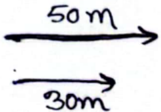

**Part 1**
**x_fnTFtIariKms-VJGG5Nv8Ea35ZMiPmUpB-kgtvhJfJWLmHoVRnR75TgqkMA7T52DwWCEOi3JnzsrHE__image_000001_83afcfb7a2311286d7310210e76948f9a500fb190b85ea7d6eef635ae2feb57f_part1.png**

**Part 2**
**x_fnTFtIariKms-VJGG5Nv8Ea35ZMiPmUpB-kgtvhJfJWLmHoVRnR75TgqkMA7T52DwWCEOi3JnzsrHE__image_000001_83afcfb7a2311286d7310210e76948f9a500fb190b85ea7d6eef635ae2feb57f_part2.png**


(like Vecton):

a (unlike vectorn)

- 上

- ·Aa

- yiln

50m

西3Vector 3 ar vector 3T vector N

30m

图3すvector RATTvectom, A veetona

3效

列列(colinear Vector)

- T NATA

- T

到0m

(Null Veeton)

- 3

- 世证

：3 Chus

：

pa=r vecton vecton.

**x_fnTFtIariKms-VJGG5Nv8Ea35ZMiPmUpB-kgtvhJfJWLmHoVRnR75TgqkMA7T52DwWCEOi3JnzsrHE__image_000002_6672b8acd824802d034c8fd6696d2a0a7394c1b92436ac724a21ebe55fd2e22a.png**
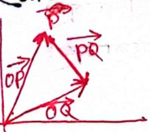

(

2

XR

Y"

Zm

X

**x_fnTFtIariKms-VJGG5Nv8Ea35ZMiPmUpB-kgtvhJfJWLmHoVRnR75TgqkMA7T52DwWCEOi3JnzsrHE__image_000003_a9cd7c3366bddf4d02979d040c765e265cb12891c6a0fe75be627470be09944d.png**
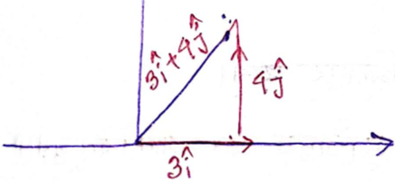

11

t

11

11

3+43=342=5 3+43+4 5

5=

**x_fnTFtIariKms-VJGG5Nv8Ea35ZMiPmUpB-kgtvhJfJWLmHoVRnR75TgqkMA7T52DwWCEOi3JnzsrHE__image_000004_e2b2d92af2ea7b8d4636528a6c8f7db69c2bcce7f315e10331003d219e901f90.png**
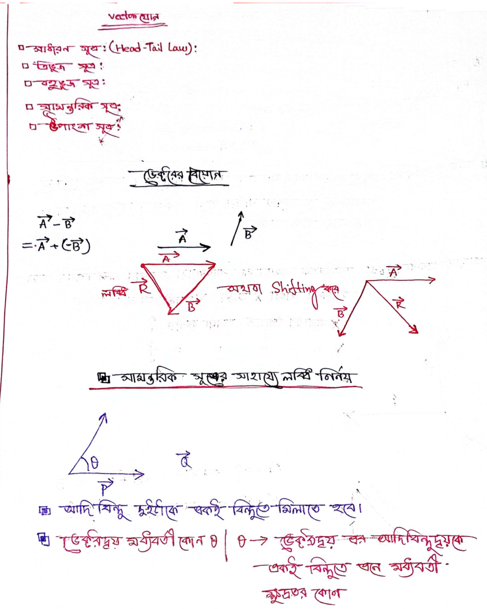

**x_fnTFtIariKms-VJGG5Nv8Ea35ZMiPmUpB-kgtvhJfJWLmHoVRnR75TgqkMA7T52DwWCEOi3JnzsrHE__image_000005_f863b5dda76a224735a116e0f66b2cbebb74c11b06eed4fc16726c643b2fd730.png**
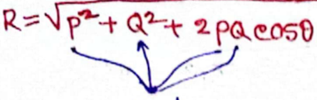

R=√p2+Q2+2paco50

Vecton-

**x_fnTFtIariKms-VJGG5Nv8Ea35ZMiPmUpB-kgtvhJfJWLmHoVRnR75TgqkMA7T52DwWCEOi3JnzsrHE__image_000006_5dbde9e3f20dd5fd8a0b0f676c0018021e7aa84f50fb72ef55385cf643da1798.png**
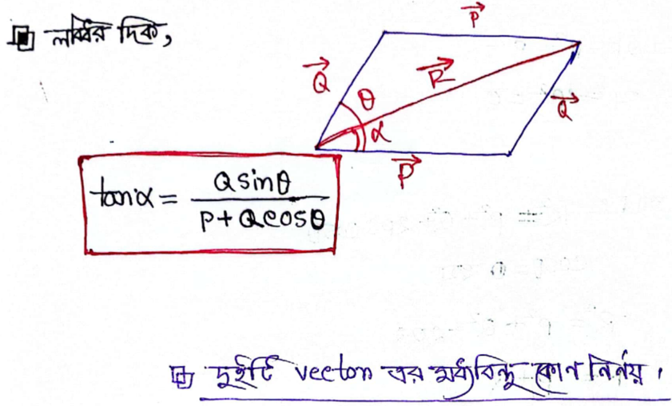

**x_fnTFtIariKms-VJGG5Nv8Ea35ZMiPmUpB-kgtvhJfJWLmHoVRnR75TgqkMA7T52DwWCEOi3JnzsrHE__image_000007_32a6da9036b9777058931e7854dd3efd176a3cc50076ba2903d0afc7981f469a.png**
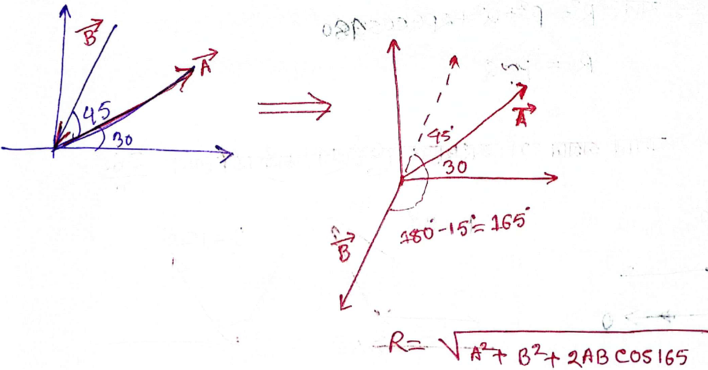

R=A+B2+2ABCOS165

电D=180Vecton

**x_fnTFtIariKms-VJGG5Nv8Ea35ZMiPmUpB-kgtvhJfJWLmHoVRnR75TgqkMA7T52DwWCEOi3JnzsrHE__image_000008_15d73d76c518e5401be8ccb760062a6ea1ec2dd15a06fb54133544a053f0e234.png**
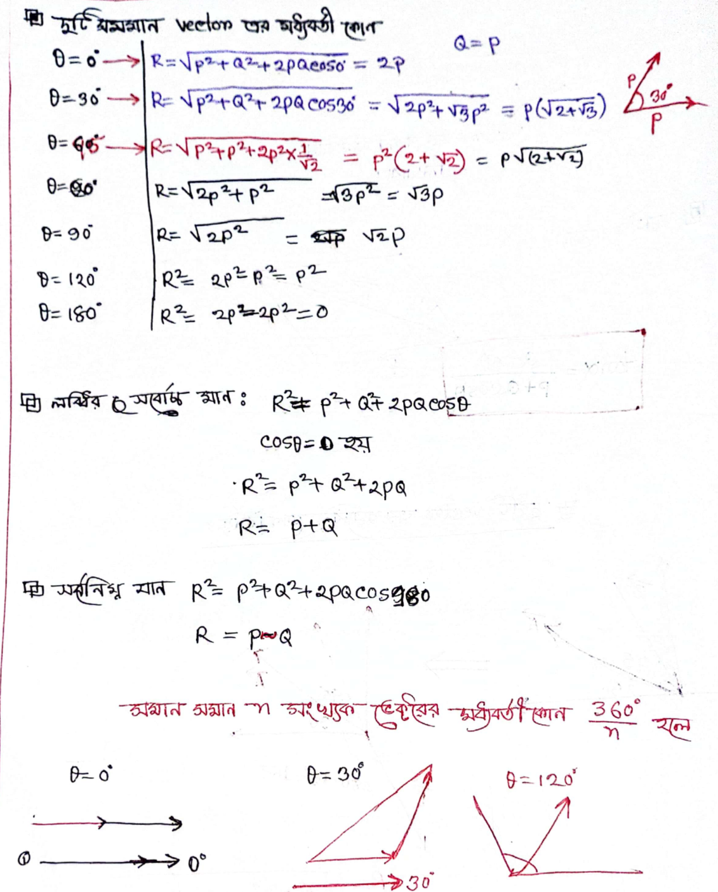

**x_fnTFtIariKms-VJGG5Nv8Ea35ZMiPmUpB-kgtvhJfJWLmHoVRnR75TgqkMA7T52DwWCEOi3JnzsrHE__image_000009_de6e209434f90e46714befd9d911db966b986cfd500f27a773f99b89cfc4aa7a.png**
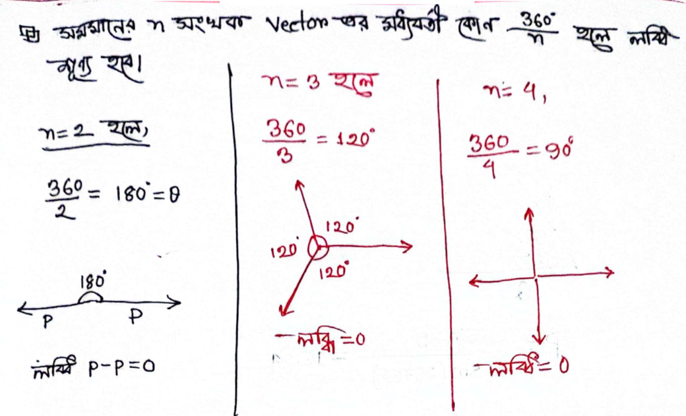

52 Vector - 1 sad 2m N

problem! 50m51  A(2)1)B(9 2

<!-- formula-not-decoded -->

**x_fnTFtIariKms-VJGG5Nv8Ea35ZMiPmUpB-kgtvhJfJWLmHoVRnR75TgqkMA7T52DwWCEOi3JnzsrHE__image_000010_1a2bc72cd47847c3ba3ecaba4c25966467fa6a51e009294f8bd17c004c8a566b.png**
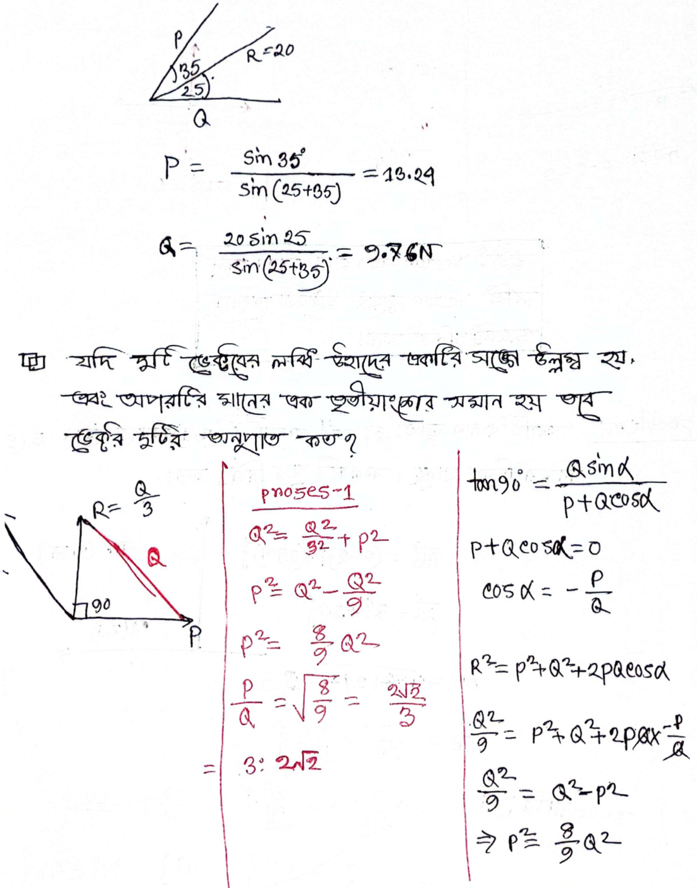

**x_fnTFtIariKms-VJGG5Nv8Ea35ZMiPmUpB-kgtvhJfJWLmHoVRnR75TgqkMA7T52DwWCEOi3JnzsrHE__image_000011_0ae5b5d81f8f216ce12ffaed0d1ae8b2531dfe56f4dba42745e1f91a157cec88.png**
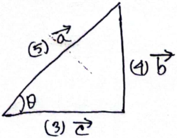

# =0S0

<!-- formula-not-decoded -->

problem-30 200mile

B

$$△ABC- AC sin30°= AB #= Ae 200 →AC= 10omile$$

A

**x_fnTFtIariKms-VJGG5Nv8Ea35ZMiPmUpB-kgtvhJfJWLmHoVRnR75TgqkMA7T52DwWCEOi3JnzsrHE__image_000012_c4f578730b120cbab6db8ddd432d4814c27b35eaae88b6a7658dd0063f9b8804.png**
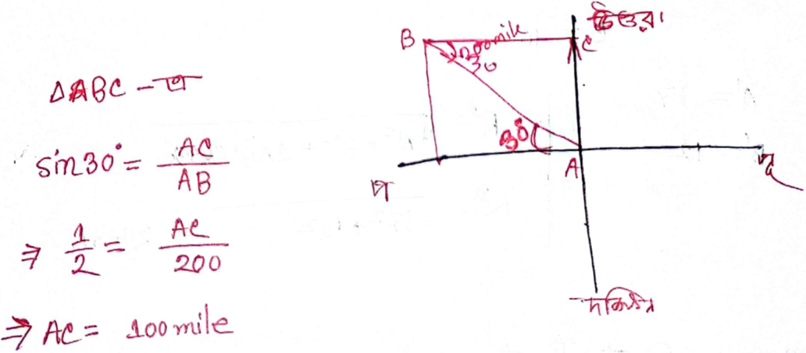

problem 2 120945

**x_fnTFtIariKms-VJGG5Nv8Ea35ZMiPmUpB-kgtvhJfJWLmHoVRnR75TgqkMA7T52DwWCEOi3JnzsrHE__image_000013_a2825ecda01e3bb469a2ad2172c93db7ce59d9d02802970f28f1b57519fa3d51.png**
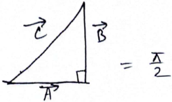

probem25N5N DN

<!-- formula-not-decoded -->

problem-6a+b= 2N

c2=a2+b2+2abcos0

⇒a=632ab=a+b=2abc050

2ab

|0=0°

8N

0

2150° problem-7! 2

**x_fnTFtIariKms-VJGG5Nv8Ea35ZMiPmUpB-kgtvhJfJWLmHoVRnR75TgqkMA7T52DwWCEOi3JnzsrHE__image_000014_fbd054e07fa0c87aa086c822897378d9732dce81d32b22da8c11349aa26ad5c6.png**
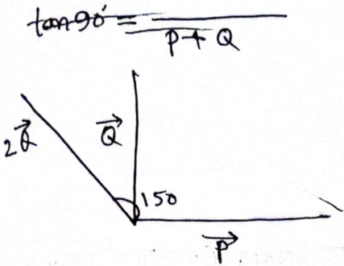

<!-- formula-not-decoded -->

<!-- formula-not-decoded -->

<!-- formula-not-decoded -->

## problem: g

①120

prblem-103:5 35N

<!-- formula-not-decoded -->

<!-- formula-not-decoded -->

R=A+B+E

**x_fnTFtIariKms-VJGG5Nv8Ea35ZMiPmUpB-kgtvhJfJWLmHoVRnR75TgqkMA7T52DwWCEOi3JnzsrHE__image_000015_28013fe5a2900f031238bad0d351f5b4328bab95e64b7334b2eb83103a167595.png**
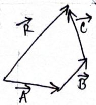

**Part 1**
**x_fnTFtIariKms-VJGG5Nv8Ea35ZMiPmUpB-kgtvhJfJWLmHoVRnR75TgqkMA7T52DwWCEOi3JnzsrHE__image_000016_de101aaff75e00288421078e3a3fb4aebe222b6dbe4e261f3720112e89aba4dc_part1.png**

**Part 2**
**x_fnTFtIariKms-VJGG5Nv8Ea35ZMiPmUpB-kgtvhJfJWLmHoVRnR75TgqkMA7T52DwWCEOi3JnzsrHE__image_000016_de101aaff75e00288421078e3a3fb4aebe222b6dbe4e261f3720112e89aba4dc_part2.png**
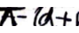

<!-- formula-not-decoded -->

<!-- formula-not-decoded -->

x+β=90°

DeSD

RsinB

Rsind

Rsimβ

sim(x+B)

Simg0

P= Rsinβ = Reosd

Q=

FSimθ

8m

Rsind Rsind

Sin go ReosB

Aims

19. 1 1N

FeoSQ

FsinO

一

-Feo50

Olist Neu.

=Reosd=RsinB

## li@li

**x_fnTFtIariKms-VJGG5Nv8Ea35ZMiPmUpB-kgtvhJfJWLmHoVRnR75TgqkMA7T52DwWCEOi3JnzsrHE__image_000017_02e577fa8288ebbf757e4d7555368316db14c8dc1155f43c8405ff7414c9f20f.png**
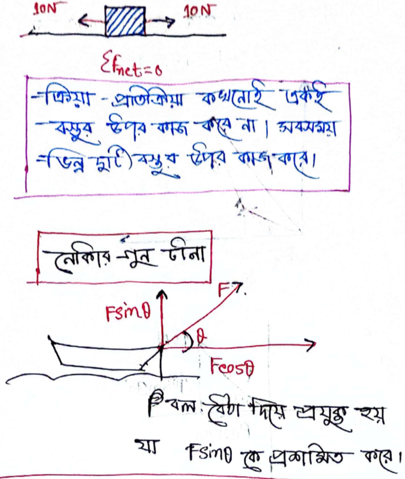

2n(m

**Part 1**
**x_fnTFtIariKms-VJGG5Nv8Ea35ZMiPmUpB-kgtvhJfJWLmHoVRnR75TgqkMA7T52DwWCEOi3JnzsrHE__image_000018_0c4b6d89e868b84a77b3d0ea5f48132c84b6885d66e20398ba0c45e5c6849676_part1.png**
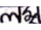
**Part 2**
**x_fnTFtIariKms-VJGG5Nv8Ea35ZMiPmUpB-kgtvhJfJWLmHoVRnR75TgqkMA7T52DwWCEOi3JnzsrHE__image_000018_0c4b6d89e868b84a77b3d0ea5f48132c84b6885d66e20398ba0c45e5c6849676_part2.png**
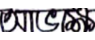

Cosine

Seulan

**x_fnTFtIariKms-VJGG5Nv8Ea35ZMiPmUpB-kgtvhJfJWLmHoVRnR75TgqkMA7T52DwWCEOi3JnzsrHE__image_000019_a30f1fda75cc9d3e88edbcdd11d507321c302cc87cf0a1fa950a138a72ccab55.png**
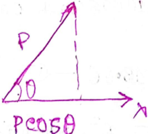

## Sullalng

**x_fnTFtIariKms-VJGG5Nv8Ea35ZMiPmUpB-kgtvhJfJWLmHoVRnR75TgqkMA7T52DwWCEOi3JnzsrHE__image_000020_4350c995565e8600fe88c1938161f3fcdf18313a357adcbb21b3d1a8a355476a.png**
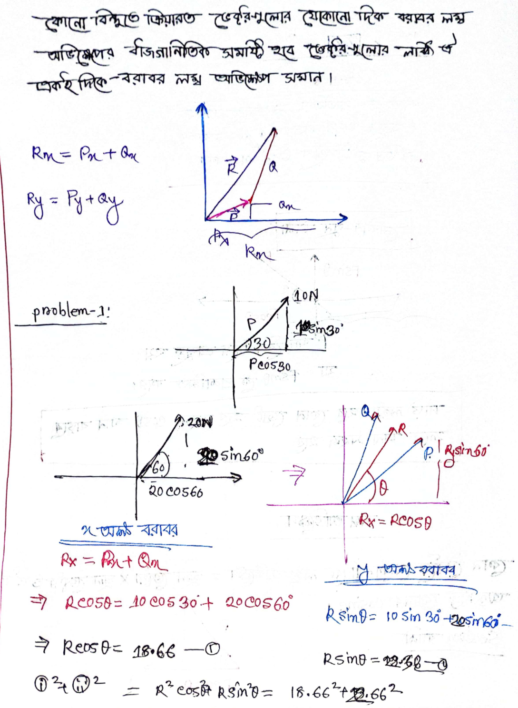

<!-- formula-not-decoded -->

**x_fnTFtIariKms-VJGG5Nv8Ea35ZMiPmUpB-kgtvhJfJWLmHoVRnR75TgqkMA7T52DwWCEOi3JnzsrHE__image_000021_0a3cd85b3a4693beb68ba9d61e03ddcbd56abee5849a4b987b80016c11634b65.png**
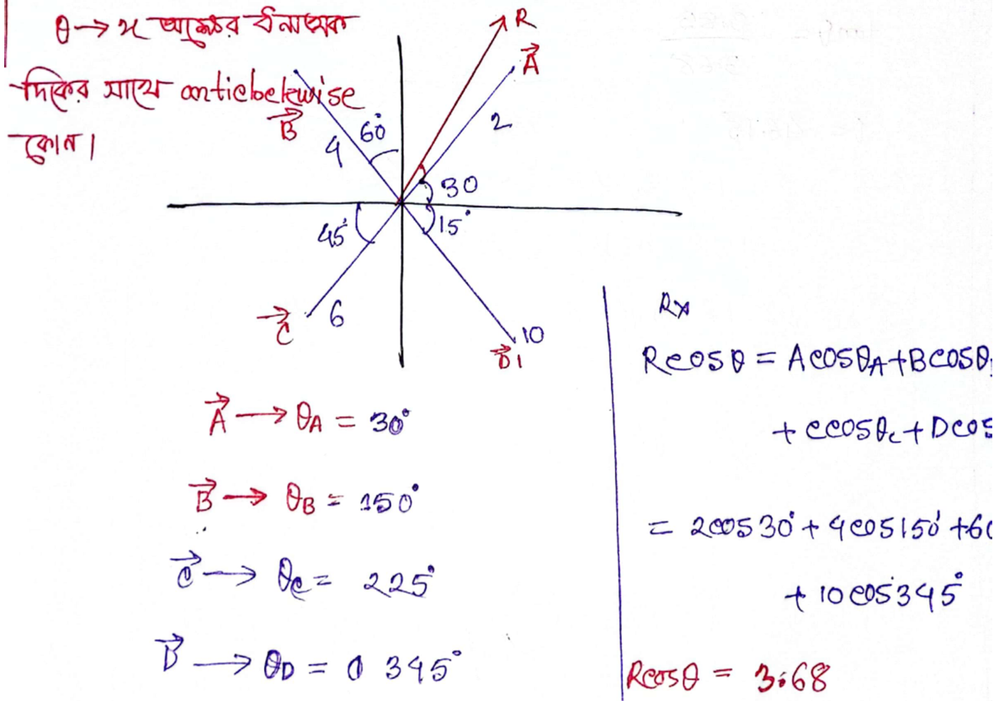

Rsint= 2sin30+ qcos150+ 605225+l0co5345 Rsing=-3.83

**x_fnTFtIariKms-VJGG5Nv8Ea35ZMiPmUpB-kgtvhJfJWLmHoVRnR75TgqkMA7T52DwWCEOi3JnzsrHE__image_000022_7d50e88793e53e68ce6165e6a3ecfdcc57323d95d3eec9d9ee8548151bb5b619.png**
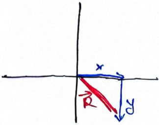

<!-- formula-not-decoded -->

**x_fnTFtIariKms-VJGG5Nv8Ea35ZMiPmUpB-kgtvhJfJWLmHoVRnR75TgqkMA7T52DwWCEOi3JnzsrHE__image_000023_547363b96b787a434177c21004de5ddce4d2e7b38e3bdf6444f365462ad14999.png**
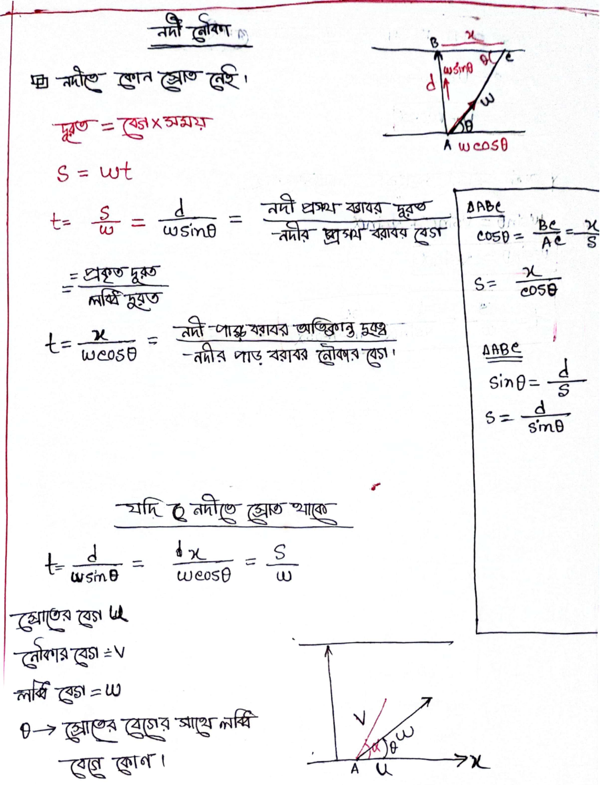

## 2

WeosO=UCOS0°+veosx

Wsinθ = Usmo°+vsind

wsinθ = vsind

t=

S

3

P

2

vsindu+veosd

3mewo

- 1

<!-- formula-not-decoded -->

⇒u+vcosx=0

eosd= -

7

d=co51

**Part 1**
**x_fnTFtIariKms-VJGG5Nv8Ea35ZMiPmUpB-kgtvhJfJWLmHoVRnR75TgqkMA7T52DwWCEOi3JnzsrHE__image_000024_db7cd325b6a09099aaa5219f2793869f58301f14c0e335ce37780a7582640222_part1.png**
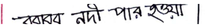
**Part 2**
**x_fnTFtIariKms-VJGG5Nv8Ea35ZMiPmUpB-kgtvhJfJWLmHoVRnR75TgqkMA7T52DwWCEOi3JnzsrHE__image_000024_db7cd325b6a09099aaa5219f2793869f58301f14c0e335ce37780a7582640222_part2.png**
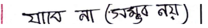

**x_fnTFtIariKms-VJGG5Nv8Ea35ZMiPmUpB-kgtvhJfJWLmHoVRnR75TgqkMA7T52DwWCEOi3JnzsrHE__image_000025_50e3a5eba8a7409076851a6044c168b99ddc2d49645e01c9c34f708ffa444365.png**
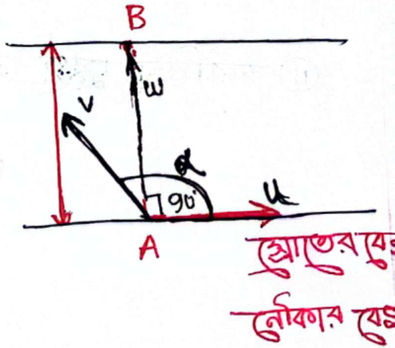

## 西3 AAAA

we0590°= ucos0°+ veosd

⇒0=ve050°+ve0sx

⇒x=e05(号）

wsing0°= vsindtusino°

w=∨simd w=√u2+v²+2uveosd

**x_fnTFtIariKms-VJGG5Nv8Ea35ZMiPmUpB-kgtvhJfJWLmHoVRnR75TgqkMA7T52DwWCEOi3JnzsrHE__image_000026_2703186e8d319f63d6381f0fd92089b63ac6a940e992f2cecc9e8a370b8194ef.png**
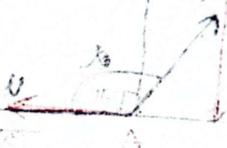

**Part 1**
**x_fnTFtIariKms-VJGG5Nv8Ea35ZMiPmUpB-kgtvhJfJWLmHoVRnR75TgqkMA7T52DwWCEOi3JnzsrHE__image_000027_69151e30aabb5fc49de9cfd18ebb1759b02f64556c0a0a92fa7a76961756ab77_part1.png**
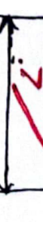
**Part 2**
**x_fnTFtIariKms-VJGG5Nv8Ea35ZMiPmUpB-kgtvhJfJWLmHoVRnR75TgqkMA7T52DwWCEOi3JnzsrHE__image_000027_69151e30aabb5fc49de9cfd18ebb1759b02f64556c0a0a92fa7a76961756ab77_part2.png**


=√u2+v=20v（#）

=√u=∨≥2u2

√√2u2

<!-- formula-not-decoded -->

## 35

P

vsind

2d

**x_fnTFtIariKms-VJGG5Nv8Ea35ZMiPmUpB-kgtvhJfJWLmHoVRnR75TgqkMA7T52DwWCEOi3JnzsrHE__image_000028_f65939d4176676fdf99bb1ddc1148b6e341633c1e2368ca3262db8240ac15d85.png**
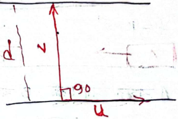

utveosd

で

S=wt

=√U²v2x

七=

S

M

=7

S

P

Vsind

<!-- formula-not-decoded -->

<!-- formula-not-decoded -->

<!-- formula-not-decoded -->

4hbth

VA=10ms

VB=16ms1

VB=16

VA =10m5)

B

A

A

B

AB

AB =10+6

=16-10=6ms

VB=16ms

750

is

VA=10m51

AB

T

**x_fnTFtIariKms-VJGG5Nv8Ea35ZMiPmUpB-kgtvhJfJWLmHoVRnR75TgqkMA7T52DwWCEOi3JnzsrHE__image_000029_5f4316dcf7aceff49ca57209e76e052fa4c174189173ab370f6fff827bb44382.png**
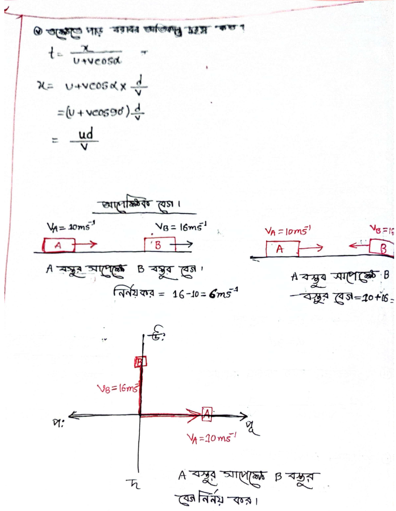

VAB B

SDV

↓

-=1

BA

—= 三B+

A 2

**x_fnTFtIariKms-VJGG5Nv8Ea35ZMiPmUpB-kgtvhJfJWLmHoVRnR75TgqkMA7T52DwWCEOi3JnzsrHE__image_000030_2c2d61bbdded4c0d361d8d2c371edff89173328343f175f12b6c92cd65314b45.png**
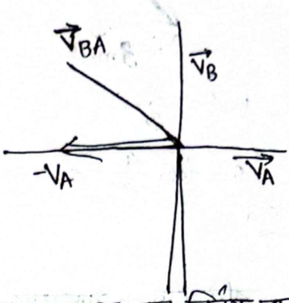

20325

OR AnS: SET ATR TNT

Coase-  g3m

3ms1

A

tano=#

#=tan12

vp=2ms

**x_fnTFtIariKms-VJGG5Nv8Ea35ZMiPmUpB-kgtvhJfJWLmHoVRnR75TgqkMA7T52DwWCEOi3JnzsrHE__image_000031_b681a88b95fa90f59be6796ae003b1d3a0b15db80f120dfba976300454481225.png**
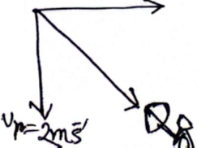

**x_fnTFtIariKms-VJGG5Nv8Ea35ZMiPmUpB-kgtvhJfJWLmHoVRnR75TgqkMA7T52DwWCEOi3JnzsrHE__image_000032_4b7db212feac06b65117bb9e0e648e2fbf56efde2504c7a632a77d8048697c0b.png**
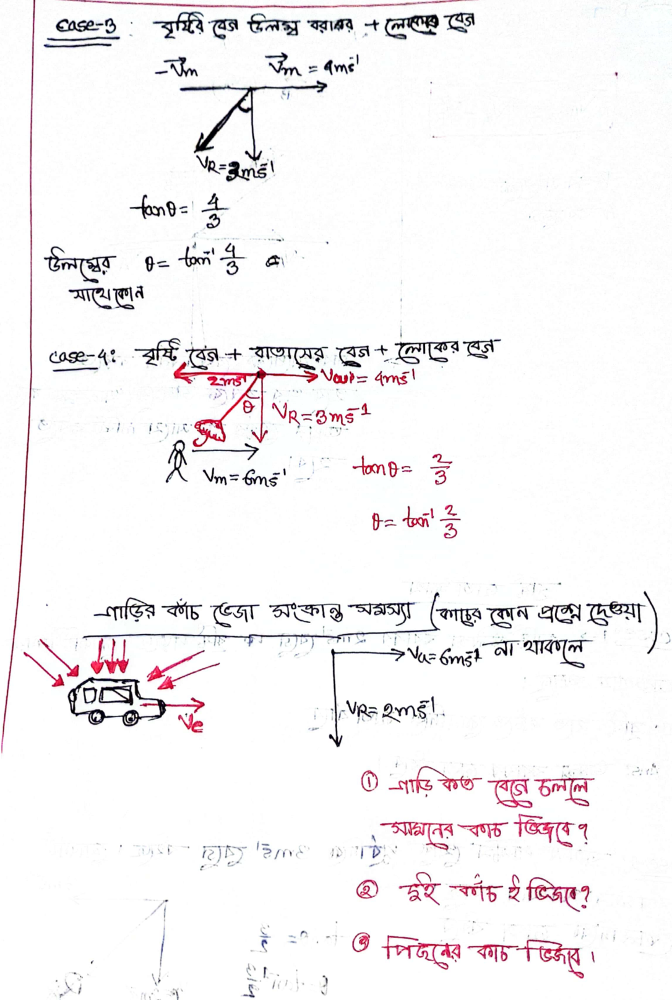

Date:01-00-2029

## leeton-9

Scalom  vector

Produet 54 vecton

21

**x_fnTFtIariKms-VJGG5Nv8Ea35ZMiPmUpB-kgtvhJfJWLmHoVRnR75TgqkMA7T52DwWCEOi3JnzsrHE__image_000033_839ccecf86a1d0106e6dea753b96723df0bfaeec9aadfbfbe45b06572b1fc2db.png**
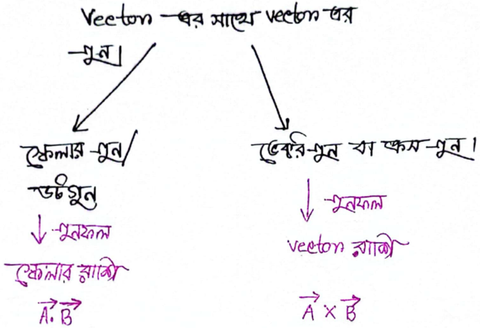

G NR  DiS

**x_fnTFtIariKms-VJGG5Nv8Ea35ZMiPmUpB-kgtvhJfJWLmHoVRnR75TgqkMA7T52DwWCEOi3JnzsrHE__image_000034_825fe0815fbc5ddf3f9a4931a20f245983d880ccdbb0c2e80183de2461fa08db.png**
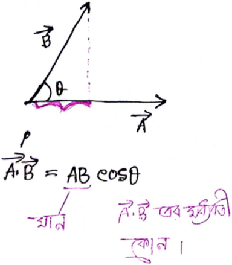

A(BeOS9)

二A

## #

(切)=

西

房(过+馆)=不官士民定

A m)) =R.(mB) #有官）m

**x_fnTFtIariKms-VJGG5Nv8Ea35ZMiPmUpB-kgtvhJfJWLmHoVRnR75TgqkMA7T52DwWCEOi3JnzsrHE__image_000035_7f11f780de1d98c10f2fa7a10d2afbdcab37472d05a9d019d94a2787c096c014.png**
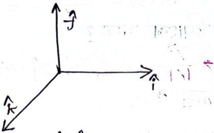

.1= 1x1xe050= 1

k.ê = 1x1X C050=A

余 = 1x1x 050° =1

1.j = 1x1xc0s90 =0

**x_fnTFtIariKms-VJGG5Nv8Ea35ZMiPmUpB-kgtvhJfJWLmHoVRnR75TgqkMA7T52DwWCEOi3JnzsrHE__image_000036_ad60b55d20c6794de3cc838b4485bd797c226067d161c7a8c8841a983342bdc7.png**
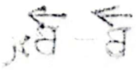

A= An+Ay+Az

A.B= AnBu+AyBy+AzBz

A=2+3j+4k

B=i+2j+gk

AB=2x-1)+3×2+4x3

=-2+6+12=16

A图

二

AB=ABCOSO

BCOSθ=

A

Beost

BCOSOA =

A.B

④A?

TAI

**x_fnTFtIariKms-VJGG5Nv8Ea35ZMiPmUpB-kgtvhJfJWLmHoVRnR75TgqkMA7T52DwWCEOi3JnzsrHE__image_000037_f4e817dd636678d741258bc939495d7d8e7db13828dc88a48a053460e546e34b.png**
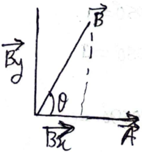

by=官b （1）(2—48 )+k(3-61 29

16

⑤R

- 5

29

√29

A

(2i+3+4k)

16

ア=2i+3j+4k2203N)8

B=-i+2+3k

COB =?

AB=ABCOSA

=ISOE

AB

70=37.43°

16

22+342

2

AB=ABCOSB

0=02 A.官=AB-

40S0 0=480°205θ)min

AB=·ABCOS0=0

CoS0=0

.06=0

vector 6221

R=2i+3j-4k B=5i+mj+2A m062 府官=101

AB=ABCos90=0

10+3m-8=0

m—#

209

## #=2i+3j-4

bh

**x_fnTFtIariKms-VJGG5Nv8Ea35ZMiPmUpB-kgtvhJfJWLmHoVRnR75TgqkMA7T52DwWCEOi3JnzsrHE__image_000038_2de963da472cddf9d52ab0fd3702ed2cfd955776574da0025dae2b3fa9dbba5a.png**
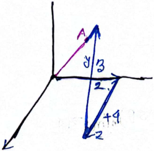

<!-- formula-not-decoded -->

A=2i+3j+4

**x_fnTFtIariKms-VJGG5Nv8Ea35ZMiPmUpB-kgtvhJfJWLmHoVRnR75TgqkMA7T52DwWCEOi3JnzsrHE__image_000039_99e429f49b9c4b116183b31467a7fd3a13bb14c83580067a841b549310bc4e03.png**
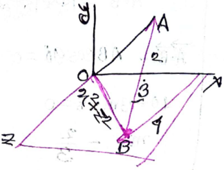

veto

le

S0

2≥2

OnyzB

Z

y

tom=3

**x_fnTFtIariKms-VJGG5Nv8Ea35ZMiPmUpB-kgtvhJfJWLmHoVRnR75TgqkMA7T52DwWCEOi3JnzsrHE__image_000040_0d52c7e4b9050e44500aaafc568fb0cb3596680208a2d32fb5ec79fada3a3b5b.png**
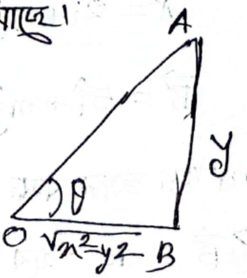

**x_fnTFtIariKms-VJGG5Nv8Ea35ZMiPmUpB-kgtvhJfJWLmHoVRnR75TgqkMA7T52DwWCEOi3JnzsrHE__image_000041_b84ffeaca7b46f9000e7df8f69d390d87117af501e41a5be64b46aa61e97b08f.png**
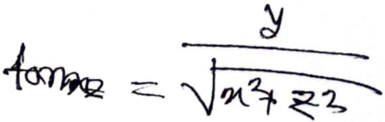

## Cross Prodvet

**x_fnTFtIariKms-VJGG5Nv8Ea35ZMiPmUpB-kgtvhJfJWLmHoVRnR75TgqkMA7T52DwWCEOi3JnzsrHE__image_000042_fe0e729532cfa9bfcb6b6b610d711c84edab2dfcda3d80f408491addf90f5af7.png**
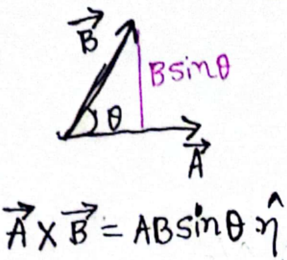

STT 2TTO Senew 图 e Nssous A×B=ABsinθ

**x_fnTFtIariKms-VJGG5Nv8Ea35ZMiPmUpB-kgtvhJfJWLmHoVRnR75TgqkMA7T52DwWCEOi3JnzsrHE__image_000043_b1f8097cef4dbe01cee0cfd8cc2218af04f6a52e9ff053c9aa3a8208e53c5833.png**
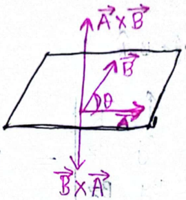

**Part 1**
**x_fnTFtIariKms-VJGG5Nv8Ea35ZMiPmUpB-kgtvhJfJWLmHoVRnR75TgqkMA7T52DwWCEOi3JnzsrHE__image_000044_9ddee50b63ec85b16acb7deaea6365027eddb247db12e92515fd2c4d5ac4d09e_part1.png**
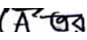
**Part 2**
**x_fnTFtIariKms-VJGG5Nv8Ea35ZMiPmUpB-kgtvhJfJWLmHoVRnR75TgqkMA7T52DwWCEOi3JnzsrHE__image_000044_9ddee50b63ec85b16acb7deaea6365027eddb247db12e92515fd2c4d5ac4d09e_part2.png**
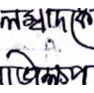

## B≠BA

西区 Ax(B+E)=AxB+Axで 西Sealan xm =(A×B)m ixi=jx=kxk=10 ixj = 1x1×Smg0=1

**x_fnTFtIariKms-VJGG5Nv8Ea35ZMiPmUpB-kgtvhJfJWLmHoVRnR75TgqkMA7T52DwWCEOi3JnzsrHE__image_000045_2bafb9134a2e8a5bd52649a5ece21149acbe47ad59caff7fdd468bdc44bce658.png**
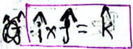

**x_fnTFtIariKms-VJGG5Nv8Ea35ZMiPmUpB-kgtvhJfJWLmHoVRnR75TgqkMA7T52DwWCEOi3JnzsrHE__image_000046_36d5bd743179e88ecc3592e877e21c5cb61417dce8042606196ebdb7fd6d8a8a.png**


**x_fnTFtIariKms-VJGG5Nv8Ea35ZMiPmUpB-kgtvhJfJWLmHoVRnR75TgqkMA7T52DwWCEOi3JnzsrHE__image_000047_f5f9d8845d27dfd345d3bb224100f99923e7cdcc4722f8ce1259f66065c62bf2.png**
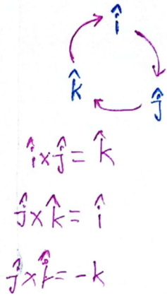

Date: 01-02-2024

<!-- formula-not-decoded -->

<!-- formula-not-decoded -->

A=ABABAAB+ABAB

AyBz-AzBy=0

h

Az

By BZ

An

Bn XX0

AxB=ABsimθ=0

sinθ=022

.081102.0=6

A

CMDREREEEL

<!-- formula-not-decoded -->

ABAV

<!-- formula-not-decoded -->

<!-- formula-not-decoded -->

<!-- formula-not-decoded -->

<!-- formula-not-decoded -->

vector3

**x_fnTFtIariKms-VJGG5Nv8Ea35ZMiPmUpB-kgtvhJfJWLmHoVRnR75TgqkMA7T52DwWCEOi3JnzsrHE__image_000048_46948af1c114010e071338a8bc93b49f9458779d571fc87715cbeedc862acf17.png**
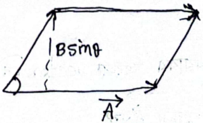

=AB

=AxBsmθ

=Ax

AB

1AxB|=ABSimO Smθ=.1 0=902m

## Cros

|AxB=ABSinθ

sinθ=0

θ=0°≤0≤180°

sinθ→min(0≤0≤180°)

sinθ=0

θ=0°寸T180°

## 3级322

**x_fnTFtIariKms-VJGG5Nv8Ea35ZMiPmUpB-kgtvhJfJWLmHoVRnR75TgqkMA7T52DwWCEOi3JnzsrHE__image_000049_99f93b89a5563ac12f36bea3f08daa75d6a64018d750ffd4b3a467c7f79ca8d6.png**
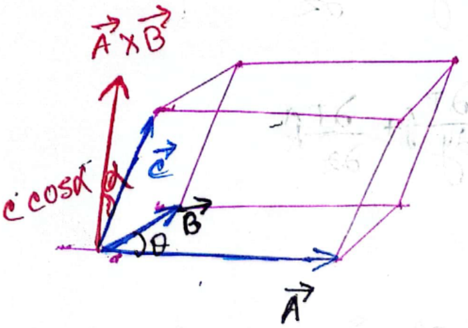

E=

**x_fnTFtIariKms-VJGG5Nv8Ea35ZMiPmUpB-kgtvhJfJWLmHoVRnR75TgqkMA7T52DwWCEOi3JnzsrHE__image_000050_68940fa5a4ed2b5f3036b22d95f6aeb3cabfe18ac0af8a308958d0d5efa4dfed.png**
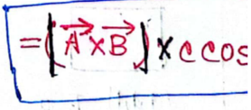

<!-- formula-not-decoded -->

<!-- formula-not-decoded -->

A=2i+3一作 B=ei+m-10个

mvectom

m

m=12

(AxB)，e=0

(AxB)Lco5d=0

cosd=0

96=4

O

**x_fnTFtIariKms-VJGG5Nv8Ea35ZMiPmUpB-kgtvhJfJWLmHoVRnR75TgqkMA7T52DwWCEOi3JnzsrHE__image_000051_9a67eac066d27415beb06227fc935e3735d3dac213016ea5bd33cb4c55026a39.png**
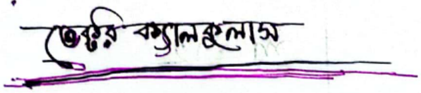

## Differentiation

T=3x²yz3

(1) T=φ

T3

<!-- formula-not-decoded -->

**x_fnTFtIariKms-VJGG5Nv8Ea35ZMiPmUpB-kgtvhJfJWLmHoVRnR75TgqkMA7T52DwWCEOi3JnzsrHE__image_000052_e5542e728591aee233e4ddca6cfc5cf56b8b9bb2f97ac0edb3fb2dcdddee63c8.png**
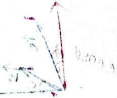

<!-- formula-not-decoded -->

## SISCTAGN

√Dot

veetor fieldDiver gence

<!-- formula-not-decoded -->

<!-- formula-not-decoded -->

<!-- formula-not-decoded -->

<!-- formula-not-decoded -->

## =0 可xa

**Part 1**
**x_fnTFtIariKms-VJGG5Nv8Ea35ZMiPmUpB-kgtvhJfJWLmHoVRnR75TgqkMA7T52DwWCEOi3JnzsrHE__image_000053_39cbe528fcade859987af29cdfcb691020deff9a38a2246a1c73a60fe67d925b_part1.png**
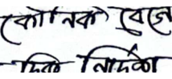
**Part 2**
**x_fnTFtIariKms-VJGG5Nv8Ea35ZMiPmUpB-kgtvhJfJWLmHoVRnR75TgqkMA7T52DwWCEOi3JnzsrHE__image_000053_39cbe528fcade859987af29cdfcb691020deff9a38a2246a1c73a60fe67d925b_part2.png**
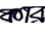


---

## Source 2: `Basic Docker Concepts.md`


## Lab Details

## Running an NGINX Web Server in a Docker Container

### Overview of This Lab

In this lab, you will learn how to set up and run an NGINX web server inside a Docker container using **Puku CLI** . You will use the integrated terminal in Puku CLI to execute Docker commands, manage containers, and configure an NGINX web server.

By the end of this lab, you will understand how Docker simplifies application deployment by providing a lightweight, portable, and scalable environment for hosting web applications.

### What You'll Learn

- Use Docker commands in the **Puku CLI integrated terminal** to pull images, run containers, and manage container configurations.
- Deploy an NGINX web server inside a Docker container.
- Start, stop, restart, and remove Docker containers.
- View and analyze container logs for monitoring and troubleshooting.

Lab start

## Running an NGINX Web Server in a Docker Container

In today's DevOps and cloud-native world, the ability to quickly deploy services in isolated environments is essential. **Docker** makes this possible by providing lightweight, portable containers. In this lab, you will use **Puku CLI** and its integrated terminal to build, run, and manage an NGINX web server inside a Docker container.

**Part 1**
**Basic Docker Concepts__image_000000_39e68af6226d7c9f358e7875c730cf800029a15e0a193e367c9cf7a0abe012ed_part1.png**

**Part 2**
**Basic Docker Concepts__image_000000_39e68af6226d7c9f358e7875c730cf800029a15e0a193e367c9cf7a0abe012ed_part2.png**


This lab will guide you through the complete process of running an **NGINX web server inside a Docker container** using **Puku CLI** . You will learn how to pull the official NGINX Docker image, create a custom HTML page, configure a volume mount, run the container, and verify that the web server is running successfully.

### Lab Overview

In this lab, you will:

- Understand the basics of Docker and NGINX.
- Pull the official NGINX Docker image.
- Create and serve a custom HTML page from a Docker container.
- Map ports and mount volumes between your local project workspace and the Docker container.
- Manage the container lifecycle using the **Puku CLI integrated terminal** (start, stop, view logs, and remove containers).

## Concepts Explained

Before starting the lab, let's understand the key technologies used.

### What is Docker?

Docker is a containerization platform that packages applications and their dependencies into **containers** . These containers are lightweight, portable, and provide a consistent runtime environment across different systems.

### What is NGINX?

NGINX is a high-performance web server that serves web content efficiently. It can also function as a reverse proxy, load balancer, and HTTP cache, making it a popular choice for hosting modern web applications.

### Docker Image vs. Container

- **Image:** A read-only template that contains everything needed to run an application (for example, the official **NGINX** image).
- **Container:** A running instance of an image with its own isolated filesystem, processes, and networking.

## Hands-on: Running NGINX in Docker

In the following exercises, you will use the **Puku CLI integrated terminal** to pull the official NGINX Docker image, run it as a container, and manage it using Docker commands.

Yes, exactly. Since you're **actually running the commands in Puku CLI** , your documentation should say **Puku CLI** , not AWS Terminal. The commands remain the same.

Here's a professional version for your docs:

### Step 1: Pull the Official NGINX Docker Image

Open **Puku CLI** and launch the **integrated terminal** .

Run the following command to download the latest official NGINX image from Docker Hub:

docker pull nginx

**Basic Docker Concepts__image_000001_3d0f24c68bef2702dd4fdfe756e9ada4d7031e99ced5f0bc1c249906e5faf772.png**


Docker will download the required image layers. Once the download is complete, the latest NGINX image will be available on your local machine.

**Expected Output**

You should see output similar to the following in the Puku CLI terminal:

**Basic Docker Concepts__image_000002_c40b3889b133ac72b0b44ed744890dcceefe1c0bbc070b02312622efbe61ce89.png**


#### Verify the Download

To confirm that the image has been downloaded successfully, run:

docker images

**Basic Docker Concepts__image_000003_d3fc8307702e79a6b4cdc1b678530e15cf63a6a43cb7cca5084874114778b5b2.png**


**Expected Output**

The command should list the nginx image with the latest tag.

**Basic Docker Concepts__image_000004_f79b74c4f53d0758a6232ef685c6d87d512cd25a9721e9864b096b5e07d1e03b.png**


This format is much cleaner because the screenshots you capture from **Puku CLI** will naturally match the text in your documentation.

Here's the Puku CLI version with only the necessary changes. The commands stay the same except for the project path.

### Step 2: Create a Directory for Web Content

Open the **Puku CLI integrated terminal** and create a directory to store your custom HTML content. This directory will later be mounted into the NGINX container.

**Basic Docker Concepts__image_000005_a6eec19b9f1450b21498f87672dffe4d945b9f9ffedc98fb62d17983ab347e1d.png**


This directory will act as the source for the web content served by the NGINX container, allowing you to update files without modifying the container itself.

### Step 3: Create a Simple Web Page

Create a simple HTML page inside the html directory by running the following command:

**Basic Docker Concepts__image_000006_39c020f80ffd0ac5e551a3081535353b2a89df210d92c855a519a4ff67ff0751.png**


This page will be served by the NGINX web server once the container is running.

### Step 4: Run the NGINX Container

From the **Puku CLI integrated terminal** , run the following command:

**Basic Docker Concepts__image_000007_0df2f31113b163049852f4c1946f45849f4473033ef58ba5d07deb057ce494e2.png**


**Note:** On Windows PowerShell, replace $(pwd) with ${PWD} if required.

#### Command Breakdown

- --name my-nginx – Assigns the name **my-nginx** to the container.
- -v $(pwd)/nginx-lab/html:/usr/share/nginx/html:ro – Mounts your local HTML directory into the container's web root in read-only mode.
- -p 8000:80 – Maps port **8000** on your machine to port **80** inside the container.
- -d nginx – Runs the NGINX container in detached mode.

**Expected Output**

If the command executes successfully, Docker will return a long container ID.

**Basic Docker Concepts__image_000008_f10c690de8c020aaf4dfa513c3bac71456f0180a41b0bd26b88556a47883a968.png**


## 

## Step 5: Verify the Setup

### Check Running Containers

Run the following command to confirm that the NGINX container is running:

**Basic Docker Concepts__image_000009_a2367ebb15710c3761d2368ce26d19dad75a0acf4735ef52268efc555a9695a0.png**


Verify that:

- The container name is **my-nginx**
- The status is **Up**
- **Host port 5000 is mapped to container port 80**

### View the Web Page

Test the web server directly from the terminal:

curl http://localhost:50000

Expected output:

**Basic Docker Concepts__image_000010_d64048952936f48016d8e9ea0550e2e399a991fd8d490401f6d1e16968a88dff.png**


If you're using **Puku CLI** , you can also open the forwarded port from the Ports panel or the generated preview URL to view the page in your browser.

You should see:

Hello from NGINX running in Docker!

## Managing the NGINX Container

### Stop the Container

docker stop my-nginx

### Start the Container Again

docker start my-nginx

### View Container Logs

Display the NGINX logs:

docker logs my-nginx

Example output:

**Basic Docker Concepts__image_000011_8e0750bc17bffa7d2e5f89de88015943c2d017cffd2672fb153d722895e911cd.png**


Viewing logs is useful for debugging configuration issues and monitoring the container.

## Remove the Container

Once you're finished with the lab, stop and remove the container.

Stop the container:

docker stop my-nginx

Remove the container:

docker rm my-nginx

The NGINX image will remain on your system, allowing you to create new containers without downloading the image again.

## Conclusion

Congratulations! 🎉

You have successfully deployed an **NGINX web server inside a Docker container using Puku CLI** .

Throughout this lab, you learned how to:

- Pull a Docker image from Docker Hub.
- Run an NGINX container.
- Map host ports to container ports.
- Mount a local directory to serve a custom HTML page.
- Verify that the container is running.
- Access the web server using both curl and the Puku CLI browser preview.
- View container logs for troubleshooting.
- Stop, restart, and remove Docker containers.

This exercise demonstrates how Docker provides a portable and reproducible environment for running web applications. Using **Puku CLI** , you can develop, test, and manage containerized applications directly from your browser without installing Docker locally.


---

## Source 3: `Untitled presentation.md`


INTERNET OF THINGS (IOT):

CONNECTING THE PHYSICAL

AND DIGITAL WORLD

COURSE: ADVANCED NETWORKING

UNIVERSITY OF TECHNOLOGY

2024

PAGE 1

What is IoT?

Physical objects embedded with sensors, software &amp; connectivity to exchange data over the internet. Term coined by Kevin Ashton, MIT, 1999. 15.9B connected devices in 2023 → 29.4B by 2030.

Data

Exchange

Real-time data transmission

Smart

Objects

Everyday devices become intelligent

Physical-

Digital

Bridges two worlds seamlessly

PAGE 2

History &amp; Evolution of IoT

1969–1999: Origins

• 1969: ARPANET — first networked computers

• 1982: CMU Coke Machine — first internet-connected device

• 1991: World Wide Web goes public

• 1999: Kevin Ashton coins "Internet of Things" at MIT

2000–2016: Growth Era

• 2007: iPhone launches — smartphones accelerate IoT

• 2011: IPv6 enables trillions of device addresses

• 2014: Amazon Echo — voice-controlled IoT enters homes

• 2016: Mirai Botnet hijacks 600,000+ IoT devices

2017–2030: Intelligent IoT

• 2020: 5G + Edge Computing deployed globally

• 2023: 15.9 billion connected devices worldwide

• 2025: TinyML &amp; AIoT — self-learning smart devices

• 2030: Quantum IoT Security + 29.4B devices projected

01

02

03

PAGE 3

How IoT Works

SENSE

Sensors detect physical data — temperature, motion, light, humidity. Smart thermostat reads room temperature and environmental conditions in real time.

CONNECT &amp; PROCESS

Data transmitted via Wi-Fi, Zigbee, LoRaWAN, or 5G. Edge or cloud platform analyzes the incoming sensor data stream instantly.

ACT

Automated response triggered — thermostat adjusts heating, alert sent to app. System responds without human intervention, closing the IoT loop.

01

02

03

PAGE 4


---

## Source 4: `dip1.md`


## Comparative Analysis of Canny Edge Detection 

This assignment conducts a comparative analysis of the Canny edge detection algorithm. The primary objectives are to evaluate the performance of different gradient filters and to investigate the impact of hyperparameter tuning on the resultant edge maps.

```
import cv2 import numpy as np import matplotlib.pyplot as plt image_path = '/content/sample_data/dip.webp' original_image = cv2.imread(image_path) if original_image is None: print(f"Error: Image not found at {image_path}. Please verify the path.") else: gray_image = cv2.cvtColor(original_image, cv2.COLOR_BGR2GRAY) plt.figure(figsize=(8, 6)) plt.imshow(gray_image, cmap='gray') plt.title('Original Grayscale Image') plt.axis('off') plt.show() print("Setup complete: Image loaded and converted to grayscale.")
```

## Original Grayscale Image

**dip1__image_000000_18bf7451bd2650cc0b63c7659d15ae4f1b381866c7f785ab98fcd22ee146f8bf.png**


Setup complete: Image loaded and converted to grayscale.

- Custom Canny Edge Detector Implementation 

As cv2.Canny() internally utilizes only the Sobel filter, a custom implementation of the Canny algorithm is necessary to compare various gradient filters (Sobel, Prewitt, Roberts Cross). This involves manually implementing Gaussian blurring, gradient calculation, non-maximum suppression (NMS), and double-threshold hysteresis. This approach ensures a consistent and comparable pipeline across all evaluated filters.

```
def gaussian_blur(image, kernel_size, sigma): return cv2.GaussianBlur(image, (kernel_size, kernel_size), sigma) def calculate_gradients(image, filter_type='sobel'): if filter_type == 'sobel': Gx = cv2.Sobel(image, cv2.CV_64F, 1, 0, ksize=3) Gy = cv2.Sobel(image, cv2.CV_64F, 0, 1, ksize=3) elif filter_type == 'prewitt': kernel_x = np.array([[-1, 0, 1], [-1, 0, 1], [-1, 0, 1]], dtype=np.float32) kernel_y = np.array([[-1, -1, -1], [0, 0, 0], [1, 1, 1]], dtype=np.float32) Gx = cv2.filter2D(image, cv2.CV_64F, kernel_x) Gy = cv2.filter2D(image, cv2.CV_64F, kernel_y) elif filter_type == 'roberts': kernel_x = np.array([[1, 0], [0, -1]], dtype=np.float32) kernel_y = np.array([[0, 1], [-1, 0]], dtype=np.float32) Gx = cv2.filter2D(image, cv2.CV_64F, kernel_x) Gy = cv2.filter2D(image, cv2.CV_64F, kernel_y) else: raise ValueError("Invalid filter_type. Choose 'sobel', 'prewitt', or 'roberts'.") magnitude = np.sqrt(Gx**2 + Gy**2) magnitude = cv2.normalize(magnitude, None, 0, 255, cv2.NORM_MINMAX, cv2.CV_8U) direction = np.arctan2(Gy, Gx) return magnitude, direction def non_maximum_suppression(magnitude, direction): rows, cols = magnitude.shape output = np.zeros_like(magnitude, dtype=np.uint8) angle = direction * 180. / np.pi angle[angle < 0] += 180 for i in range(1, rows - 1): for j in range(1, cols - 1): q = 255 r = 255 if (0 <= angle[i, j] < 22.5) or (157.5 <= angle[i, j] <= 180): q = magnitude[i, j + 1] r = magnitude[i, j - 1] elif (22.5 <= angle[i, j] < 67.5): q = magnitude[i + 1, j - 1] r = magnitude[i - 1, j + 1] elif (67.5 <= angle[i, j] < 112.5): q = magnitude[i + 1, j] r = magnitude[i - 1, j] elif (112.5 <= angle[i, j] < 157.5): q = magnitude[i - 1, j - 1] r = magnitude[i + 1, j + 1] if (magnitude[i, j] >= q) and (magnitude[i, j] >= r): output[i, j] = magnitude[i, j] else: output[i, j] = 0 return output
```

```
def double_threshold_hysteresis(image, low_threshold, high_threshold): image = image.astype(np.float32) rows, cols = image.shape output = np.zeros_like(image, dtype=np.uint8) strong_i, strong_j = np.where(image >= high_threshold) weak_i, weak_j = np.where((image >= low_threshold) & (image < high_threshold)) output[strong_i, strong_j] = 255 output[weak_i, weak_j] = 75 for i in range(1, rows - 1): for j in range(1, cols - 1): if output[i, j] == 75: if ((output[i + 1, j - 1] == 255) or (output[i + 1, j] == 255) or (output[i + or (output[i, j - 1] == 255) or (output[i, j + 1] == 255) or (output[i - 1, j - 1] == 255) or (output[i - 1, j] == 255) or (output[ output[i, j] = 255 else: output[i, j] = 0 return output def custom_canny(image, filter_type, gaussian_ksize, sigma, low_threshold, high_threshold): blurred_image = gaussian_blur(image, gaussian_ksize, sigma) magnitude, direction = calculate_gradients(blurred_image, filter_type) nms_output = non_maximum_suppression(magnitude, direction) final_edges = double_threshold_hysteresis(nms_output, low_threshold, high_threshold) return final_edges print("Custom Canny components (Gaussian blur, gradient calculation, NMS, Hysteresis) defined Custom Canny components (Gaussian blur, gradient calculation, NMS, Hysteresis) defined.
```

## Task 1: Gradient Filter Comparison 

The Canny edge detection algorithm is applied using three distinct gradient filters: Sobel, Prewitt, and Roberts Cross. To ensure a fair comparison, Gaussian kernel size, sigma, and threshold values are maintained constant across all three filters.

```
GAUSSIAN_KSIZE = 5 SIGMA = 1.0 LOW_THRESHOLD = 30 HIGH_THRESHOLD = 90 sobel_edges = custom_canny(gray_image, 'sobel', GAUSSIAN_KSIZE, SIGMA, LOW_THRESHOLD, HIGH_TH prewitt_edges = custom_canny(gray_image, 'prewitt', GAUSSIAN_KSIZE, SIGMA, LOW_THRESHOLD, HIG roberts_edges = custom_canny(gray_image, 'roberts', GAUSSIAN_KSIZE, SIGMA, LOW_THRESHOLD, HIG plt.figure(figsize=(18, 6)) plt.subplot(1, 3, 1) plt.imshow(sobel_edges, cmap='gray') plt.title('Canny with Sobel Filter') plt.axis('off') plt.subplot(1, 3, 2) plt.imshow(prewitt_edges, cmap='gray') plt.title('Canny with Prewitt Filter')
```

**Canny with Sobel Filter**
**dip1__image_000001_6b2a2aecf78dafd441f3adf18a857fa49a80e7232d98a4f09bda07851334f781_part1.png**
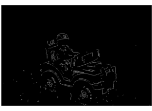
**Canny with Prewitt Filter**
**dip1__image_000001_6b2a2aecf78dafd441f3adf18a857fa49a80e7232d98a4f09bda07851334f781_part2.png**
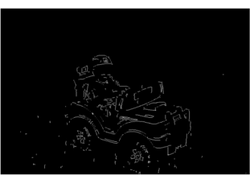
**Canny with Roberts Cross Filter**
**dip1__image_000001_6b2a2aecf78dafd441f3adf18a857fa49a80e7232d98a4f09bda07851334f781_part3.png**
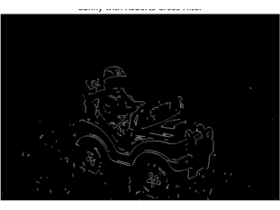

## Comparison Summary of Gradient Filters:

- Sobel Filter: Produced strong, continuous edges, effectively outlining primary subjects with good noise handling. Its 3x3 kernel provides a balanced approach to noise suppression and detail retention.
- Prewitt Filter: Exhibited performance similar to Sobel, with comparable edge continuity, though edges appeared marginally less defined in certain areas.
- Roberts Cross Filter: Demonstrated high sensitivity due to its 2x2 kernel, detecting fine details but also exacerbating noise. This resulted in thinner, fragmented, and jagged edges, indicating high susceptibility to noise.

Conclusion: The Sobel filter provided the most effective and clean edge map for the given image, achieving an optimal balance between edge strength, continuity, and noise suppression. Therefore, the Sobel filter will be utilized for subsequent hyperparameter tuning in Task 2.

## Task 2: Hyperparameter Tuning (using Sobel Filter) 

Following the selection of the Sobel filter, this section focuses on tuning Canny's hyperparameters. This process aims to understand the influence of each parameter on the final edge map and to identify optimal settings for the image.

## Gaussian Kernel Size Tuning 

This experiment evaluates the effect of varying Gaussian blur kernel sizes on edge detection. Kernel sizes of 3x3, 5x5, and 7x7 are tested, while maintaining constant sigma and threshold values, to assess their impact on smoothing levels.

```
BEST_FILTER = 'sobel' FIXED_SIGMA = 1.0
```

```
FIXED_LOW_THRESHOLD = 30 FIXED_HIGH_THRESHOLD = 90 kernel_sizes = [3, 5, 7] edges_ksize_comparison = [] for ksize in kernel_sizes: edges = custom_canny(gray_image, BEST_FILTER, ksize, FIXED_SIGMA, FIXED_LOW_THRESHOLD, FI edges_ksize_comparison.append(edges) plt.figure(figsize=(18, 6)) for i, ksize in enumerate(kernel_sizes): plt.subplot(1, len(kernel_sizes), i + 1) plt.imshow(edges_ksize_comparison[i], cmap='gray') plt.title(f'Kernel Size: {ksize}x{ksize}') plt.axis('off') plt.suptitle('Canny Edge Detection: Gaussian Kernel Size Comparison (Sobel Filter)', fontsize plt.tight_layout(rect=[0, 0.03, 1, 0.95]) plt.show()
```

**Kernel Size: 3x3**
**dip1__image_000002_88f56ae1b1c542bdc2f7dfcfa596deedff49ecb868129a11429e95b78d4f7b82_part1.png**
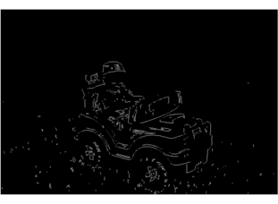
**Kernel Size: 5x5**
**dip1__image_000002_88f56ae1b1c542bdc2f7dfcfa596deedff49ecb868129a11429e95b78d4f7b82_part2.png**

**Kernel Size: 7x7**
**dip1__image_000002_88f56ae1b1c542bdc2f7dfcfa596deedff49ecb868129a11429e95b78d4f7b82_part3.png**
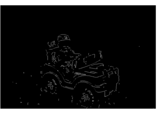

## Sigma Value Tuning 

The impact of the sigma value (standard deviation of the Gaussian blur) on edge detection is investigated. A kernel size of 5x5 (selected from previous experiments for its balanced performance) is used, with fixed thresholds. Sigma values of 0.5, 1.0, and 1.5 are evaluated.

```
BEST_KSIZE_FOR_SIGMA_TUNING = 5 sigma_values = [0.5, 1.0, 1.5] edges_sigma_comparison = [] for sigma in sigma_values: edges = custom_canny(gray_image, BEST_FILTER, BEST_KSIZE_FOR_SIGMA_TUNING, sigma, FIXED_L edges_sigma_comparison.append(edges) plt.figure(figsize=(18, 6)) for i, sigma in enumerate(sigma_values): plt.subplot(1, len(sigma_values), i + 1) plt.imshow(edges_sigma_comparison[i], cmap='gray') plt.title(f'Sigma: {sigma}') plt.axis('off') plt.suptitle('Canny Edge Detection: Sigma Value Comparison (Sobel Filter)', fontsize=16) plt.tight_layout(rect=[0, 0.03, 1, 0.95])
```

**Sigma: 0.5**
**dip1__image_000003_1b2f0ecbd658fe2501663cad87e9b1d7f5a468eff25ff8376c0c2ad447a07d1c_part1.png**
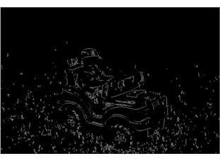
**Sigma: 1.0**
**dip1__image_000003_1b2f0ecbd658fe2501663cad87e9b1d7f5a468eff25ff8376c0c2ad447a07d1c_part2.png**
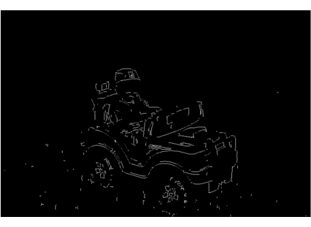
**Sigma: 1.5**
**dip1__image_000003_1b2f0ecbd658fe2501663cad87e9b1d7f5a468eff25ff8376c0c2ad447a07d1c_part3.png**
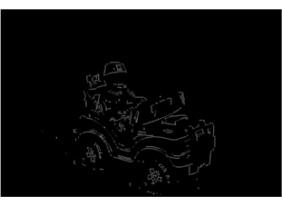

## Threshold Pair Tuning 

This section explores the effect of varying low\_threshold and high\_threshold values, which are critical for determining strong and weak edges. The previously identified optimal kernel\_size and sigma values are maintained. Threshold pairs (0.03, 0.09), (0.05, 0.11), and (0.08, 0.16) are tested. Note that the custom Canny functions expect thresholds in the 0-255 range, necessitating scaling of the provided 0-1 range values.

```
BEST_KSIZE_FOR_THRESHOLD_TUNING = 5 BEST_SIGMA_FOR_THRESHOLD_TUNING = 1.0 threshold_pairs = [(0.03, 0.09), (0.05, 0.11), (0.08, 0.16)] edges_threshold_comparison = [] scaled_threshold_pairs = [] for low_t, high_t in threshold_pairs: scaled_low = int(low_t * 255) scaled_high = int(high_t * 255) scaled_threshold_pairs.append((scaled_low, scaled_high)) print(f"Original relative threshold pairs: {threshold_pairs}") print(f"Scaled absolute threshold pairs (low, high): {scaled_threshold_pairs}") for low_t, high_t in scaled_threshold_pairs: edges = custom_canny(gray_image, BEST_FILTER, BEST_KSIZE_FOR_THRESHOLD_TUNING, BEST_SIGMA edges_threshold_comparison.append(edges) plt.figure(figsize=(18, 6)) for i, (low_t_orig, high_t_orig) in enumerate(threshold_pairs): plt.subplot(1, len(threshold_pairs), i + 1) plt.imshow(edges_threshold_comparison[i], cmap='gray') plt.title(f'Thresholds: ({low_t_orig:.2f}, {high_t_orig:.2f})') plt.axis('off') plt.suptitle('Canny Edge Detection: Threshold Comparison (Sobel Filter)', fontsize=16) plt.tight_layout(rect=[0, 0.03, 1, 0.95]) plt.show()
```

**Thresholds: (0.03, 0.09)**
**dip1__image_000004_2e625d801c33b7155ee659cab4e48241db57b559175f46f7d5808fadbe992aa6_part1.png**
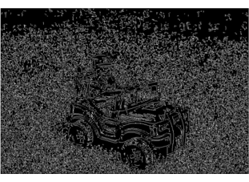
**Thresholds: (0.05, 0.11)**
**dip1__image_000004_2e625d801c33b7155ee659cab4e48241db57b559175f46f7d5808fadbe992aa6_part2.png**
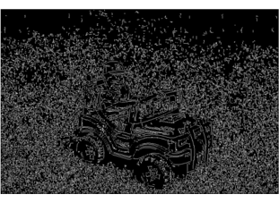
**Thresholds: (0.08, 0.16)**
**dip1__image_000004_2e625d801c33b7155ee659cab4e48241db57b559175f46f7d5808fadbe992aa6_part3.png**
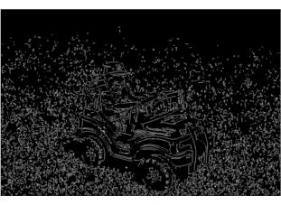

## Final Optimized Edge Map 

Based on the comprehensive hyperparameter tuning, the optimal Canny parameters are applied to generate the final, most effective edge map for the given image.

```
OPTIMUM_KSIZE = 5 OPTIMUM_SIGMA = 1.0 OPTIMUM_LOW_THRESHOLD = int(0.05 * 255) OPTIMUM_HIGH_THRESHOLD = int(0.11 * 255) print("Selected Optimum Parameters:") print(f"  Gradient Filter: {BEST_FILTER.capitalize()}") print(f"  Gaussian Kernel Size: {OPTIMUM_KSIZE}x{OPTIMUM_KSIZE}") print(f"  Sigma Value: {OPTIMUM_SIGMA}") print(f"  Low Threshold: {OPTIMUM_LOW_THRESHOLD} (relative ~0.05)") print(f"  High Threshold: {OPTIMUM_HIGH_THRESHOLD} (relative ~0.11)") print("--------------------------------------------------") final_best_edges = custom_canny(gray_image, BEST_FILTER, OPTIMUM_KSIZE, OPTIMUM_SIGMA, OPTIMUM_ plt.figure(figsize=(8, 6)) plt.imshow(final_best_edges, cmap='gray') plt.title('Final Best Edge Map (Optimum Parameters)') plt.axis('off') plt.show()
```

Selected Optimum Parameters: Gradient Filter: Sobel Gaussian Kernel Size: 5x5 Sigma Value: 1.0 Low Threshold: 12 (relative ~0.05)

High Threshold: 28 (relative ~0.11)

--------------------------------------------------

Final Best Edge Map (Optimum Parameters)

**dip1__image_000005_6e5b120aad826372e366096ae820fe295881cdcbdc3edaaa6994a5b6a66fd306.png**

