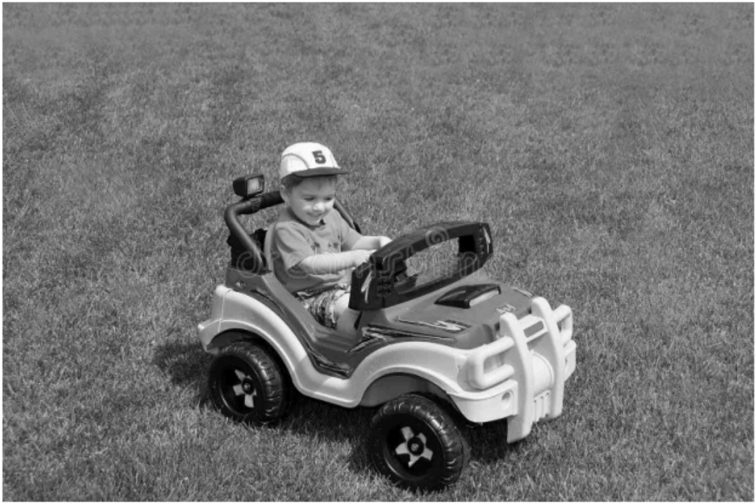
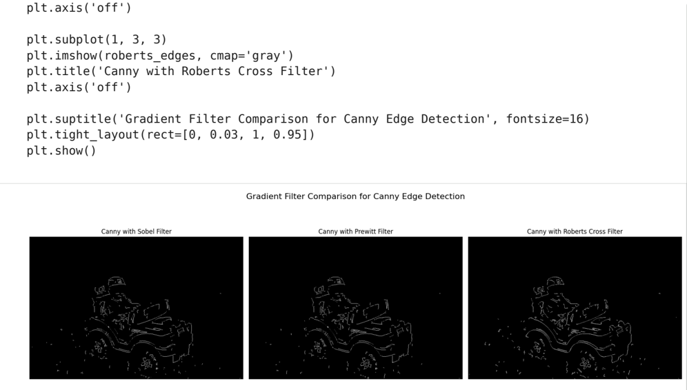
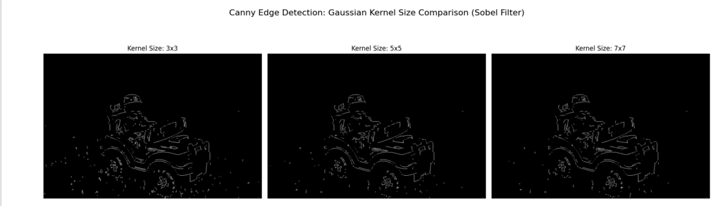
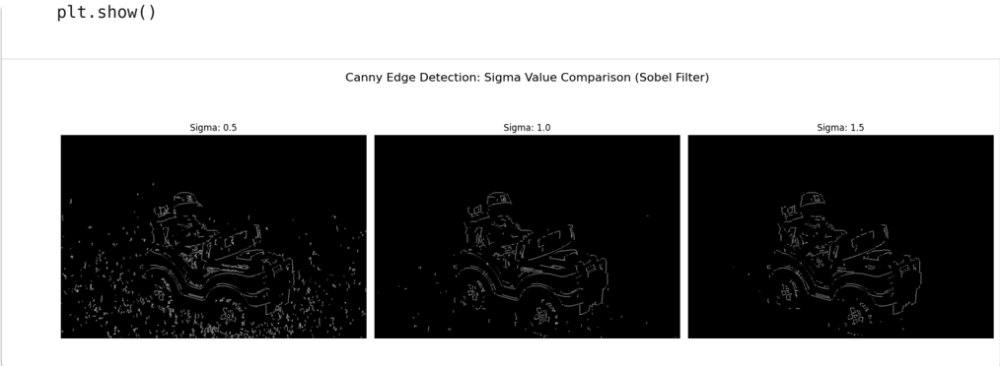
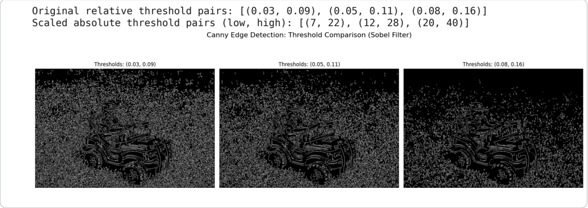
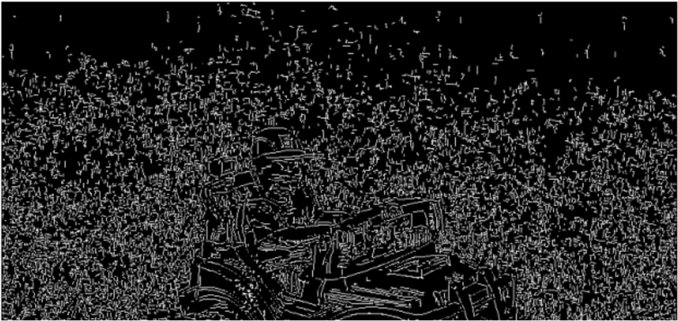

## Comparative Analysis of Canny Edge Detection 

This assignment conducts a comparative analysis of the Canny edge detection algorithm. The primary objectives are to evaluate the performance of different gradient filters and to investigate the impact of hyperparameter tuning on the resultant edge maps.

```
import cv2 import numpy as np import matplotlib.pyplot as plt image_path = '/content/sample_data/dip.webp' original_image = cv2.imread(image_path) if original_image is None: print(f"Error: Image not found at {image_path}. Please verify the path.") else: gray_image = cv2.cvtColor(original_image, cv2.COLOR_BGR2GRAY) plt.figure(figsize=(8, 6)) plt.imshow(gray_image, cmap='gray') plt.title('Original Grayscale Image') plt.axis('off') plt.show() print("Setup complete: Image loaded and converted to grayscale.")
```

## Original Grayscale Image

**dip1__image_000000_18bf7451bd2650cc0b63c7659d15ae4f1b381866c7f785ab98fcd22ee146f8bf.png**


Setup complete: Image loaded and converted to grayscale.

- Custom Canny Edge Detector Implementation 

As cv2.Canny() internally utilizes only the Sobel filter, a custom implementation of the Canny algorithm is necessary to compare various gradient filters (Sobel, Prewitt, Roberts Cross). This involves manually implementing Gaussian blurring, gradient calculation, non-maximum suppression (NMS), and double-threshold hysteresis. This approach ensures a consistent and comparable pipeline across all evaluated filters.

```
def gaussian_blur(image, kernel_size, sigma): return cv2.GaussianBlur(image, (kernel_size, kernel_size), sigma) def calculate_gradients(image, filter_type='sobel'): if filter_type == 'sobel': Gx = cv2.Sobel(image, cv2.CV_64F, 1, 0, ksize=3) Gy = cv2.Sobel(image, cv2.CV_64F, 0, 1, ksize=3) elif filter_type == 'prewitt': kernel_x = np.array([[-1, 0, 1], [-1, 0, 1], [-1, 0, 1]], dtype=np.float32) kernel_y = np.array([[-1, -1, -1], [0, 0, 0], [1, 1, 1]], dtype=np.float32) Gx = cv2.filter2D(image, cv2.CV_64F, kernel_x) Gy = cv2.filter2D(image, cv2.CV_64F, kernel_y) elif filter_type == 'roberts': kernel_x = np.array([[1, 0], [0, -1]], dtype=np.float32) kernel_y = np.array([[0, 1], [-1, 0]], dtype=np.float32) Gx = cv2.filter2D(image, cv2.CV_64F, kernel_x) Gy = cv2.filter2D(image, cv2.CV_64F, kernel_y) else: raise ValueError("Invalid filter_type. Choose 'sobel', 'prewitt', or 'roberts'.") magnitude = np.sqrt(Gx**2 + Gy**2) magnitude = cv2.normalize(magnitude, None, 0, 255, cv2.NORM_MINMAX, cv2.CV_8U) direction = np.arctan2(Gy, Gx) return magnitude, direction def non_maximum_suppression(magnitude, direction): rows, cols = magnitude.shape output = np.zeros_like(magnitude, dtype=np.uint8) angle = direction * 180. / np.pi angle[angle < 0] += 180 for i in range(1, rows - 1): for j in range(1, cols - 1): q = 255 r = 255 if (0 <= angle[i, j] < 22.5) or (157.5 <= angle[i, j] <= 180): q = magnitude[i, j + 1] r = magnitude[i, j - 1] elif (22.5 <= angle[i, j] < 67.5): q = magnitude[i + 1, j - 1] r = magnitude[i - 1, j + 1] elif (67.5 <= angle[i, j] < 112.5): q = magnitude[i + 1, j] r = magnitude[i - 1, j] elif (112.5 <= angle[i, j] < 157.5): q = magnitude[i - 1, j - 1] r = magnitude[i + 1, j + 1] if (magnitude[i, j] >= q) and (magnitude[i, j] >= r): output[i, j] = magnitude[i, j] else: output[i, j] = 0 return output
```

```
def double_threshold_hysteresis(image, low_threshold, high_threshold): image = image.astype(np.float32) rows, cols = image.shape output = np.zeros_like(image, dtype=np.uint8) strong_i, strong_j = np.where(image >= high_threshold) weak_i, weak_j = np.where((image >= low_threshold) & (image < high_threshold)) output[strong_i, strong_j] = 255 output[weak_i, weak_j] = 75 for i in range(1, rows - 1): for j in range(1, cols - 1): if output[i, j] == 75: if ((output[i + 1, j - 1] == 255) or (output[i + 1, j] == 255) or (output[i + or (output[i, j - 1] == 255) or (output[i, j + 1] == 255) or (output[i - 1, j - 1] == 255) or (output[i - 1, j] == 255) or (output[ output[i, j] = 255 else: output[i, j] = 0 return output def custom_canny(image, filter_type, gaussian_ksize, sigma, low_threshold, high_threshold): blurred_image = gaussian_blur(image, gaussian_ksize, sigma) magnitude, direction = calculate_gradients(blurred_image, filter_type) nms_output = non_maximum_suppression(magnitude, direction) final_edges = double_threshold_hysteresis(nms_output, low_threshold, high_threshold) return final_edges print("Custom Canny components (Gaussian blur, gradient calculation, NMS, Hysteresis) defined Custom Canny components (Gaussian blur, gradient calculation, NMS, Hysteresis) defined.
```

## Task 1: Gradient Filter Comparison 

The Canny edge detection algorithm is applied using three distinct gradient filters: Sobel, Prewitt, and Roberts Cross. To ensure a fair comparison, Gaussian kernel size, sigma, and threshold values are maintained constant across all three filters.

**dip1__image_000001_6b2a2aecf78dafd441f3adf18a857fa49a80e7232d98a4f09bda07851334f781.png**


## Comparison Summary of Gradient Filters:

- Sobel Filter: Produced strong, continuous edges, effectively outlining primary subjects with good noise handling. Its 3x3 kernel provides a balanced approach to noise suppression and detail retention.
- Prewitt Filter: Exhibited performance similar to Sobel, with comparable edge continuity, though edges appeared marginally less defined in certain areas.
- Roberts Cross Filter: Demonstrated high sensitivity due to its 2x2 kernel, detecting fine details but also exacerbating noise. This resulted in thinner, fragmented, and jagged edges, indicating high susceptibility to noise.

Conclusion: The Sobel filter provided the most effective and clean edge map for the given image, achieving an optimal balance between edge strength, continuity, and noise suppression. Therefore, the Sobel filter will be utilized for subsequent hyperparameter tuning in Task 2.

## Task 2: Hyperparameter Tuning (using Sobel Filter) 

Following the selection of the Sobel filter, this section focuses on tuning Canny's hyperparameters. This process aims to understand the influence of each parameter on the final edge map and to identify optimal settings for the image.

## Gaussian Kernel Size Tuning 

This experiment evaluates the effect of varying Gaussian blur kernel sizes on edge detection. Kernel sizes of 3x3, 5x5, and 7x7 are tested, while maintaining constant sigma and threshold values, to assess their impact on smoothing levels.

```
BEST_FILTER = 'sobel' FIXED_SIGMA = 1.0
```

**dip1__image_000002_88f56ae1b1c542bdc2f7dfcfa596deedff49ecb868129a11429e95b78d4f7b82.png**


## Sigma Value Tuning 

The impact of the sigma value (standard deviation of the Gaussian blur) on edge detection is investigated. A kernel size of 5x5 (selected from previous experiments for its balanced performance) is used, with fixed thresholds. Sigma values of 0.5, 1.0, and 1.5 are evaluated.

**dip1__image_000003_1b2f0ecbd658fe2501663cad87e9b1d7f5a468eff25ff8376c0c2ad447a07d1c.png**


## Threshold Pair Tuning 

This section explores the effect of varying low\_threshold and high\_threshold values, which are critical for determining strong and weak edges. The previously identified optimal kernel\_size and sigma values are maintained. Threshold pairs (0.03, 0.09), (0.05, 0.11), and (0.08, 0.16) are tested. Note that the custom Canny functions expect thresholds in the 0-255 range, necessitating scaling of the provided 0-1 range values.

**dip1__image_000004_2e625d801c33b7155ee659cab4e48241db57b559175f46f7d5808fadbe992aa6.png**


## Final Optimized Edge Map 

Based on the comprehensive hyperparameter tuning, the optimal Canny parameters are applied to generate the final, most effective edge map for the given image.

```
OPTIMUM_KSIZE = 5 OPTIMUM_SIGMA = 1.0 OPTIMUM_LOW_THRESHOLD = int(0.05 * 255) OPTIMUM_HIGH_THRESHOLD = int(0.11 * 255) print("Selected Optimum Parameters:") print(f"  Gradient Filter: {BEST_FILTER.capitalize()}") print(f"  Gaussian Kernel Size: {OPTIMUM_KSIZE}x{OPTIMUM_KSIZE}") print(f"  Sigma Value: {OPTIMUM_SIGMA}") print(f"  Low Threshold: {OPTIMUM_LOW_THRESHOLD} (relative ~0.05)") print(f"  High Threshold: {OPTIMUM_HIGH_THRESHOLD} (relative ~0.11)") print("--------------------------------------------------") final_best_edges = custom_canny(gray_image, BEST_FILTER, OPTIMUM_KSIZE, OPTIMUM_SIGMA, OPTIMUM_ plt.figure(figsize=(8, 6)) plt.imshow(final_best_edges, cmap='gray') plt.title('Final Best Edge Map (Optimum Parameters)') plt.axis('off') plt.show()
```

Selected Optimum Parameters: Gradient Filter: Sobel Gaussian Kernel Size: 5x5 Sigma Value: 1.0 Low Threshold: 12 (relative ~0.05)

High Threshold: 28 (relative ~0.11)

--------------------------------------------------

Final Best Edge Map (Optimum Parameters)

**dip1__image_000005_6e5b120aad826372e366096ae820fe295881cdcbdc3edaaa6994a5b6a66fd306.png**

