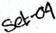
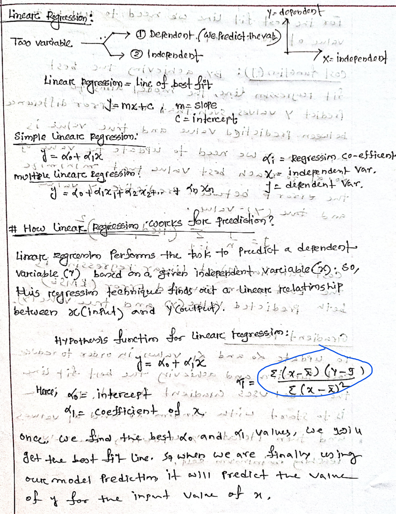
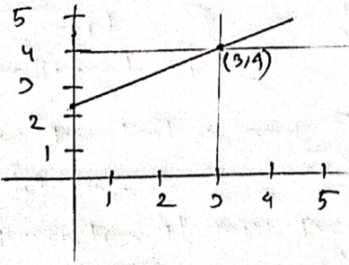
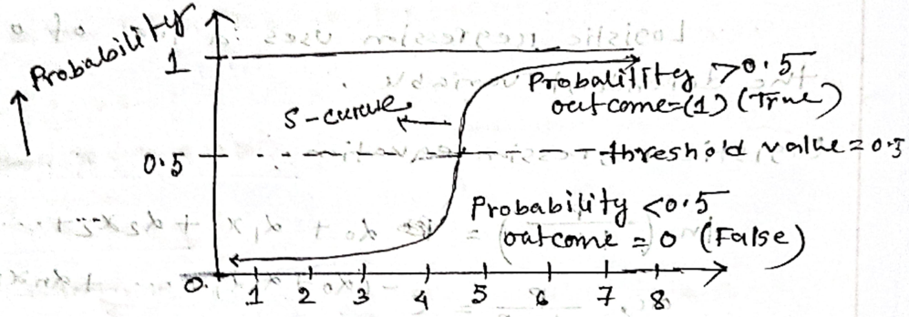
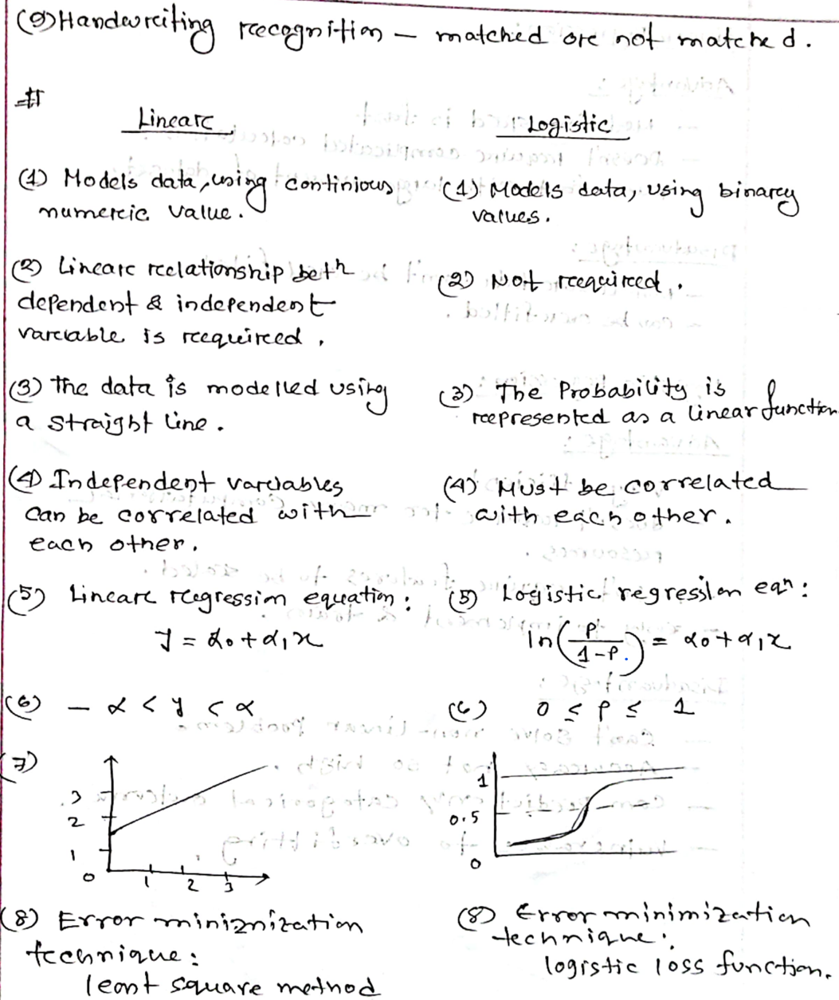

**english__image_000000_6f908a88098ac838841104999bfe1747649cfafbc0acb0ba2a19733bfed24e8f.png**


_Extracted text:_
```text
Set-04
```

Regrossion:

Regresion aralysis is a foreom ofPredictive modeling techriue cohich investigalas the relationship botaron a dependent and independentvartiable.

-mainty used fore Prediting &amp;. forcaoting.

Regression

Linearc

maps a continjous f of 2

logistic

maps a continjous xto biniary (TruelPalse

Linear Rogression: 1 a Prcedictive modecing tecmique.

- attempts to model the relationstip betcveen. tewa varciables by titting a linear equation to the observed data.
- one varciable is called - Exploratory verciable
- Other Varciable is called - dependent varciasle
- the best fil- line coould be the line cohice hes the least differuence betweer the estimated ralne annd actal vare.

**english__image_000001_68fef000f0eae4b7c86f474a6502eb3342265cc0d9b23eaca65e9e4f4e155791.png**


_Extracted text:_
```text
copaodop=
sw
Linearc Rigresiion
→ ①Dependent.(we Predict thevalt
Tao variable
②Independent
x= independert
122d
2
i6=mxc=slope
tibo
C=intercept
bmp
2ev byilpib2asued
Simple linearc Regression.'
y=do+dixc
boen wdi = Regressim co-efficent
moltile linearc egression2dN independentvar.
J= defendent Var.
y=20+d1x22
sust
6.mp
for preediction?
How linear Regression Corks
Lirar Rogrcenim Performs the tok to preedict a dependent
Varciable()bared onagirer indeperdentvarciable:S0,
2M3)
Hhis regression fechnique finds out ar linear relatimship
between Cintut) and outplty. ba
Hypotheis functim for linear tegressi:i
CV
b~~
690
=xo+xx
∑(x-x)(y-9)
wis fik fead 20
Niv22v
∑(x-x)2
Here; doE intercept INibi
222
=coefficientof
trvot?
once, we find the best do and i yalues, we yoiu
get tee bost fit Line, sg wher we are finally using
our model Predictim, it will Predict the Vaine
of y for tne ingnt valne of x,
```

sitls

TOV

for the best fit line wke need to update tue

valweofdo and d,to farabo sjbal

cost function (J): By achieving tue best fit rugressim line, the model aims to Predict y valves sveh that ther error differenc between predictied value and. true valut is minimurn, so we need to update tue vahe of doi dp to reach best value tuat minimize fcobmpb valwe and tove (Y) value,

cost function (J) of linear regressim and treevahely),

## Scoilsibunf one (Predyi) =f fueqiet qoteoqce n 1=1 edl·cmost aiom

the Root mean squered. Error (RMSE) beth Predicted Valye(y)

to update do and xi. valun in order to reduce cost functian and achieving tue best fit line the model uses aradient Pescerti. the idee is to start with randimnt koilknd di vaiwes reaching ininin t, d tit fod t o fibaa7 1ic H mifoibsi 1abom 1

|   x |   R | (x-x)   |    |       | (y-y)1(x-x(x-元)0-5)   | g       | (-y)        |
|-----|-----|---------|----|-------|-----------------------|---------|-------------|
|   1 |   2 | -2      | -2 | 4     | 4 2.8                 | 0.8     | (9-y)2 0.64 |
|   2 |   4 | -1      |  0 | 1     | 0                     | 0.C     | 0.36        |
|   3 |   5 | Q       |  1 | 0     | 3.4 4                 |         |             |
|   4 |   4 | 1       |  0 | 0 1 0 | 4,6                   | -1      | 1           |
|   5 |   5 | 2       |  1 | 4 2   | 5.2                   | 0.6 0,2 | 75.0 he,g   |

<!-- formula-not-decoded -->

Linear regression, &lt;0 =x0+x1x

<!-- formula-not-decoded -->

do can be calculated using thecordinate (x,7)= (3.4)

<!-- formula-not-decoded -->

∴ y = 2.2 + 0.6Xx, which is the regression line.

Now, error=

∑(g-y)

n-2

**english__image_000002_d9d0b8e98957249d3c8c4af2407bb20a61dd5687a737e50d404a6aef419a9075.png**


_Extracted text:_
```text
5
4
2
5
2
```

0.89

J8:0

- D Business ften uselineac regression to understima the relationship betwveen adverctising spending &amp; revenue. 0

22.0

po.o

- 2) Medical tieseatechere use lineate treg ten im to anderstarid therelatinship! betaween draug dosage &amp; blood prasurce of a Patienl=x 27211
2. 3 Agricultarel scientists use Linear reegrerin to meanurce the effect tof fertilizer s cwaterilon (已-巳)(x-0)子 Crcop yeilds, x= 2.0 01 (x-K)3
3. futurce montrs. (AC)(④)Foreccooting
4. Price on riumber of sales. Impact of produet 2.0+0x=P&lt; 6 SC=Ox

P8.0

~(P-e)3

fo      e Predictive analysis?

Logistic regressin is a method which falls unden supervised ML algorithm, It is used to predict the binary outcomes for a given set of independent variable, The dependent variable outeome is discreate.

109 of odds as Logistic regressimn uses

dependentveriasu

the

logisticeregressianieavation,.

3.0

<!-- formula-not-decoded -->

function on lirean ploweis t bulddo b gethted togistico relgression orst2 ei lioris arp gedtadw toibat of Sigmoid function; P n 1+e

where,

y

tb2o toibt (A)

os radtedes

0051d0999

ro t2ibif

at~10m

V

te09

213

2eiaraolob of bo20 2ti

Divonr

amaobvo(2).

t0

tosit0s2

x ()

dabamrp The output of tue logistic regressin is a Sigmoid curve. there are onry 2 Possizk value to make our predictimi fse

**english__image_000003_8e61b127eb4349ce4577a91991ee7c74967af64a5934db860877661cdd30926f.png**


_Extracted text:_
```text
Probabilit
1
0<d
outcome=(1)(trne)
s-curue
thresho'dvalue20.5
0.5
Probability <015
5xs+
outcome =0 (False)
5
3
78
4
```

→x

## Legistic Rogression Application:

BA obblA!Nd

- Probabilitg of having heart attack, (2) to predict whether an email is spar ornof.
- ③ Probabilitg of faileree of a Parcticuilar Protect.
- Democrate or Republican Panty boned on tesidence, occupation, 'income ete.
- (8) In NLP it's osed to determine the sentiment of movie review, Marcketings ,(8) outcome of amatch

9上

**english__image_000004_1cd87fe306291e246cab5ff05926e61987675086e3119ba62e0cba9151e371b7.png**


_Extracted text:_
```text
(9)Handwrciting
recognition - matched ore not matched.
Linearc
bLogistic
(4) Models data using
mumeric. value.
values.
® Linearc reelationship beth
(2) Not reeqairced.
dependent & independent
varciable is reequirced,
(3) The Probability is
(③) the data is modelled usikg
rcepreserted as a linearfunction
a straight line.
(D Independent varcables
(A) Must be correlated
Can be correlated with
with eacrother.
eacn other.
Logistic regresslon ean:
5) Lineare Feegressin equation
5)
P
J=xotd1x
in
20+01℃
-
6
1
Q
↑
(3)
1
.3
0.5
2
一
0
0
2
3
8.Erronrminimizatian
(8) Error miniznizatin
techniane..
fcchnique:
logistic loss function.
leont square metnod
```

## Linear Regression!

## Advantage:

- Modeling speed is fast
- -reuns fort aith large amount of dataset.

## Disaduartage:

- Non-lineate data can't be ciell fited
- Can be overcfiHted.

## Legistic Ragression:

## Advantage:

- veryefficien L asttas resources.

doesr't reequitce features to be scaled.

- ensty to implement &amp; train J 十0 =

## Disadvantege:

- D (3) Can't solve non-linear pooblem
- — Aecurcaay not so high.
- camn predict only catagooical outeome.
- to overfitting srrarlns—

bubbom

## clamificatim

- D The output is a class on catagory.
- 2) Evaluating by mearsurirg aocuracy.
- (③) Algo: Decision-tree, kNN
- 4)The depen dent variable
- are Unordered.

## Igesion

- (4) -the output is nurerla value
- (2) fvalua-ted by leastsquare method.
3. 3 linear, Logistic regression.
- (4) dependent Vanicsu are ordeved,
